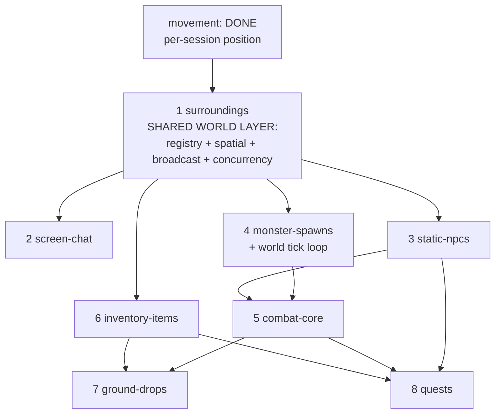

# Conquer Server — Multi-Feature Epic Roadmap

Patch-5065 private server. .NET 8, COServer-Redux fork. Target: **hundreds of
concurrent connections.** Each epic below is self-contained and ralph-specum-ready.

---

## 1. Overview

### Where we are (live on master — NOT re-planned)
Auth (`:9958`), game handshake (`:5816`), enter-world, character creation, and
**movement** all work. Movement is **per-session-isolated**: each
`ClientSession` holds its own authoritative `CurrentMap/CurrentX/CurrentY`,
mutated by `WalkHandler`/`ActionHandler`, flushed to DB once on disconnect. **No
session can see any other.** The world is N isolated single-player bubbles.

### The inflection point
Every requested feature (surroundings, chat, NPCs, monsters, items, combat) needs
**one session's action to be observed by other sessions.** That is the transition
from *per-session-isolated state* to *shared world state touched concurrently by
N per-connection async loops*. This transition is the hard part — not the packets.

The movement design **named the seams but did not build them** (per the brief and
CLAUDE.md): a global entity registry keyed by UID, a spatial index, a broadcast
mechanism, and a concurrency model. **EPIC 1 (surroundings) builds all four.**
Everything else consumes them.

### Build-order rationale (one line each)
1. **surroundings** — forces and builds the shared world layer. Foundational.
2. **screen-chat** — first consumer; cheapest validation of broadcast fan-out.
3. **static-npcs** — read-only non-player entities; validates registry for non-players + dialog request/response.
4. **monster-spawns** — server-driven entities + a world tick loop (the AI heartbeat). Needed before combat.
5. **combat-core** — entities damage entities; HP/death; respawn.
6. **inventory-items** — per-player item state + persistence cadence.
7. **ground-drops** — combat + items + spatial registry converge (drop on kill, pick up).
8. **quests** — NPC dialog + inventory + kill-tracking glue. Mostly logic, little new infra.

---

## 2. Dependency graph

**Critical path:** `surroundings → monster-spawns → combat-core → ground-drops`.
`inventory-items` and `static-npcs` can be built in parallel after surroundings.
`screen-chat` is a fast parallel win that exercises the broadcast layer early.

---

## 3. Shared infrastructure (the crux — designed in EPIC 1)

> Retrofitting this later is expensive. It MUST be designed carefully the first
> time it is needed (surroundings), then **reused unchanged** by every later epic.
> Tie-in: CLAUDE.md "live world state held in memory as authoritative; persistence
> async/batched; never a DB round-trip per movement or per surroundings packet."

The Redux reference (`src/Redux/Space/Map.cs`, `Objects/Entity.cs`) shows the
*shape* of this layer but ships the **two anti-patterns we must not copy**:
- `Map.QueryScreen` is a **LINQ full-scan over `Objects.Values`** every query —
  O(entities-on-map) per surroundings request. At hundreds of players on one map,
  that is O(n²) world-wide. **Replace with a grid spatial index.**
- `Entity.VisibleObjects` does per-entity O(n) visible-set diffing. Keep diffing
  but drive it off cheap grid-cell deltas, not full re-scans.

### 3.1 Entity / world registry
- `IWorldEntity` interface: `uint Uid`, `int MapId`, `ushort X/Y`, `EntityKind`
  (Player/Npc/Monster/GroundItem), `byte[] BuildSpawnPacket()`.
- `ClientSession` becomes (or wraps) a `PlayerEntity : IWorldEntity`. Its
  authoritative `CurrentMap/X/Y` move into the entity.
- Global UID allocation by kind (mirror Redux `ThreadSafeCounter` bands: players
  use CharacterID; mobs 400000–500000; ground items 100000–150000; NPCs from DB).
- **Data structure:** one `World` holding `ConcurrentDictionary<int, MapInstance>`;
  each `MapInstance` holds `ConcurrentDictionary<uint, IWorldEntity>` (the map roster).

### 3.2 Spatial index (screen/grid buckets)
- The 5065 screen is an **18-tile radius (36×36 box)** — confirmed in Redux
  `Map.GetEntityScreenArea` (`new Rectangle(center-18, 36, 36)`).
- Partition each map into a **fixed grid of cells** (cell size ≈ screen radius, ~18).
  A screen query = the 3×3 block of cells around the entity. Query cost becomes
  **O(entities-in-9-cells)**, independent of total map population — this is the
  single most important scalability decision in the roadmap.
- `ConcurrentDictionary<long cellKey, ConcurrentDictionary<uint, IWorldEntity>>`
  per map (cellKey = packed cellX/cellY). Movement updates cell membership only
  when an entity crosses a cell boundary, not every step.

### 3.3 Broadcast / SendToScreen
- `MapInstance.Broadcast(IWorldEntity center, byte[] packet, bool includeSelf)`:
  enumerate the 3×3 cell block, send to each `PlayerEntity` found. **Never iterate
  the whole map.** Mirrors Redux `Entity.SendToScreen` but grid-bounded.
- **Fan-out cost:** broadcasting is O(players-in-screen), and each of N players
  moving triggers one broadcast → O(N · k) total where k = avg screen population,
  **not O(N²)**. This is the whole ballgame for hundreds of connections.
- **Allocation:** build each outbound packet **once**, broadcast the same `byte[]`
  to all recipients. SendGame encrypts per-stream (each session has its own cipher
  counter), so the encrypt is per-recipient but the *packet build* is shared. Use
  `ArrayPool<byte>` on per-walk/per-spawn packet builds (CLAUDE.md Rule 3).

### 3.4 Concurrency model (holds at hundreds of connections)
- **Default: lock-free reads via `ConcurrentDictionary`** for registry + cells.
  Each per-connection async loop (`ServeGameAsync`) reads the grid and writes its
  own entity's cell membership. No global lock.
- **Per-map serialization only where mutation must be ordered** (cell move = remove
  from old cell + add to new): a striped/per-cell lock or `Interlocked` swap, NOT
  a per-map global lock (a global lock serializes a whole busy map = throughput
  cliff). Combat/drops (EPICs 5/7) that mutate shared HP/ground state get a
  **per-MapInstance work model** — start actor-style (single consumer per map for
  mutations) if contention shows up; **measure first** (CLAUDE.md).
- **Threading implication to call out in EPIC 1 design:** N independent
  `Task.Run` read loops will now touch shared state concurrently. Every shared
  structure must be concurrent-safe or owned by exactly one writer. This is new —
  movement never had it.

### 3.5 Persistence cadence (shared rule, all epics)
- Hot state in memory; **never DB-per-packet.** Position already flushes on
  disconnect. Inventory/stats flush on a **periodic batched timer + on disconnect**
  (EPIC 6). Ground items and monster state are **ephemeral — never persisted.**

---

## 4. Epics

### EPIC 1 — `world-surroundings`
**Goal:** A player entering a map sees all other players/entities in screen range,
and movement/spawn/leave is broadcast live to everyone nearby.

- **Depends on:** movement (done). **Builds all of §3.**
- **Scope IN (v1):** player↔player visibility; spawn-on-enter-screen; despawn-on-
  leave-screen/disconnect; broadcast MsgWalk(1005) and jump(1010/133) to the screen;
  reply to `GetSurroundings` Action(114) and self-spawn InvisibleEntity Action(102)
  — both are **gated-off fallbacks today** in `ActionHandler` (see comments at
  `case 102/114`). **Out:** NPCs, monsters, items, chat, combat (later epics
  consume the layer); cross-map visibility.
- **Touches:** `src/Packets/ActionHandler.cs` (un-gate 102/114), `WalkHandler.cs`
  (broadcast after position mutate), `SpawnEntity.cs` (already builds [1014];
  generalize from `BuildSelf` to any entity), `src/Network/ClientSession.cs`
  (promote to `PlayerEntity`), `src/Redux/GameConnection.cs` + `NetworkListener.cs`
  (register on connect / unregister + broadcast-leave on disconnect),
  `src/Maps/MapRegistry.cs` (add live `MapInstance` roster). New: `World`,
  `MapInstance`, spatial grid, `IWorldEntity`. Reference: `src/Redux/Space/Map.cs`,
  `Objects/Entity.cs`, `Packets/Game/[1014] SpawnEntity.cs`.
- **Scalability:** the **defining epic** — see §3 in full. Grid (not LINQ
  full-scan); 3×3-cell screen query; build-packet-once broadcast; cell-delta on
  boundary cross only; `ArrayPool` on walk-broadcast buffers; concurrent registry,
  no global map lock.
- **Complexity:** **XL.** **Risk:** highest — the concurrency model and grid sizing
  are load-bearing for everything after; mis-design forces a retrofit. Verify
  spawn/despawn packet correctness against the real 5065 client.

---

### EPIC 2 — `screen-chat`
**Goal:** Players send local chat that everyone in screen range sees.

- **Depends on:** surroundings (broadcast layer).
- **Scope IN:** inbound MsgTalk(1004) local/screen channel; broadcast to screen.
  **Out:** whisper, team, guild, world/broadcast(2050), GM commands.
- **Touches:** `src/Packets/MsgTalk.cs` (add inbound parse — today it only *builds*),
  `ChatType.cs` (add Talk=2000), `PacketRouter.Dispatch` (route 1004 inbound),
  `MapInstance.Broadcast`. Reference: `src/Redux/Packets/Game/[1004]Talk.cs`.
- **Scalability:** lightest consumer; same screen-fan-out as movement. **Validate
  untrusted input** (Rule 7): bound the chat-string length from `NetStringPacker`
  before reading; reject oversize. No new hot-path allocation beyond the one shared
  packet.
- **Complexity:** **S.** **Risk:** low. Good early proof the broadcast layer works.

---

### EPIC 3 — `static-npcs`
**Goal:** NPCs render on the map; clicking one opens its dialog.

- **Depends on:** surroundings (registry holds non-player entities).
- **Scope IN:** load NPCs from DB into the map roster as `IWorldEntity`; spawn
  NPCs to players entering screen (SpawnNpc 2030); handle NPC-click/dialog request
  and send a static dialog (NpcDialog 2032). **Out:** quest logic, shops/vendors,
  scripted multi-step flows (quests epic).
- **Touches:** new `NpcEntity : IWorldEntity`; `MapInstance` load-on-init;
  `PacketRouter` route NPC-activate; new dialog builders. Reference:
  `src/Redux/Packets/Game/[2030] SpawnNpc.cs`, `[2031] Npc.cs`, `[2032] NpcDialog.cs`,
  `src/Redux/Objects/Npc.cs`, `src/Redux/Npcs/`. Schema: a `cq_npc` table.
- **Scalability:** NPCs are **static** — insert into grid once at load, never move,
  never re-index. Near-zero ongoing cost; they ride the existing screen query.
- **Complexity:** **M.** **Risk:** low-med (dialog packet/protocol fidelity).

---

### EPIC 4 — `monster-spawns`
**Goal:** Monsters spawn from spawn rules, are visible in screen, and **move on a
server tick** (the world heartbeat).

- **Depends on:** surroundings. **Introduces the world tick loop** (the AI/sim
  heartbeat — new shared infra, but built here not in EPIC 1 because only server-
  driven entities need it).
- **Scope IN:** load spawn rules; spawn monsters into the grid; a periodic
  per-map tick that moves/wanders monsters and broadcasts movement to screen;
  respawn timers. **Out:** monster→player aggression/damage (combat epic), drops
  (drops epic), pathfinding/A*.
- **Touches:** new `MonsterEntity : IWorldEntity`, `SpawnManager` port, a
  `WorldTick` (single timer/loop per map or a shared scheduler). Reference:
  `src/Redux/Managers/SpawnManager.cs`, `Objects/Monster.cs`, `Maps/MapManager.cs`.
- **Scalability:** **the tick is the new O(n) risk.** Tick cost = O(active
  monsters), and each monster move = one screen broadcast. Cap monster movement
  frequency; only tick **maps with players present** (skip empty maps entirely);
  use the same grid for monster screen-broadcast. One tick thread per map (or a
  fixed worker pool scheduling maps) — **not** one timer per monster. Monster state
  is in-memory only, **never persisted.**
- **Complexity:** **L.** **Risk:** med-high (tick scheduling + contention with
  player read loops on the same map's grid).

---

### EPIC 5 — `combat-core`
**Goal:** Players attack monsters (and PK players); HP decreases; death; respawn.

- **Depends on:** monster-spawns (targets) + static-npcs (entity model) +
  surroundings (broadcast).
- **Scope IN:** melee attack (Interact 1022), damage calc, HP update broadcast,
  death + monster respawn, basic XP gain. **Out:** skills/magic (1105), ranged/
  archer mechanics, status effects, guild/team combat rules, drops (next epic).
- **Touches:** `Interact` packet handler (1022), HP fields on entities, broadcast
  of damage/death. Reference: `src/Redux/Managers/CombatManager.cs`,
  `Packets/Game/[1022] InteractPacket.cs`, `[1105] SkillEffect.cs`,
  `Structures/CombatStatistics.cs`.
- **Scalability:** combat **mutates shared HP on entities other than the actor** —
  the first true cross-session write contention. Serialize damage application
  **per MapInstance** (actor-style queue per map, or per-target lock) to avoid lost
  updates; keep the read/broadcast path lock-free. Damage events broadcast to
  screen only. **Validate** (Rule 7) attacker→target range/existence server-side;
  never trust client damage.
- **Complexity:** **L.** **Risk:** high (concurrency correctness + balance).

---

### EPIC 6 — `inventory-items`
**Goal:** Players have a persistent inventory; equip/unequip; use/move items.

- **Depends on:** surroundings (entity/session model). Parallel with EPIC 3/4/5.
- **Scope IN:** load inventory at login; item info (1008) / item-action (1009);
  equip→broadcast appearance change to screen; **batched persistence cadence.**
  **Out:** trade, warehouse, vendor/shops, item composition/sockets, drops.
- **Touches:** new `InventoryRepository`, item state on `PlayerEntity`,
  `CharacterRepository` extension. Reference:
  `src/Redux/Packets/Game/[1008] ItemInformation.cs`, `[1009] ItemActionPacket.cs`,
  `src/Redux/Structures/ConquerItem.cs`, `Managers/EquipmentManager.cs`,
  `Items/`. Schema: `cq_item` / `cq_itemtype`.
- **Scalability:** inventory is **per-player cold-ish state**, not a hot broadcast
  path — except equip (appearance) which broadcasts to screen once. **Persistence
  cadence is the focus:** in-memory authoritative, flushed on a **batched periodic
  timer + on disconnect** (one bulk UPSERT per dirty player, never per item-move).
  Mark inventory dirty on mutate; flush dirty set only.
- **Complexity:** **M-L.** **Risk:** med (persistence correctness, dupe prevention).

---

### EPIC 7 — `ground-drops`
**Goal:** Killed monsters drop items/silver to the ground; players pick them up.

- **Depends on:** combat-core (kill event) + inventory-items (destination) +
  surroundings (ground item is an `IWorldEntity` in the grid).
- **Scope IN:** drop-on-death into the grid as `GroundItemEntity`; spawn ground
  item to screen (1101); pickup → remove from grid + add to inventory; despawn
  timer. **Out:** drop ownership/protection rules, money-bag stacking nuance.
- **Touches:** new `GroundItemEntity`, drop tables, pickup handler (1101).
  Reference: `src/Redux/Objects/GroundItem.cs`, `Managers/DropManager.cs`,
  `Packets/Game/[1101] GroundItem.cs`.
- **Scalability:** ground items go through the **same grid + screen broadcast** —
  zero new infra. They are **ephemeral (never persisted)**. Pickup is a contended
  remove (two players race for one item): atomic `TryRemove` on the grid cell wins;
  loser gets nothing. Despawn via the EPIC-4 world tick (cheap), not per-item timer.
- **Complexity:** **M.** **Risk:** med (pickup race correctness).

---

### EPIC 8 — `quests`
**Goal:** NPC-driven quests: accept, track kills/item-turn-in, reward.

- **Depends on:** static-npcs (dialog) + combat-core (kill tracking) +
  inventory-items (turn-in/reward).
- **Scope IN:** multi-step NPC dialog flows; quest state per player; objective
  tracking (kill X, collect Y); reward grant. **Out:** scripted cutscenes, timed/
  world events, branching quest engines.
- **Touches:** quest state on `PlayerEntity` (persisted via EPIC 6 cadence),
  NPC dialog handlers (2032), kill/item hooks into EPIC 5/6/7 events. Reference:
  `src/Redux/Npcs/` (per-map NPC scripts), `Structures/Task.cs`.
- **Scalability:** **almost no new hot-path cost** — quest logic fires on discrete
  events (dialog click, kill, pickup), not per-tick or per-packet. Quest state
  persists on the existing batched cadence. The risk is **logic glue**, not load.
- **Complexity:** **L** (breadth of content) / infra **S**. **Risk:** low on
  scalability, med on correctness/content volume.

---

## 5. Summary table

| # | Epic | Depends on | Complexity | Scalability headline |
|---|------|-----------|-----------|----------------------|
| 1 | `world-surroundings` | movement | XL | Builds grid+registry+broadcast+concurrency; grid not LINQ scan |
| 2 | `screen-chat` | 1 | S | Reuses broadcast; bound chat string |
| 3 | `static-npcs` | 1 | M | Static grid entries, ~zero ongoing cost |
| 4 | `monster-spawns` | 1 | L | World tick = new O(n); tick only populated maps |
| 5 | `combat-core` | 3,4 | L | First cross-session HP writes; per-map serialize |
| 6 | `inventory-items` | 1 | M-L | Batched dirty-set persistence, never per-move |
| 7 | `ground-drops` | 5,6 | M | Reuses grid; ephemeral; atomic pickup race |
| 8 | `quests` | 3,5,6 | L | Event-driven, negligible load cost |

**Start with EPIC 1.** Get the grid, registry, broadcast, and concurrency model
right under real load before anything consumes them — every later epic inherits
those decisions.
