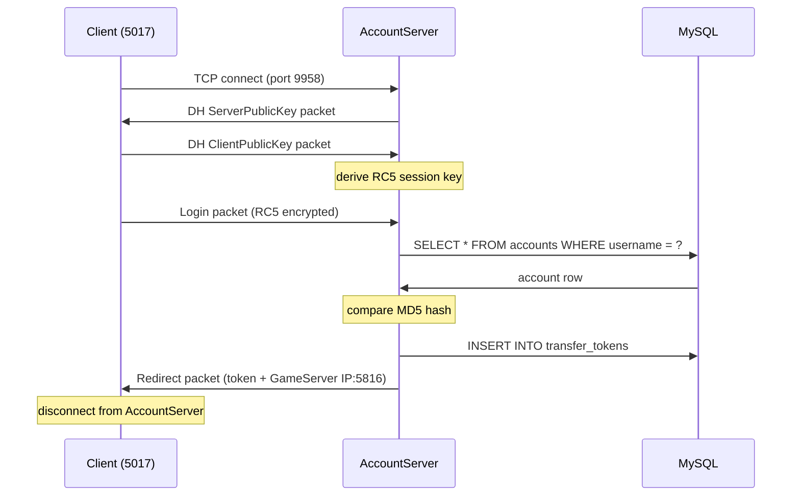
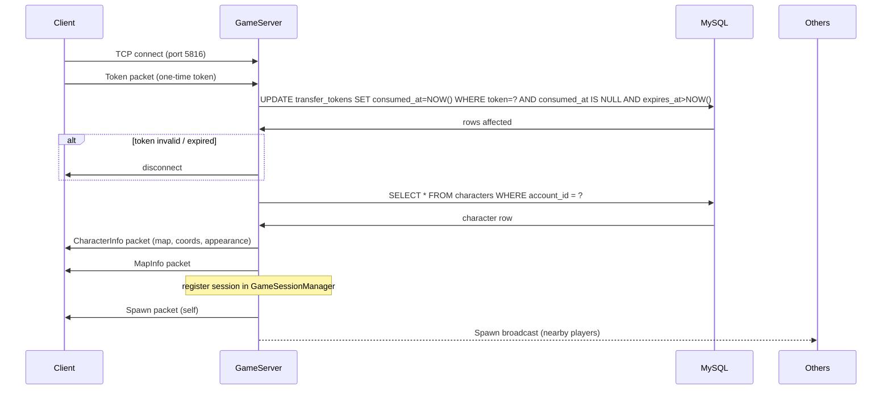
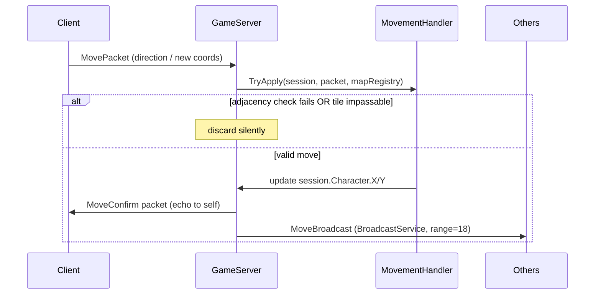

# Design: Conquer Online Private Server — Milestone 1

## Overview

Two .NET 8 console processes (`AccountServer`, `GameServer`) share a `Common` library for packet framing, crypto abstractions, and Dapper helpers. Token handoff between processes uses a MySQL `transfer_tokens` table with an atomic consume via `UPDATE … WHERE consumed_at IS NULL`. The packet cipher is abstracted behind `ICipher` so GameServer can ship with `NullCipher` until the 5017 encryption behavior is confirmed.

---

## Solution Structure

```
ConquerServer.sln
├── src/
│   ├── AccountServer/          # Auth process — DH handshake, RC5, login, token issue
│   │   └── AccountServer.csproj
│   ├── GameServer/             # Game process — session, character, map, movement, broadcast
│   │   └── GameServer.csproj
│   └── Common/                 # Shared library (no process entry point)
│       ├── Packets/            # PacketFramer, base packet types, serialization helpers
│       ├── Crypto/             # ICipher, DhKeyExchange, Rc5Cipher, NullCipher
│       ├── Db/                 # DapperConnectionFactory, migration runner
│       ├── Config/             # ServerConfig models (bound from appsettings.json / env)
│       └── Common.csproj
├── data/                       # GITIGNORED — .dmap files, community SQL dump
│   └── README.md               # Documents where to source and place game data files
├── docker/
│   ├── account-server.Dockerfile
│   ├── game-server.Dockerfile
│   └── init/
│       └── 01-schema.sql       # CREATE TABLE + seed accounts/characters
└── docker-compose.yml
```

---

## Component Architecture

### TcpListener / ConnectionAcceptor

**Responsibility:** Accepts inbound TCP connections on the configured port and hands each off to an async per-connection handler loop. One acceptor per server process.

| Class | Purpose |
|-------|---------|
| `TcpConnectionAcceptor` | `TcpListener` wrapper; `AcceptTcpClientAsync` loop; spawns `Task` per client |
| `IConnectionHandler` | Interface: `HandleAsync(TcpClient, CancellationToken)` |

**Dependencies:** `TcpListener` (BCL), `ILogger`, `IConnectionHandler`

---

### PacketFramer

**Responsibility:** Reads length-prefixed packets from a `NetworkStream`, accumulates partial reads into an internal buffer, and yields complete `byte[]` payloads. Writes encrypted packets to the stream.

| Class | Purpose |
|-------|---------|
| `PacketFramer` | `ReadNextAsync()` → `byte[]`; `WriteAsync(byte[])` |

Wire format: `UInt16 LE length` (includes the 4-byte header) + `UInt16 LE type` + payload.

Partial read handling: maintain a `byte[8192]` ring buffer; read available bytes, wait for full length before surfacing the packet. Any read that would exceed `MaxPacketSize` (configurable, default 4096) causes connection close.

**Dependencies:** `NetworkStream`, `ICipher`, `ILogger`

---

### ICipher / DhRc5Cipher / NullCipher

**Responsibility:** Encrypts/decrypts packet byte arrays. Abstracted so GameServer can run with `NullCipher` until 5017 GameServer encryption is confirmed.

```csharp
public interface ICipher
{
    void Encrypt(Span<byte> data);
    void Decrypt(Span<byte> data);
}

public sealed class NullCipher : ICipher
{
    public void Encrypt(Span<byte> data) { }
    public void Decrypt(Span<byte> data) { }
}

public sealed class Rc5Cipher : ICipher
{
    public Rc5Cipher(ReadOnlySpan<byte> key) { ... }
    public void Encrypt(Span<byte> data) { ... }
    public void Decrypt(Span<byte> data) { ... }
}
```

**Dependencies:** None (pure computation)

---

### DhKeyExchange

**Responsibility:** Implements the Conquer Online 5017 DH variant — generates server keypair, serializes the server public key for the handshake packet, and derives the shared RC5 key from the client's public key response.

```csharp
public sealed class DhKeyExchange
{
    public byte[] ServerPublicKey { get; }
    public Rc5Cipher DeriveSessionCipher(ReadOnlySpan<byte> clientPublicKey);
}
```

**Dependencies:** `System.Security.Cryptography` (BigInteger arithmetic), `Rc5Cipher`

---

### AccountHandler

**Responsibility:** Drives the per-connection state machine for AccountServer: send DH public key → receive client public key → initialize RC5 → receive login packet → authenticate → issue token → send redirect.

| Class | Purpose |
|-------|---------|
| `AccountConnectionHandler` | Implements `IConnectionHandler`; orchestrates the auth flow |
| `LoginPacket` | Parsed DTO: `Username`, `PasswordMd5` |
| `RedirectPacket` | Serialized response: token bytes + GameServer IP + port |

**Dependencies:** `PacketFramer`, `DhKeyExchange`, `Rc5Cipher`, `AccountRepository`, `TokenService`, `ILogger`

---

### TokenService

**Responsibility:** Issues and atomically validates one-time transfer tokens backed by MySQL.

```csharp
public interface ITokenService
{
    Task<string> IssueAsync(int accountId, CancellationToken ct);
    // Returns accountId if valid and not yet consumed; null otherwise
    Task<int?> ConsumeAsync(string token, CancellationToken ct);
}
```

Issue: generate 128-bit `RandomNumberGenerator` token (hex string), `INSERT INTO transfer_tokens`.
Consume: `UPDATE transfer_tokens SET consumed_at = NOW() WHERE token = @token AND consumed_at IS NULL AND expires_at > NOW()` — `rows affected == 1` means success (atomic against concurrent claims).

**Dependencies:** Dapper, `MySqlConnection`, `ILogger`

---

### AccountRepository

**Responsibility:** MySQL read for account credential lookup.

```csharp
public interface IAccountRepository
{
    Task<Account?> FindByUsernameAsync(string username, CancellationToken ct);
}
```

**Dependencies:** Dapper, `MySqlConnection`

---

### GameSessionManager

**Responsibility:** Tracks all connected `GameSession` objects; map-partitioned for future spatial indexing. Provides iteration over sessions in a given map.

```csharp
public sealed class GameSessionManager
{
    public void Register(GameSession session);
    public void Unregister(GameSession session);
    // Returns all sessions on the same map as the given session
    public IReadOnlyList<GameSession> GetMapSessions(int mapId);
}
```

Internally: `ConcurrentDictionary<int /*mapId*/, ConcurrentDictionary<int /*charId*/, GameSession>>`. Linear scan within the map dictionary for M1 proximity queries; structure allows future spatial partitioning without changing callers.

**Dependencies:** None (pure in-memory)

---

### GameConnectionHandler

**Responsibility:** Per-connection state machine for GameServer: receive token → validate → load character → send spawn → enter movement loop.

| Class | Purpose |
|-------|---------|
| `GameConnectionHandler` | Implements `IConnectionHandler`; orchestrates game session lifecycle |
| `GameSession` | Mutable session state: `Account`, `Character`, `PacketFramer`, map position |

**Dependencies:** `PacketFramer`, `NullCipher` (or future `ICipher`), `TokenService`, `CharacterRepository`, `GameSessionManager`, `BroadcastService`, `MovementHandler`, `ILogger`

---

### CharacterRepository

**Responsibility:** MySQL CRUD for character data (load, create, save position).

```csharp
public interface ICharacterRepository
{
    Task<Character?> GetByAccountIdAsync(int accountId, CancellationToken ct);
    Task<int> CreateAsync(Character character, CancellationToken ct); // returns new id
    Task SavePositionAsync(int characterId, int mapId, ushort x, ushort y, CancellationToken ct);
}
```

**Dependencies:** Dapper, `MySqlConnection`

---

### MapRegistry + DmapParser

**Responsibility:** `DmapParser` reads `.dmap` binary files into an in-memory `GameMap`. `MapRegistry` loads all maps at startup and exposes passability queries by map ID.

```csharp
public sealed class GameMap
{
    public int MapId { get; }
    public bool IsPassable(int x, int y);
}

public sealed class MapRegistry
{
    public GameMap GetMap(int mapId);  // throws if not loaded
    public bool TryGetMap(int mapId, out GameMap map);
}

public static class DmapParser
{
    public static GameMap Parse(int mapId, Stream stream);
}
```

Startup: enumerate `data/maps/*.dmap`, parse each, register. On parse failure: log ERROR + `Environment.Exit(1)`.

**Dependencies:** `ILogger` (MapRegistry only)

---

### MovementHandler

**Responsibility:** Validates a movement request against adjacency rules and DMAP passability.

```csharp
public static class MovementHandler
{
    // Returns true and updates session position if valid; false = discard
    public static bool TryApply(GameSession session, MovePacket packet, MapRegistry maps);
}
```

Adjacency: `|newX - oldX| <= 1 && |newY - oldY| <= 1 && (newX, newY) != (oldX, oldY)` — 8-directional.

**Dependencies:** `MapRegistry`, `GameSession`

---

### BroadcastService

**Responsibility:** Sends a packet to all sessions in the same map within screen range of a given origin.

```csharp
public sealed class BroadcastService
{
    public Task BroadcastAsync(GameSession origin, byte[] packet, int range, CancellationToken ct);
    // Excludes origin from receiving its own broadcast
    public Task BroadcastToAsync(GameSession origin, byte[] packet, int range,
                                  bool includeSelf, CancellationToken ct);
}
```

M1 implementation: linear scan over `GameSessionManager.GetMapSessions(mapId)`, Chebyshev distance filter (`max(|dx|, |dy|) <= range`), send via each session's `PacketFramer.WriteAsync`.

**Dependencies:** `GameSessionManager`

---

### Docker / Infra

| File | Purpose |
|------|---------|
| `docker/account-server.Dockerfile` | Multi-stage: `dotnet publish` → `mcr.microsoft.com/dotnet/runtime:8.0` |
| `docker/game-server.Dockerfile` | Same pattern |
| `docker/init/01-schema.sql` | `CREATE TABLE` DDL + seed row for test account + character |
| `docker-compose.yml` | `mysql:8`, `account-server`, `game-server`; health checks; `depends_on` with condition |

Migration strategy: inline in `Program.cs` at startup using raw Dapper `Execute` of embedded SQL resource, idempotent (`CREATE TABLE IF NOT EXISTS`). No external migration framework for M1.

---

## Data Model

### `accounts`
| Column | Type | Notes |
|--------|------|-------|
| `id` | `INT UNSIGNED AUTO_INCREMENT PRIMARY KEY` | |
| `username` | `VARCHAR(32) NOT NULL` | `UNIQUE INDEX` |
| `password_hash` | `CHAR(32) NOT NULL` | MD5 hex; never logged |
| `created_at` | `DATETIME NOT NULL DEFAULT CURRENT_TIMESTAMP` | |

### `characters`
| Column | Type | Notes |
|--------|------|-------|
| `id` | `INT UNSIGNED AUTO_INCREMENT PRIMARY KEY` | |
| `account_id` | `INT UNSIGNED NOT NULL` | `UNIQUE INDEX` (one char per account, M1) |
| `name` | `VARCHAR(16) NOT NULL` | `UNIQUE INDEX` |
| `map_id` | `INT UNSIGNED NOT NULL DEFAULT 1002` | |
| `x` | `SMALLINT UNSIGNED NOT NULL` | |
| `y` | `SMALLINT UNSIGNED NOT NULL` | |
| `body` | `SMALLINT UNSIGNED NOT NULL` | Appearance |
| `hair` | `SMALLINT UNSIGNED NOT NULL` | Appearance |
| `class` | `TINYINT UNSIGNED NOT NULL` | |
| `level` | `TINYINT UNSIGNED NOT NULL DEFAULT 1` | |
| `updated_at` | `DATETIME NOT NULL DEFAULT CURRENT_TIMESTAMP ON UPDATE CURRENT_TIMESTAMP` | |

### `transfer_tokens`
| Column | Type | Notes |
|--------|------|-------|
| `token` | `CHAR(32) PRIMARY KEY` | 128-bit hex |
| `account_id` | `INT UNSIGNED NOT NULL` | `INDEX` |
| `expires_at` | `DATETIME NOT NULL` | `INDEX` |
| `consumed_at` | `DATETIME NULL DEFAULT NULL` | NULL = not yet used |

---

## Key Flows

### Auth Flow



### Game Session Flow



### Movement Flow



---

## Packet Layer Design

**Wire format** (all little-endian):
```
[ UInt16: total length (4 + payload bytes) ][ UInt16: packet type ][ ... payload ... ]
```

**PacketFramer read loop:**
1. Read until 4-byte header is buffered.
2. Parse `length` from header bytes 0–1.
3. Guard: `length < 4` or `length > MaxPacketSize` → close connection.
4. Read `length - 4` remaining payload bytes.
5. Return `byte[length]` (header + payload) to caller.
6. Caller passes slice through `ICipher.Decrypt` before parsing.

**Encryption pipeline:**

```
Read:   NetworkStream → raw bytes → ICipher.Decrypt → parse DTO
Write:  serialize DTO → byte[] → ICipher.Encrypt → NetworkStream
```

`ICipher` is injected into `PacketFramer` at construction. AccountServer creates `Rc5Cipher` after DH completes (replaces `NullCipher`). GameServer creates `NullCipher` for M1; a future patch swaps in the appropriate cipher once 5017 GameServer encryption is confirmed via protocol capture.

---

## Error Handling Strategy

| Scenario | Action | Log Level |
|----------|--------|-----------|
| Malformed / oversized packet | Close connection; catch in `PacketFramer.ReadNextAsync` | WARN |
| Unknown packet type | Log and discard; do not close | WARN |
| DB query exception | Close session; catch at handler level | ERROR |
| Missing/corrupt .dmap at startup | Log path + exception; `Environment.Exit(1)` | ERROR |
| Token expired | Close connection | INFO |
| Token already consumed | Close connection | INFO |
| Character name duplicate (create) | Send error packet; do not close | INFO |
| Abrupt client disconnect (socket reset) | Cleanup session; despawn broadcast | INFO |
| SIGTERM (graceful shutdown) | Final character position save for all active sessions; then exit | INFO |

---

## Configuration

All keys live in `appsettings.json`; any key may be overridden by environment variable (standard .NET `DOTNET_` / direct env var binding).

| Key | Default | Used By |
|-----|---------|---------|
| `ConnectionStrings:Default` | (required) | Both |
| `AccountServer:Port` | `9958` | AccountServer |
| `GameServer:Port` | `5816` | GameServer |
| `GameServer:PublicIp` | `127.0.0.1` | AccountServer (sent in redirect) |
| `TokenTtlSeconds` | `30` | AccountServer, GameServer |
| `CharacterSaveIntervalSeconds` | `60` | GameServer |
| `ScreenRangeTiles` | `18` | GameServer |
| `MapFilesPath` | `data/maps` | GameServer |
| `MaxPacketSize` | `4096` | Both |

---

## File Structure

### `src/Common/`
```
src/Common/Common.csproj
src/Common/Crypto/ICipher.cs
src/Common/Crypto/NullCipher.cs
src/Common/Crypto/Rc5Cipher.cs
src/Common/Crypto/DhKeyExchange.cs
src/Common/Packets/PacketFramer.cs
src/Common/Packets/PacketType.cs          # enum of known type IDs
src/Common/Db/DapperConnectionFactory.cs
src/Common/Db/MigrationRunner.cs
src/Common/Config/ServerConfig.cs
```

### `src/AccountServer/`
```
src/AccountServer/AccountServer.csproj
src/AccountServer/Program.cs
src/AccountServer/Handlers/AccountConnectionHandler.cs
src/AccountServer/Packets/LoginPacket.cs
src/AccountServer/Packets/RedirectPacket.cs
src/AccountServer/Repositories/AccountRepository.cs
src/AccountServer/Services/TokenService.cs
src/AccountServer/appsettings.json
```

### `src/GameServer/`
```
src/GameServer/GameServer.csproj
src/GameServer/Program.cs
src/GameServer/Handlers/GameConnectionHandler.cs
src/GameServer/Sessions/GameSession.cs
src/GameServer/Sessions/GameSessionManager.cs
src/GameServer/Packets/TokenPacket.cs
src/GameServer/Packets/CharacterInfoPacket.cs
src/GameServer/Packets/SpawnPacket.cs
src/GameServer/Packets/MovePacket.cs
src/GameServer/Packets/MoveConfirmPacket.cs
src/GameServer/Packets/DespawnPacket.cs
src/GameServer/Repositories/CharacterRepository.cs
src/GameServer/Services/TokenService.cs      # GameServer-side consume only
src/GameServer/Services/BroadcastService.cs
src/GameServer/Maps/DmapParser.cs
src/GameServer/Maps/GameMap.cs
src/GameServer/Maps/MapRegistry.cs
src/GameServer/Movement/MovementHandler.cs
src/GameServer/appsettings.json
```

### `tests/`
```
tests/Common.Tests/Common.Tests.csproj
tests/Common.Tests/Crypto/DhKeyExchangeTests.cs
tests/Common.Tests/Crypto/Rc5CipherTests.cs
tests/Common.Tests/Packets/PacketFramerTests.cs
tests/GameServer.Tests/GameServer.Tests.csproj
tests/GameServer.Tests/Maps/DmapParserTests.cs
tests/GameServer.Tests/Movement/MovementHandlerTests.cs
tests/Integration.Tests/Integration.Tests.csproj
tests/Integration.Tests/Auth/AuthFlowTests.cs    # Testcontainers MySQL
tests/Integration.Tests/Auth/TokenServiceTests.cs
```

### Infra
```
docker/account-server.Dockerfile
docker/game-server.Dockerfile
docker/init/01-schema.sql
docker-compose.yml
data/README.md                               # (gitignored: data/maps/, data/sql/)
.gitignore
README.md
ConquerServer.sln
```

---

## Test Strategy

### Unit Tests (`tests/Common.Tests`, `tests/GameServer.Tests`)

| Target | What to test |
|--------|-------------|
| `DhKeyExchange` | Shared secret equals reference value from known client/server keypair |
| `Rc5Cipher` | Round-trip encrypt→decrypt; known-plaintext vector from COServer Redux |
| `PacketFramer` | Single packet; partial reads across multiple chunks; oversized packet closes connection |
| `DmapParser` | Parse sample .dmap fixture; passability returns correct result at known coords |
| `MovementHandler` | Valid 8-dir moves accepted; diagonal > 1 step rejected; impassable tile rejected |

### Integration Tests (`tests/Integration.Tests`)

Uses `Testcontainers.MsSql` / `Testcontainers.MySql` to spin a real MySQL container.

| Scenario | Covers |
|----------|--------|
| Auth flow end-to-end | FR-2 through FR-6 |
| Token issue + same-token concurrent consume | FR-8 atomic race safety |
| Expired token rejected | AC-3.3 |

### Manual / Client Tests

1. Launch via `docker-compose up`.
2. Connect CO 5017 client to `127.0.0.1:9958`.
3. Log in with seeded credentials.
4. Verify character spawns in Twin City.
5. Walk in all 8 directions; verify smooth movement.
6. Open second client, verify both clients see each other's movement.

---

## Technical Decisions

| Decision | Options | Choice | Rationale |
|----------|---------|--------|-----------|
| Token storage | MySQL vs Redis vs named pipe | MySQL (`transfer_tokens`) | No extra infra; atomic `UPDATE` is sufficient for M1 concurrency |
| GameServer cipher | RC5 now vs NullCipher + interface | `NullCipher` + `ICipher` interface | 5017 GS encryption unconfirmed; interface allows zero-refactor swap |
| Broadcast data structure | Flat list vs map-partitioned dict | Map-partitioned `ConcurrentDictionary` | Linear scan within map is O(sessions_on_map) not O(total); future spatial index replaces inner structure only |
| DB access | EF Core vs Dapper | Dapper | Lighter weight; explicit SQL matches protocol-level mindset; COServer Redux convention |
| Migration approach | FluentMigrator / EF Migrations vs inline SQL | Inline idempotent SQL at startup | Zero external dependency; sufficient for M1 schema |
| Character save on shutdown | No save vs final save | Final save on SIGTERM | Prevents position rollback on clean restart; negligible complexity |

---

## Existing Patterns to Follow

- COServer Redux: `PacketReader` / `PacketWriter` structs over `Span<byte>` — prefer struct-based packet DTOs over classes to avoid heap allocations per packet.
- COServer Redux: DMAP header: 4-byte magic, then per-cell `CELL` structs with `Mask` bitfield; passability = `(cell.Mask & 1) == 0`.
- Standard .NET: `IHostedService` + `IHost` for `Program.cs` to get `ILogger`, `IConfiguration`, and graceful shutdown (`CancellationToken`) wired automatically.

---

## Unresolved Questions

- GameServer 5017 packet encryption: confirm via Wireshark capture against a known-good server before implementing the cipher swap.
- Community .dmap licensing: keep files out of Git; `data/README.md` must document exact extraction steps.
