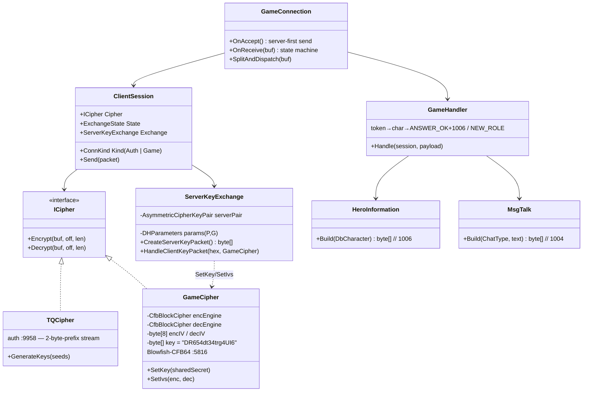
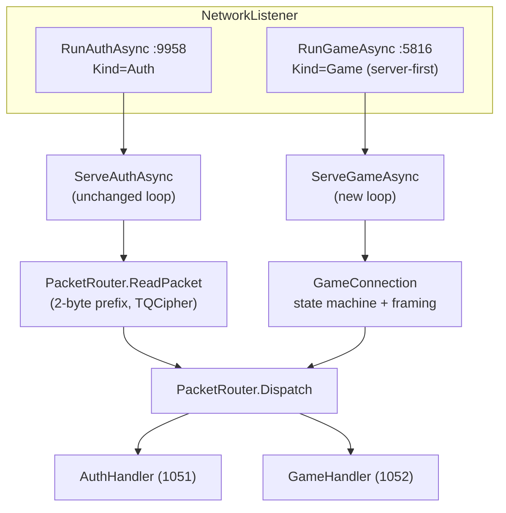
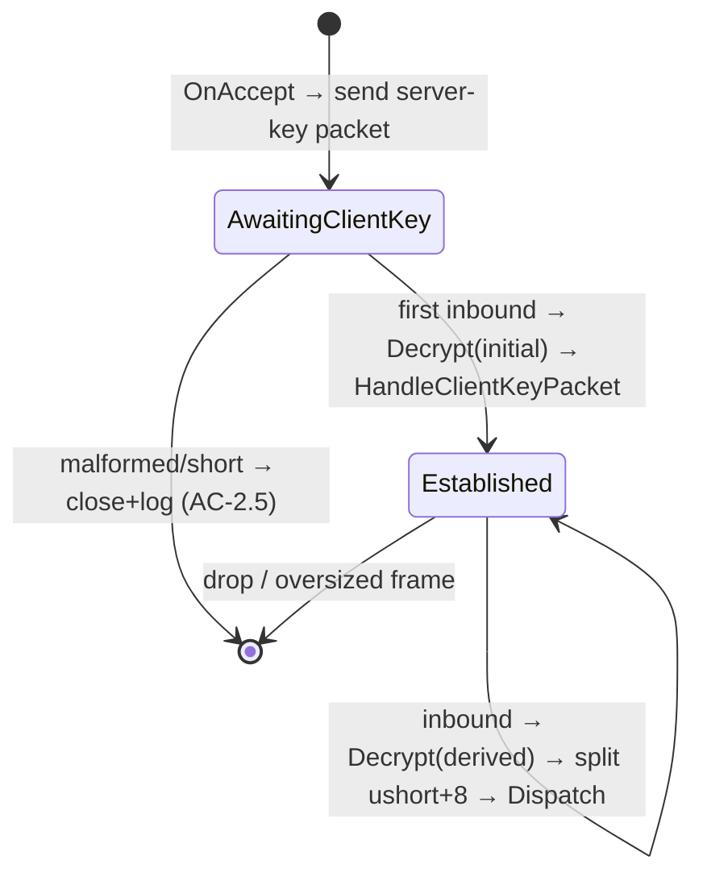

# Design: character-select

## Overview

Port the 5065 server-first DH key exchange + Blowfish-CFB64 game cipher (commit `0b094c6`, originally native ManagedOpenSsl) to **managed BouncyCastle** in `Conquer.Crypto`, then wire a **game-connection state machine** (`AwaitingClientKey`→`Established`) into the existing net8 stack via a new **`ICipher` abstraction**. Auth path (TQCipher, :9958) is untouched; the game path (:5816) sends the server-key packet on accept, derives the shared secret from the client reply, then handles `MsgConnect(1052)`→`ANSWER_OK`+`HeroInformation(1006)` for the seeded char. Enter-world is out of scope.

---

## Architecture (component / class)



---

## Game-connection sequence

```mermaid
sequenceDiagram
    participant C as 5065 Client
    participant L as NetworkListener (:5816)
    participant S as ClientSession (Game)
    participant X as ServerKeyExchange
    participant K as GameCipher
    participant H as GameHandler
    participant DB as CharacterRepository

    C->>L: TCP connect
    L->>S: new ClientSession(Kind=Game)
    L->>X: CreateServerKeyPacket()
    Note over X,K: DH GenerateKeys(P,G); pad/junk/IVs(0)/P/G/pubkey hex + "TQServer"
    L->>K: Encrypt(packet) under INITIAL key "DR654dt34trg4UI6"
    L->>C: server-key packet  (state=AwaitingClientKey)  [log: key sent]

    C->>S: client-key buffer
    S->>K: Decrypt(buf) under INITIAL key
    S->>X: HandleClientKeyPacket(pubKeyHex)
    X->>K: SetKey(sharedSecret) + SetIvs(0,0)  [KEY SWAP]
    Note over S: state=Established  [log: derived key]

    C->>S: MsgConnect(1052) (Blowfish, derived key)
    S->>K: Decrypt → split by ushort+8 seal
    S->>H: Handle(payload)
    H->>H: TokenStore.TryConsume(token)
    alt valid token
        H->>DB: FindByAccountId(accountId)
        alt char exists
            H->>C: MsgTalk(Entrance,"ANSWER_OK")  [+seal, Blowfish]
            H->>C: HeroInformation(1006)           [+seal, Blowfish]
            Note over C: leaves "loading" → char-select screen
        else no char
            H->>C: MsgTalk(Entrance,"NEW_ROLE")
        end
    else invalid/consumed
        H->>S: Disconnect + log (no char data)
    end
```

### Where it hooks into the net8 stack



---

## Components

### ICipher (new, `Conquer.Crypto`)
**Purpose**: cipher-agnostic read/write path. Minimal surface — only what both ciphers share.
```csharp
public interface ICipher {
    void Encrypt(byte[] data, int offset, int length);
    void Decrypt(byte[] data, int offset, int length);
}
```
- `TQCipher : ICipher` — already has `Encrypt/Decrypt(data,off,len)`; add `: ICipher`, leave `GenerateKeys` off the interface (cast where auth needs it; only `GameHandler` for game path uses key-swap on the game cipher). No behavior change → **NFR-2 regression safety** (auth path keeps calling the same methods).
- `GameCipher : ICipher` — Blowfish-CFB64; adds `SetKey/SetIvs` (not on `ICipher`; called only by `ServerKeyExchange`).

### GameCipher (new, `Conquer.Crypto`) — port of `GameCryptography`
**Purpose**: Blowfish-CFB64, byte-compatible with OpenSSL `Blowfish_CFB64`. **The load-bearing risk (NFR-1).**

| Field | Value |
|-------|-------|
| Algorithm | `CfbBlockCipher(new BlowfishEngine(), 64)` — **two persistent instances** (enc, dec), one per direction |
| Encrypt IV | `byte[8] _encIV` (server→client), starts zeroed |
| Decrypt IV | `byte[8] _decIV` (client→server), starts zeroed, **separate** from enc |
| Initial key | ASCII `"DR654dt34trg4UI6"` (16 bytes) — set in ctor |
| Key swap | `SetKey(byte[] sharedSecret)` re-inits both engines with new `KeyParameter` (CFB64 segment size preserved) |

**BouncyCastle mapping**:
```csharp
_encEngine = new CfbBlockCipher(new BlowfishEngine(), 64); // 64 = CFB SEGMENT bits (8 bytes)
_encEngine.Init(forEncryption:true,  new ParametersWithIV(new KeyParameter(key), _encIV));
_decEngine = new CfbBlockCipher(new BlowfishEngine(), 64);
_decEngine.Init(forEncryption:false, new ParametersWithIV(new KeyParameter(key), _decIV));
// process byte-by-byte to mirror OpenSSL CFB64 partial-block streaming:
for (int i=0;i<len;i++) engine.ProcessBytes/* via a 8-byte feedback buffer */;
```
**CFB-64 segment detail (NFR-1 / AC-3.5)**: OpenSSL `Blowfish_CFB64` is a self-feedback CFB with **64-bit (8-byte) feedback** processed a byte at a time. BouncyCastle's `CfbBlockCipher(engine, 64)` uses a 64-bit feedback register and exposes `ProcessBlock` over `blockSize/8 = 8` bytes; the cipher must **keep the same instance across packets** (running feedback register) and feed the **exact byte count** (no padding) so partial trailing blocks match OpenSSL. The KAT gates this before any client test.

**Documented fallback (Assumption A1)**: if BouncyCastle bytes diverge from the OpenSSL KAT, replace the engine with a **hand-rolled CFB64 loop** over a bare `BlowfishEngine` (ECB-encrypt the 8-byte IV register → XOR keystream byte into plaintext → shift ciphertext byte into the register; per-direction register persists). This is the canonical CFB64 algorithm and is byte-defined, removing the BouncyCastle-mode ambiguity. Same `ICipher` surface either way.

### ServerKeyExchange (new managed impl, `Conquer.Crypto`) — port of `0b094c6`
**Purpose**: DH(P,G) key gen + exact server-key packet + client-key parse → derive secret → swap cipher key.

Constants (verbatim from source):
```
P = "E7A69EBDF105F2A6BBDEAD7E798F76A209AD73FB466431E2E7352ED262F8C558F10BEFEA977DE9E21DCEE9B04D245F300ECCBBA03E72630556D011023F9E857F"
G = "05"   PAD_LENGTH=11   JUNK_LENGTH=12   TQSERVER="TQServer"
```

**BouncyCastle mapping**:
```csharp
var P = new BigInteger(Phex, 16); var G = new BigInteger(Ghex, 16);
var dhp = new DHParameters(P, G);
var gen = GeneratorUtilities.GetKeyPairGenerator("DH");
gen.Init(new DHKeyGenerationParameters(new SecureRandom(), dhp));
_pair = gen.GenerateKeyPair();
var agree = AgreementUtilities.GetBasicAgreement("DH");  // DHBasicAgreement
agree.Init(_pair.Private);
// server public key, sent as uppercase hex:
string pubHex = ((DHPublicKeyParameters)_pair.Public).Y.ToString(16).ToUpperInvariant();
// derive:
var clientPub = new DHPublicKeyParameters(new BigInteger(clientHex, 16), dhp);
byte[] secret = agree.CalculateAgreement(clientPub).ToByteArrayUnsigned(); // AC-2.2 / A3
```

**CreateServerKeyPacket byte layout** (AC-1.2 corrected offsets — 7×4-byte ints = 28 overhead; `size = 28 + PAD(11) + JUNK(12) + clientIV(8) + serverIV(8) + P.Len(128) + G.Len(2) + pubKey.Len + 8`):

| Offset | Field | Bytes |
|--------|-------|-------|
| 0 | pad (random) | 11 |
| 11 | `size - PAD_LENGTH` (int LE) | 4 |
| 15 | JUNK_LENGTH (int = 12) | 4 |
| 19 | junk (random) | 12 |
| 31 | clientIV.Length (int = 8) | 4 |
| 35 | clientIV (zeros) | 8 |
| 43 | serverIV.Length (int = 8) | 4 |
| 47 | serverIV (zeros) | 8 |
| 55 | P.Length (int = 128) | 4 |
| 59 | P (ASCII hex, 128) | 128 |
| 187 | G.Length (int = 2) | 4 |
| 191 | G (ASCII "05") | 2 |
| 193 | pubKey.Length (int) | 4 |
| 197 | pubKey (ASCII hex) | var |
| end | "TQServer" trailer | 8 |

P/G/pubKey are **uppercase ASCII hex strings**, not raw bytes (AC-1.3). Packet is then `GameCipher.Encrypt`-ed under the **initial** key before send (AC-1.1).

**HandleClientKeyPacket** — parse per original `CompleteExchange` framing (AC-2.1): after Blowfish-decrypt under initial key, read `length@7(int)`, `junk@11(int)`, `pubKeyLen@(15+junk)(int)`, `pubKey@(19+junk)` as ASCII hex. Then `secret = CalculateAgreement(clientPub)`, `cipher.SetKey(secret)`, `cipher.SetIvs(clientIV, serverIV)` (both zero), advance `State=Established` (AC-2.3).

### GameConnection state machine + framing (new, `Redux`)
**Purpose**: server-first send, route first reply to exchange, then Blowfish framing with 8-byte seal. **Distinct from auth's `ReadPacket`** (AC-4.2/4.3).



**Inbound (Established)**: read available bytes → `GameCipher.Decrypt(whole buffer)` → split: at each offset `bodyLen = ReadUInt16LE(ptr+offset)`, frame size = `bodyLen + 8` (the 8-byte seal), `typeId = ReadUInt16LE(ptr+offset+2)` → `Dispatch(session, typeId, frame)`. **Header length field = `size - 8`** (confirmed in `PacketBuilder.AppendHeader`), i.e. it already excludes the seal, so `+8` recovers the full frame. NOT the auth 2-byte-prefix/TQCipher stream model.

**Outbound (post-Established)**: builders allocate `len + 8`; the last 8 bytes are stamped with `SERVER_SEAL`("TQServer"); then `GameCipher.Encrypt(whole buffer)`; then write (AC-4.1). Pre-Established (the server-key packet) carries its own "TQServer" trailer already and is encrypted under the initial key.

### GameHandler (modify, `Conquer.Packets`) — char flow
Already validates token via `TokenStore.TryConsume`. Changes:
- Remove the TQCipher `GenerateKeys` call (game path uses Blowfish, key already swapped by exchange).
- On valid token + char: `session.Send(MsgTalk.Build(ChatType.Entrance, "ANSWER_OK"))` then `session.Send(HeroInformation.Build(char))` (AC-6.1). `session.Send` applies seal + Blowfish.
- On no char: `MsgTalk.Build(ChatType.Entrance, "NEW_ROLE")` (AC-7.1); **no create handler** (AC-7.2).
- `ChatType.Entrance` = **2101** (`enum ChatType: ushort`, `Register = Talk(2000)+100 = 2100`, `Entrance` = next = 2101). Define a minimal `ChatType` enum in the net8 packet layer with `Entrance = 2101`.

### MsgTalk (new, `Conquer.Packets`) — port of `[1004]Talk`
Layout: `header(4: len=size-8, type=1004)`, `Color@4(uint=0x00FFFFFF)`, `Type@8(ushort ChatType)`, `Unknown0@10`, `Time@12`, `HearerLookface@16`, `SpeakerLookface@20`, `NetStringPacker@24` = [Speaker="SYSTEM", Hearer="ALLUSERS", Emotion="", Words=text]. Total `24 + packer.Length + 8` (seal). Reuse the ported `NetStringPacker`.

### HeroInformation (new, `Conquer.Packets`) — port of `[1006]` (AC-6.2)
Layout (original offsets, NOT `MsgUserInfo.Build`):

| Offset | Field | Type | DbCharacter mapping (AC-6.3) |
|--------|-------|------|------------------------------|
| 0 | header (len=size-8, type=1006) | — | — |
| 4 | Id | uint | `CharacterID` |
| 8 | Lookface | uint | `Mesh` |
| 12 | Hair | ushort | `Avatar` |
| 14 | Money | uint | `Silver` |
| 18 | CP | uint | 0 (default) |
| 22 | Experience | u64 | 0 (default) |
| 50 | Strength | ushort | `Strength` |
| 52 | Agility | ushort | `Agility` |
| 54 | Vitality | ushort | `Vitality` |
| 56 | Spirit | ushort | `Spirit` |
| 58 | Stats (extra) | ushort | 0 |
| 60 | Life | ushort | `HealthPoints` |
| 62 | Mana | ushort | `ManaPoints` |
| 64 | PKPoints | short | 0 |
| 66 | Level | byte | `Level` |
| 67 | Class | byte | 0 (default) |
| 69 | Reborn | byte | 0 |
| 70 | ShowName | byte | 1 |
| 71 | NetStringPacker | — | [Name, Spouse=""] |
| end | seal | 8 | "TQServer" |

Total `71 + strings.Length + 8`. Bytes 30–49 / 68 left zero (unknown in original).

### NetStringPacker + PacketBuilder helpers (new, `Conquer.Packets`)
Port `NetStringPacker.ToArray()` (`[count][len][bytes]...`) and `PacketBuilder.AppendHeader` (`*(ushort)ptr = size-8; *(ushort)(ptr+2)=type`). Managed `Span`/`BinaryPrimitives` rewrite (no `MSVCRT.memcpy`/unsafe required).

---

## Technical Decisions

| Decision | Options | Choice | Rationale |
|----------|---------|--------|-----------|
| Crypto provider | ManagedOpenSsl (native) / BouncyCastle / hand-roll | **BouncyCastle** | Managed-only (NFR-5); has BlowfishEngine+CfbBlockCipher(64)+DH; KAT-gated |
| CFB64 impl | BouncyCastle `CfbBlockCipher(64)` / hand-rolled loop | **BouncyCastle, fallback hand-rolled** | Try library first; A1 KAT decides; fallback is byte-defined |
| Cipher integration | branch on `is TQCipher` / **`ICipher` interface** | **ICipher** | Cipher-agnostic read/write; auth untouched (NFR-2) |
| Game read loop | reuse `ReadPacket` / **separate `GameConnection`** | **Separate** | Server-first + Blowfish whole-buffer + `+8` seal incompatible with 2-byte-prefix stream (AC-4.2) |
| Auth vs game dispatch | sniff bytes / **listener-port flag** | **`ConnKind` from listener** | Deterministic; set at accept (AC-4.3) |
| Crypto tests host | ClientPatcher.Tests / **new `Crypto.Tests`** | **New `Crypto.Tests` in Conquer.sln** | No game test project exists; NFR-4 `scripts/dotnet test` target |
| DH secret → key | truncate/pad / **`ToByteArrayUnsigned()` as-is** | **As-is (A3)** | Matches original; verify via round-trip + client |
| Char-select packet | `MsgUserInfo.Build` (guessed) / **ported 1006** | **Ported 1006** | Proven 5065 layout (AC-6.2) |

---

## File Structure

| File | Action | Purpose | Traces |
|------|--------|---------|--------|
| `src/Crypto/Crypto.csproj` | Modify | Add `BouncyCastle.Cryptography` PackageReference | FR-4, NFR-5 |
| `src/Crypto/ICipher.cs` | Create | Cipher abstraction | FR-6, AC-4.3 |
| `src/Crypto/TQCipher.cs` | Modify | `: ICipher` (signatures already match) | FR-7, NFR-2 |
| `src/Crypto/GameCipher.cs` | Create | Blowfish-CFB64 (BouncyCastle), 2 IVs, key swap | FR-3, US-3 |
| `src/Crypto/ServerKeyExchange.cs` | Create | Managed DH; server-key packet; client-key parse | FR-1, FR-2, US-1, US-2 |
| `src/Redux/Cryptography/BlowfishExchange.cs` | **No change (leave as-is)** | M1 net8 stub in namespace `Redux.Cryptography`; still referenced by dead-but-compiled `Player.cs:24,313` / `GameServer.cs` — **deleting breaks the build**. New impl is `Conquer.Crypto.ServerKeyExchange` (different namespace, no conflict); the stub stays as dead code. | FR-1 |
| `src/Redux/Cryptography/GameCryptographer.cs` | **No change (leave as-is)** | M1 net8 stub `Redux.Cryptography.GameCryptography`; referenced by dead `Player.cs:23,25,312` — deleting breaks the build. New impl is `Conquer.Crypto.GameCipher`; stub stays as dead code. | FR-3 |
| `src/Redux/GameConnection.cs` | Create | Game state machine + framing (server-first, split `+8`) | FR-5, FR-8, US-4 |
| `src/Network/ClientSession.cs` | Modify | `ICipher Cipher`; `ConnKind Kind`; `ExchangeState`; `ServerKeyExchange`; seal-aware game `Send` | FR-5, FR-6 |
| `src/Redux/NetworkListener.cs` | Modify | `RunGameAsync` → server-first send + `ServeGameAsync` loop; `RunAuthAsync` unchanged | FR-1, FR-6, FR-8 |
| `src/Redux/PacketRouter.cs` | Modify | Keep auth `ReadPacket`; expose `Dispatch` for game frames | FR-6, FR-7 |
| `src/Packets/MsgConnect.cs` (GameHandler) | Modify | Drop TQCipher key-gen; send ANSWER_OK+1006 / NEW_ROLE | FR-9, FR-10, FR-11 |
| `src/Packets/HeroInformation.cs` | Create | 1006 builder (original layout + mapping) | FR-10, AC-6.2/6.3 |
| `src/Packets/MsgTalk.cs` | Create | 1004 builder, ChatType.Entrance | FR-10, FR-11 |
| `src/Packets/NetStringPacker.cs` | Create | `[count][len][bytes]` packer | FR-10 |
| `src/Packets/PacketBuilder.cs` | Create | `AppendHeader (len=size-8)` helper | FR-10 |
| `src/Packets/ChatType.cs` | Create | enum w/ `Entrance=2101` | FR-10/11 |
| `src/Crypto.Tests/Crypto.Tests.csproj` | Create | xUnit test project | FR-13, FR-14 |
| `src/Crypto.Tests/BlowfishCfb64Tests.cs` | Create | KAT + round-trip | FR-13, AC-3.5 |
| `src/Crypto.Tests/DhExchangeTests.cs` | Create | DH agree + packet-layout assertion | FR-14, US-2 |
| `src/Conquer.sln` | Modify | Add `Crypto.Tests` project | NFR-4 |
| `src/docker-compose.yml` | No change | Committed default is already `127.0.0.1`; the `192.168.0.252` is an uncommitted operator-local override — already matches Decision #2 | Decision #2 |

---

## Error Handling

| Scenario | Strategy | Impact / Trace |
|----------|----------|----------------|
| Malformed/short client-key buffer (`len <= 36`) | Catch in `HandleClientKeyPacket`/`GameConnection`; close session + log; listener loop survives | Client dropped; server fine (AC-2.5, NFR-3) |
| Invalid/already-consumed token | `TryConsume` false → log + Disconnect; **no char data sent** | AC-5.3 |
| BouncyCastle bytes ≠ OpenSSL KAT | KAT fails in CI → switch `GameCipher` engine to hand-rolled CFB64 loop | A1 fallback; blocks client test until green |
| Oversized/garbled frame (`size > buffer`) | Disconnect + log; do not partial-dispatch | NFR-3 |
| Connection drop mid-exchange | `EndOfStream`/`IOException` → finally Disconnect (existing pattern) | Clean |
| DH secret leading-zero length quirk | `ToByteArrayUnsigned()` as-is (A3); KAT/round-trip flags if client rejects | US-2 |

## Edge Cases
- **Both IVs zero at start** (sent zeroed in packet) — enc/dec engines init with zero IV; AC-3.3.
- **Partial TCP reads on game socket** — accumulate until at least one full `ushort+8` frame; decrypt is stream-stateful so buffer boundaries must align with cipher feedback (read-then-decrypt the contiguous chunk once).
- **Multiple frames in one buffer** — loop split by `bodyLen+8` (original `OnReceive`).
- **Auth regression** — auth uses `ClientSession.Cipher` (now `ICipher`) via the unchanged `ReadPacket`; signatures identical, so :9958 login must still succeed (NFR-2 explicit check).

---

## Test Strategy

### Unit (CI, `scripts/dotnet test`)
| Test | Asserts | Trace |
|------|---------|-------|
| `BlowfishCfb64_KAT` | Managed cipher output == OpenSSL `Blowfish_CFB64` reference vector, **byte-for-byte** | NFR-1, AC-3.5, FR-13 |
| `BlowfishCfb64_RoundTrip` | `Decrypt(Encrypt(x)) == x` with persistent instances across multiple calls (feedback continuity) | AC-3.2, FR-13 |
| `Dh_RoundTrip` | Two `ServerKeyExchange` instances (server+simulated client) over `DHParameters(P,G)` derive the **same** secret | US-2, FR-14 |
| `ServerKeyPacket_Layout` | Assert corrected offsets: int@11/15, IV lens@31/43, P.Len@55=128, P@59, G.Len@187=2, G@191="05", pubKeyLen@193, "TQServer"@end | AC-1.2, FR-1 |
| `Auth_Regression` (smoke) | TQCipher via `ICipher` produces identical bytes to pre-refactor (golden vector) | NFR-2, AC-4.4 |

**KAT source** (in priority order — must be an OpenSSL-equivalent ground truth, NOT another managed impl): (1) generate the vector with the `openssl` CLI (`enc -bf-cfb`, or a tiny `Blowfish_CFB64` program) — key `"DR654dt34trg4UI6"`, IV zeros, a fixed plaintext — and embed the hex; OR (2) capture a real server-key-packet/handshake byte vector from the original (pre-M1) server output. Do NOT validate solely against a second managed CFB64 lib (circular — proves internal consistency, not OpenSSL byte-compat). The hand-rolled CFB64 fallback (A1) is byte-defined and is the de-risk if BouncyCastle diverges. Document the chosen source in the test file. **Gate A1 before any client test.**

### Integration / Manual (out of CI — AC-6.4)
Operator points the real Windows 5065 client at the server LAN IP; success = leaves "loading" and renders the selectable seeded char `Vitor`. Server-side progress signals via diagnostic logs (FR-12): `server-key packet sent (len=N)` → `CompleteExchange derived key` → `[Game] Connect accountId=…` → `ANSWER_OK + 1006 sent`.

---

## Build / Verify

```bash
scripts/dotnet build src/Conquer.sln          # NFR-4, NFR-5 (managed-only output)
scripts/dotnet test  src/Conquer.sln          # FR-13/14 KAT + DH + auth regression
docker compose -f src/docker-compose.yml up -d --build   # operator run
docker compose -f src/docker-compose.yml logs -f server  # handshake stage logs
```
Server runs on the operator LAN host (e.g. 192.168.0.252) via docker compose; `GameServer__Ip` must be the reachable LAN IP for the post-auth handoff — supplied as an **env/compose override**, not committed (see Unresolved).

---

## Performance / Security
- **Performance**: per-connection persistent cipher instances (no per-packet re-init); negligible for char-select traffic.
- **Security**: cipher is interop-only (not real security — same caveat as TQCipher). Token is single-use via `TryConsume`. No personal IP committed.

## Existing Patterns to Follow
- `ClientSession.Send` already encrypts whole buffer from offset 0 — game `Send` mirrors this, adding seal-stamp first.
- `PacketBuilder.AppendHeader` convention: length field = `size - 8` (whole frame incl. seal minus seal) — reuse exactly.
- Manual DI in `Program.cs`; diagnostic `Console.WriteLine` logging (FR-12).
- xUnit test project pattern from `ClientPatcher.Tests`.

---

## Traceability

| Component / Section | FR / NFR | US | AC |
|---------------------|----------|----|----|
| ServerKeyExchange.CreateServerKeyPacket | FR-1 | US-1 | AC-1.1–1.4 |
| ServerKeyExchange.HandleClientKeyPacket | FR-2 | US-2 | AC-2.1–2.5 |
| GameCipher (Blowfish-CFB64) | FR-3, FR-4, NFR-1, NFR-5 | US-3 | AC-3.1–3.5 |
| ICipher abstraction | FR-6, FR-7, NFR-2 | US-4 | AC-4.3, AC-4.4 |
| GameConnection framing/state machine | FR-5, FR-8, NFR-3 | US-4, US-1, US-2 | AC-4.1–4.3, AC-2.5 |
| Listener game-path / server-first | FR-1, FR-6, FR-8 | US-1, US-4 | AC-1.1, AC-4.3 |
| GameHandler char flow | FR-9, FR-10, FR-11 | US-5, US-6, US-7 | AC-5.1–5.5, AC-6.1, AC-7.1 |
| HeroInformation (1006) | FR-10 | US-6 | AC-6.2, AC-6.3 |
| MsgTalk (1004) ANSWER_OK/NEW_ROLE | FR-10, FR-11 | US-6, US-7 | AC-6.1, AC-7.1 |
| Diagnostic logs | FR-12, NFR-6 | — | AC-1.4, AC-2.4, AC-5.5 |
| Crypto.Tests (KAT/DH/layout/auth) | FR-13, FR-14, NFR-1, NFR-2, NFR-4 | US-2, US-3 | AC-3.5 |
| Manual operator verification | NFR-6 | US-6 | AC-6.4 |

---

## Unresolved Questions
- **GameServer__Ip — RESOLVED (no action):** verified the COMMITTED value on this branch is already `127.0.0.1`; the `192.168.0.252` is only an uncommitted operator-local working-tree override. This already satisfies LOCKED decision #2 — no revert needed. Just keep documenting the LAN-IP-via-local-override requirement; never commit a personal IP.
- **A1 (BouncyCastle CFB64 == OpenSSL bytes)** — unverified until KAT runs; fallback path designed but not yet proven.
- **A2 (client pubkey is ASCII hex)** / **A4 (1006 alone clears "loading")** — confirmable only against the live client (AC-6.4).

## Implementation Steps
1. Add BouncyCastle to `Crypto.csproj`; create `ICipher.cs`; make `TQCipher : ICipher`.
2. Implement `GameCipher` (CfbBlockCipher(64), 2 instances, initial key, SetKey/SetIvs).
3. Create `Crypto.Tests` project (add to `Conquer.sln`); write Blowfish-CFB64 **KAT** + round-trip — **gate A1 now**; switch to hand-rolled CFB64 if it fails.
4. Implement `ServerKeyExchange` (DHParameters P/G, GenerateKeys, CreateServerKeyPacket exact layout, HandleClientKeyPacket); add DH round-trip + packet-layout tests.
5. Add `ConnKind`/`ExchangeState`/`ICipher`/`ServerKeyExchange` to `ClientSession`; add seal-aware game `Send`.
6. Add `GameConnection` (server-first send on accept, AwaitingClientKey→Established, decrypt+split `+8`); wire `RunGameAsync`/`ServeGameAsync` in `NetworkListener`; leave `RunAuthAsync`/`ReadPacket` untouched.
7. Port `NetStringPacker`, `PacketBuilder`, `ChatType(Entrance=2101)`, `MsgTalk`, `HeroInformation(1006)` into `Conquer.Packets`.
8. Update `GameHandler`: drop TQCipher key-gen; token valid + char → ANSWER_OK + 1006; no char → NEW_ROLE.
9. (No code change for `GameServer__Ip` — committed default already `127.0.0.1`.) Document the LAN-override requirement in operator notes.
10. `scripts/dotnet build/test src/Conquer.sln`; verify auth regression green; then operator manual client test (AC-6.4).
