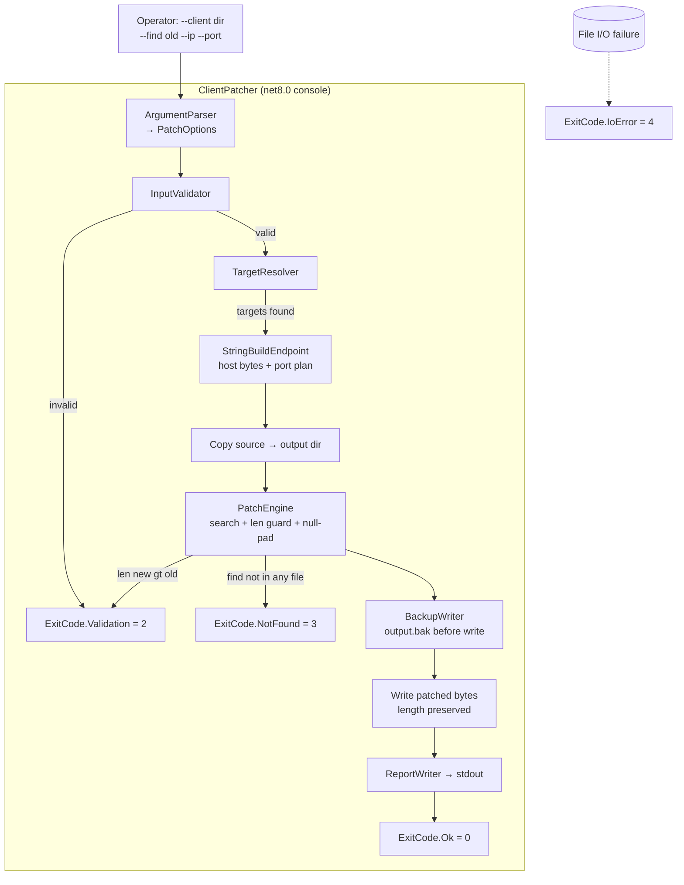
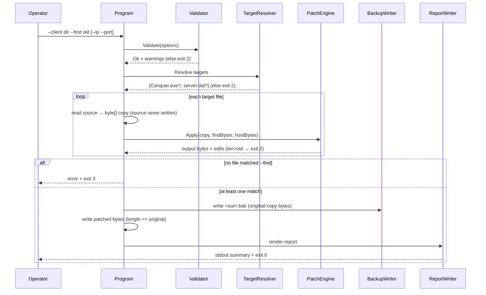

# Design: client-patcher

## Overview

Cross-platform `net8.0` console CLI that repoints a CO 5065 client's **auth/login endpoint only** (default `127.0.0.1:9958`) by ASCII byte-rewriting an operator-supplied `--find` string inside a **copy** of `Conquer.exe` and/or `server.dat`. Pure byte-rewriter — no injection, no process launch, never sets the game IP, never extends file length, never mutates the source. New isolated `src/ClientPatcher/` + `src/ClientPatcher.Tests/` projects with their own `ClientPatcher.sln`, kept off the Linux server runtime path (no Crypto/Database/Network/Packets/Redux refs).

## Architecture



Trace: FR-1/FR-2/FR-11 (rewriter, auth-only, no injection) · FR-3/FR-4 (CLI surface + defaults) · FR-5 (validate) · FR-6 (replace rule) · FR-7 (resolve targets) · FR-8 (backup) · FR-9 (report) · FR-12 (exit codes).

## Components

### 1. ArgumentParser → PatchOptions (FR-3, FR-4)

Hand-rolled parser. Zero NuGet. Recognizes `--client`, `--find`, `--ip`, `--port`, `--out`, `--help`/`-h`. Unknown flag → validation error. `--help` prints usage + all flags and exits 0.

```csharp
public sealed class PatchOptions
{
    public string ClientDir;          // --client  (required)
    public string Find;               // --find    (required, ASCII)
    public string Ip   = "127.0.0.1"; // --ip      (default, AC-1.2/FR-4)
    public int    Port = 9958;        // --port    (default, AC-1.2/FR-4)
    public string OutDir;             // --out     (default: <ClientDir>/patched)
    public bool   ShowHelp;           // --help/-h
}

public static class ArgumentParser
{
    // Throws ArgParseException (→ ExitCode.Validation) on malformed flags.
    public static PatchOptions Parse(string[] args);
    public static string UsageText();
}
```

### 2. InputValidator (FR-5 · AC-4.1/4.2/4.3)

Validates BEFORE any file touched. Collects all errors, returns a result.

```csharp
public sealed class ValidationResult
{
    public bool   Ok;
    public IReadOnlyList<string> Errors;
    public IReadOnlyList<string> Warnings; // e.g. LAN-IP warning
}

public static class InputValidator
{
    public static ValidationResult Validate(PatchOptions o);
    public static bool IsValidIpv4(string s);        // AC-4.1
    public static bool IsValidHostname(string s);    // AC-4.1 (RFC-1123 label rules)
    public static bool IsPrivateLanIpv4(string s);   // AC-5.1 → warning
}
```

Rules:
- `--ip`: valid IPv4 **or** hostname, else error (AC-4.1).
- `--port`: integer `1..65535`, else error (AC-4.2).
- `--client`: dir exists AND contains at least one of `Conquer.exe` / `server.dat`, else error (AC-4.3).
- `--find`: non-empty, pure ASCII (`0x20..0x7E`); non-ASCII → error with v1 ASCII-only note.
- LAN IP (`10.*`, `192.168.*`, `172.16–31.*`, `127.*` loopback excluded from warning) → **warning** (AC-5.1), not error.

### 3. TargetResolver (FR-7 · AC-3.2)

Resolves which target files exist under `--client`.

```csharp
public sealed record TargetFile(string Name, string SourcePath, string OutputPath);

public static class TargetResolver
{
    // Returns 1-2 entries for Conquer.exe / server.dat that exist on disk.
    public static IReadOnlyList<TargetFile> Resolve(PatchOptions o);
}
```

Names matched case-insensitively (Windows artifacts on a Linux/macOS host).

### 4. EndpointBuilder — new-string construction (FR-1, FR-2, FR-6 · the port caveat)

Builds the replacement byte payload from `--ip`/`--port`.

```csharp
public sealed class EndpointPlan
{
    public byte[] HostBytes;     // ASCII bytes of the new host (--ip value)
    public int?   Port;          // null unless co-located port slot is known
    public bool   PortApplied;   // false → report "port unchanged"
}

public static class EndpointBuilder
{
    public static EndpointPlan Build(PatchOptions o);
}
```

**How the replacement string is constructed (honest port handling):**
- The replacement payload = ASCII bytes of `--ip` (the **host** only). This is what gets written into the matched `--find` slot.
- **Port is NOT appended to the host string by default.** The auth port in a 5065 client is, per research, commonly stored *separately* from the host string (in `server.dat` or as an int near the IP), and its exact location is **per-build unknown** — resolvable only against a real client (research.md §"Binary patching", "is the port co-located"). 
- **Port-application rule (FR-6, requirements assumption (c)):** apply the port **only** when the matched slot is itself a co-located `host:port` token (i.e. the operator's `--find` string contains a `:port` suffix, proving co-location for *this* build). In that case the replacement = `<ip>:<port>`. Otherwise `PortApplied = false`, the host is patched, and the report explicitly states **"auth port left unchanged (not co-located in matched string for this build)"**.
- Game IP/port: never constructed, never written (FR-2 · AC-1.3).

This keeps v1 truthful: host is always patchable; port is best-effort and clearly reported either way.

### 5. PatchEngine — core search/replace (FR-6 · AC-3.1/3.3/3.4 · NFR-2/3/6)

The heart of the tool. Operates on an in-memory copy of the file bytes.

```csharp
public sealed record MatchEdit(int Offset, byte[] OldBytes, byte[] NewBytes);

public sealed class PatchResult
{
    public string FileName;
    public IReadOnlyList<MatchEdit> Edits; // one per occurrence
    public int  MatchCount;
}

public enum PatchError { None, FindNotFound, NewLongerThanOld }

public static class PatchEngine
{
    // Pure function: same bytes in → same bytes out (NFR-6).
    public static (byte[] output, PatchResult result, PatchError error)
        Apply(byte[] source, byte[] find, byte[] replacement);
}
```

Algorithm:
1. `len(replacement) > len(find)` → return `NewLongerThanOld`, no output (AC-3.3, FR-6).
2. ASCII byte-search `find` across `source`; collect **all** offsets (assumption (d): replace-all + collect offsets, AC-3.1).
3. Zero matches → `FindNotFound` (AC-3.2).
4. For each offset: clone source slot, write `replacement` bytes, then **null-pad** (`0x00`) bytes `len(replacement)..len(find)` of the slot (AC-3.4, FR-6). The original `--find` slot's trailing terminator is preserved by construction — we only overwrite within `[offset, offset+len(find))`, so any byte at `offset+len(find)` (the existing `\0` terminator / next field) is untouched.
5. Output buffer length == source length, always (NFR-3, AC-2.3) — we mutate in place, never insert/remove.

### 6. BackupWriter (FR-8 · AC-2.2)

```csharp
public static class BackupWriter
{
    // Writes <output>.bak with original-copy bytes BEFORE patched bytes land.
    public static string WriteBackup(string outputPath, byte[] originalCopyBytes);
}
```

Backup is of the **copied** file in the output dir (`<file>.bak`), written before the patched bytes are flushed. Source under `--client` is never opened for write (NFR-2, AC-2.1). Backup-collision handling: see Error Handling.

### 7. ReportWriter (FR-9 · AC-2.4 · NFR-7)

Human-readable plain text to stdout. No JSON, no `--json` (v1 decision).

```csharp
public static class ReportWriter
{
    public static void Write(TextWriter o,
        IReadOnlyList<PatchResult> results,
        IReadOnlyList<string> warnings,
        EndpointPlan endpoint);
}
```

Sample output:
```
ClientPatcher — auth endpoint repoint (auth-only; game IP never touched)

WARNING: 192.168.1.50 is a LAN/private IP. The client may reject it with
"Server.dat is damaged" and may require an additional manual exe hex patch
(not applied by v1). Prefer loopback 127.0.0.1.

File: Conquer.exe
  offset 0x0004A1C0  old "192.168.0.10\0"  ->  new "127.0.0.1\0\0\0\0"  (host)
  matches: 1
File: server.dat
  offset 0x00000120  old "192.168.0.10"    ->  new "127.0.0.1"          (host)
  matches: 1
Auth port: left unchanged (not co-located in matched string for this build).

Total files patched: 2   Total offsets changed: 2
Backups: patched/Conquer.exe.bak, patched/server.dat.bak
```

### 8. Program / Orchestrator (FR-12 · AC-1.3)

`Main` wires the pipeline and maps outcomes to exit codes.

```csharp
public enum ExitCode { Ok = 0, Validation = 2, NotFound = 3, IoError = 4 }
```

| Code | Meaning | Triggers |
|------|---------|----------|
| 0 | Success | At least one file patched, report written |
| 2 | Validation | Bad flag, invalid IP/hostname, bad port, missing client dir / no target file, non-ASCII `--find`, `len(new)>len(old)` |
| 3 | Not found | `--find` present in neither target file |
| 4 | IO error | Unreadable source, output write failure, backup write failure |

`--help` → exit 0. On any non-zero path, **no patched output is written** for the failing condition (validation/not-found short-circuit before write; IO error aborts the in-flight file before flush).

## Data Flow



1. Parse args → `PatchOptions` (defaults applied).
2. Validate; collect warnings (LAN-IP). Fail → exit 2, nothing written.
3. Resolve target files under `--client`. None → exit 2.
4. Read each target into an in-memory copy (source file never opened for write).
5. PatchEngine per file: length-guard, ASCII search-all, replace + null-pad.
6. If `--find` matched in **no** file → exit 3, nothing written.
7. Per matched file: write `<out>.bak`, then patched bytes (length-preserved).
8. ReportWriter → stdout. Exit 0.

## Technical Decisions

| Decision | Options | Choice | Rationale |
|----------|---------|--------|-----------|
| Project layout | extend Redux.sln / new sln | **dedicated `src/ClientPatcher.sln`** | Builds independently of Linux server; off server runtime path; no server deps |
| Server deps | reference Crypto/DB/Network | **none** | Pure byte-rewriter; keeps cross-platform + test-only |
| Arg parsing | NuGet (System.CommandLine) | **hand-rolled** | Zero new deps (repo is lean); 6 flags is trivial |
| Test framework | nUnit / MSTest / xUnit | **xUnit** | Only allowed new dep; modern default |
| Report format | JSON / text | **plain text stdout** | v1 decision; human-operator facing |
| Port handling | always append `:port` | **host-only unless `--find` proves co-location** | Per-build port location unknown; stay honest (FR-6 caveat) |
| Match mode | ASCII / wide UTF-16 | **ASCII only (v1)** | Documented limitation; wide deferred (assumption (b)) |
| Multiple matches | error / replace-all | **replace-all + report each offset** | Assumption (d); deterministic |
| Backup location | `*.bak` beside source / in out dir | **`<out>/<file>.bak`** | Source dir never written (NFR-2); assumption (a) |

## File Structure

| File | Action | Purpose |
|------|--------|---------|
| `src/ClientPatcher.sln` | Create | Independent solution (app + tests) |
| `src/ClientPatcher/ClientPatcher.csproj` | Create | net8.0, `OutputType=Exe`, `RootNamespace`/`AssemblyName=ClientPatcher`, `Nullable=enable`, no NuGet, no project refs |
| `src/ClientPatcher/Program.cs` | Create | Entrypoint; pipeline orchestration; exit-code mapping (§8) |
| `src/ClientPatcher/ArgumentParser.cs` | Create | Hand-rolled parser + `UsageText()` (§1) |
| `src/ClientPatcher/PatchOptions.cs` | Create | Options model + defaults (§1) |
| `src/ClientPatcher/InputValidator.cs` | Create | IP/hostname/port/dir/ASCII validation + LAN warning (§2) |
| `src/ClientPatcher/TargetResolver.cs` | Create | Conquer.exe / server.dat resolution (§3) |
| `src/ClientPatcher/EndpointBuilder.cs` | Create | Replacement-bytes + port plan (§4) |
| `src/ClientPatcher/PatchEngine.cs` | Create | Search/replace + len-guard + null-pad (§5) |
| `src/ClientPatcher/BackupWriter.cs` | Create | `<out>.bak` before write (§6) |
| `src/ClientPatcher/ReportWriter.cs` | Create | Plain-text stdout report (§7) |
| `src/ClientPatcher/ExitCode.cs` | Create | Exit-code enum (§8) |
| `src/ClientPatcher/README.md` | Create | Operator docs: usage, delete `tqantivirus`, AV exclusions, loopback preference, LAN hex-patch caveat, ASCII-only/port caveats |
| `src/ClientPatcher.Tests/ClientPatcher.Tests.csproj` | Create | net8.0, xUnit, `ProjectReference` to ClientPatcher |
| `src/ClientPatcher.Tests/PatchEngineTests.cs` | Create | Round-trip, len-guard, null-pad, not-found, no-collateral assertions |
| `src/ClientPatcher.Tests/InputValidatorTests.cs` | Create | IP/hostname/port/dir + LAN-warning substring |
| `src/ClientPatcher.Tests/ArgumentParserTests.cs` | Create | Flags, defaults, `--help`, unknown flag |
| `src/ClientPatcher.Tests/EndpointBuilderTests.cs` | Create | Host-only vs co-located `host:port`; game IP never produced |
| `src/ClientPatcher.Tests/Fixtures/FixtureFactory.cs` | Create | Builds synthetic stub `Conquer.exe` / `server.dat` byte arrays in-memory (no TQ assets) |

No TQ client assets vendored (NFR-5). Fixtures are synthetic byte arrays generated at test time.

## Error Handling

| Scenario | Strategy | User sees / exit |
|----------|----------|------------------|
| `--find` in neither file (AC-3.2) | Abort before any write | "search string not found in Conquer.exe or server.dat" · exit 3 |
| Multiple matches (assumption d) | Replace all; report each offset | All offsets listed in report · exit 0 |
| `len(new) > len(old)` (AC-3.3) | Reject before write | "new host 'X' (N bytes) longer than --find slot (M bytes)" · exit 2 |
| Invalid IP/hostname (AC-4.1) | Validator fails fast | "--ip 'X' is not a valid IPv4 or hostname" · exit 2 |
| Port out of range (AC-4.2) | Validator fails fast | "--port X must be 1..65535" · exit 2 |
| Missing client dir / no target (AC-4.3) | Validator fails fast | "client dir missing, or no Conquer.exe/server.dat found" · exit 2 |
| Non-ASCII `--find` | Validator fails fast | "--find must be ASCII (v1 limitation; wide/UTF-16 unsupported)" · exit 2 |
| Output dir already exists | Reuse dir; per-file overwrite of existing patched output | proceeds; report notes overwrite |
| Backup file collision (`*.bak` exists) | Overwrite the prior `.bak` (it is the original-source copy; deterministic) | proceeds; report lists backup path |
| Unreadable/missing source file | Catch IO exception | "could not read <file>: <reason>" · exit 4 |
| Output/backup write failure | Catch IO exception; abort that file before flushing patched bytes | "could not write <file>: <reason>" · exit 4 |

## Edge Cases

- **Zero-length `--find`**: rejected at validation (empty string) · exit 2.
- **`--find` longer than file**: search yields zero matches → not-found · exit 3.
- **Only one of the two targets present**: patch the present one; if `--find` matches it → success; if not → exit 3.
- **`--find` matches in one file but not the other**: success; report shows matched file only (assumption: not-found requires *both* to miss).
- **Match straddling end-of-file**: search bounded to `[0, len-len(find)]`; no out-of-range write (NFR-3).
- **`--find` contains a `:port` suffix**: triggers co-located port path in EndpointBuilder; replacement becomes `<ip>:<port>` if it fits the slot.
- **Non-ASCII / wide-string host in real client**: v1 ASCII-only; documented limitation in README + validator error. Wide UTF-16 deferred to v2 (assumption b).
- **LAN IP supplied**: warning emitted, patch still proceeds (AC-5.1/5.2; no auto-hex-patch).

## Test Strategy

xUnit + **synthetic in-memory fixtures** (NFR-4, AC-6.2). No real `Conquer.exe`. `FixtureFactory` builds byte arrays: a stub "exe" with a known placeholder host string (e.g. `OLD_AUTH=192.168.0.10\0` embedded among filler bytes) and a stub `server.dat` with a host token.

### Unit Tests (PatchEngineTests)
- **Round-trip patch** (AC-1.1/AC-3.1): replace placeholder → assert matched bytes == new host + null-pad; reverse-replace restores original.
- **Length-too-long rejection** (AC-3.3): `replacement` longer than `find` → `PatchError.NewLongerThanOld`, output null/unchanged.
- **Null-pad / shorter** (AC-3.4): shorter replacement → tail of slot is `0x00`; byte at `offset+len(find)` (terminator) unchanged.
- **Missing-string failure** (AC-3.2): `find` absent → `PatchError.FindNotFound`, no output.
- **No-collateral / no game IP touched** (AC-1.3, pinned per reviewer): after patch, assert every byte **outside** each matched `[offset, offset+len(find))` region is byte-identical to source (`Assert.Equal` slice-by-slice around edits). This is the concrete AC-1.3 assertion.
- **Length preserved** (NFR-3, AC-2.3): `output.Length == source.Length` for every case.
- **Determinism** (NFR-6): same inputs twice → byte-identical output.
- **Multiple matches** (assumption d): two placeholders → two offsets reported, both replaced.

### Validator / Parser Tests
- **LAN-IP warning** (AC-5.1): `--ip 192.168.1.5` → assert warnings contains exact substring `"Server.dat is damaged"`. (Pin to that literal.)
- IP/hostname valid + invalid cases (AC-4.1); port boundaries `0`, `1`, `65535`, `65536` (AC-4.2); missing dir / empty dir (AC-4.3); non-ASCII `--find` rejection.
- Parser: defaults `127.0.0.1:9958` when flags omitted (AC-1.2); `--help` exits 0; unknown flag → validation error.

### EndpointBuilder Tests
- Host-only path: `PortApplied == false`, replacement == host bytes.
- Co-located path: `--find` with `:port` → replacement == `<ip>:<port>`, `PortApplied == true`.
- Never emits a game IP/port (AC-1.3): output payload contains only `--ip`/`--port`-derived bytes.

### Integration Test (in-memory, optional)
- Full pipeline on fixture dir (temp dir with stub files): assert backup written, patched length == original, source temp file bytes unchanged (AC-2.1/2.2), report substrings present (AC-2.4).

### E2E (out of CI)
- Real `Conquer.exe` repoint + connect to auth on 9958 → **operator-verified**, not in CI (research.md, NFR-5). Document as manual VE.

## Performance Considerations

- Single linear ASCII scan per file; client files are tens of MB at most → trivial. Whole-file read into memory acceptable.

## Security / Legal Considerations

- No TQ client assets shipped or vendored; operator supplies their own 5065 client (NFR-5). Fixtures are synthetic.
- No injection, no process launch, no native interop in v1 (FR-11) → no AV-injector false-positive surface in the patcher itself.
- Source files never opened for write (NFR-2); backups before write (FR-8).
- README must document: delete client `tqantivirus`/anti-cheat folder, add AV exclusion for the client folder, prefer loopback, LAN hex-patch is manual.

## Existing Patterns to Follow

From `src/Redux/Redux.csproj` and repo layout:
- One project per dir: `src/<Name>/<Name>.csproj`, explicit `<RootNamespace>` + `<AssemblyName>`, `<TargetFramework>net8.0`, `<OutputType>Exe`.
- Solutions live at `src/*.sln` (`Redux.sln`, `Conquer.sln`) → add `src/ClientPatcher.sln`.
- Repo style sets `Nullable=disable`/`ImplicitUsings=disable`; **deviation:** new project uses `Nullable=enable`, `ImplicitUsings=enable` (greenfield, no server interop) — call out in PR.
- Build/verify (this solution only) — **dockerized**, no local SDK; run via the `scripts/dotnet` wrapper (mounts the repo into `mcr.microsoft.com/dotnet/sdk:8.0`, the same image `src/Dockerfile` uses):
  - `scripts/dotnet build src/ClientPatcher.sln`
  - `scripts/dotnet test src/ClientPatcher.sln`
  - (Repo otherwise uses only the Docker build; this spec adds the first test target. The dev machine has no local `dotnet`.)

## Traceability

| Component / Section | Requirements |
|---------------------|--------------|
| ArgumentParser, PatchOptions | FR-3, FR-4 · AC-1.2 |
| InputValidator | FR-5 · AC-4.1/4.2/4.3 · AC-5.1 |
| TargetResolver (assumes validation passed; no failure exit of its own) | FR-7 · AC-3.2 |
| EndpointBuilder (port caveat) | FR-1, FR-2 · AC-1.1 (host clause always; port clause conditional per requirements assumption (c)) /1.3 |
| PatchEngine | FR-1, FR-6, FR-11 · AC-1.1/2.1/2.3/3.1/3.3/3.4 · NFR-2/3/6 |
| BackupWriter | FR-8 · AC-2.1/2.2 |
| ReportWriter | FR-9 · AC-2.4 · NFR-7 |
| Exit-code scheme | FR-12 |
| LAN warning, no auto-hex | FR-10 · AC-5.1/5.2 |
| Cross-platform projects | NFR-1 · AC-6.1 |
| Synthetic xUnit fixtures | NFR-4 · AC-6.2 |
| No TQ assets | NFR-5 |
| Determinism | NFR-6 |
| Auth-only, no game IP | FR-2 · AC-1.3 · US-1 |
| Non-destructive | US-2 · NFR-2/3 |
| Operator search string | US-3 |
| Validation | US-4 |
| LAN guidance | US-5 |
| Cross-platform + tested | US-6 |

## Unresolved Questions

- **Port co-location** is per-build unknown (assumption c). Design handles it honestly: host always patched; port applied only when `--find` carries a `:port` token, else reported unchanged. Confirm against a real 5065 `server.dat` before any port-always behavior is added.
- **Wide/UTF-16 `--find`** (assumption b): deferred to v2; v1 is ASCII-only and rejects non-ASCII at validation.

## Implementation Steps

1. Scaffold `src/ClientPatcher/ClientPatcher.csproj` (net8.0, Exe, no deps) and `src/ClientPatcher.sln`.
2. Implement `PatchOptions` + `ArgumentParser` (+ `UsageText`); `--help` exits 0.
3. Implement `ExitCode` enum.
4. Implement `InputValidator` (IPv4/hostname/port/dir/ASCII + LAN warning).
5. Implement `TargetResolver` (Conquer.exe / server.dat, case-insensitive).
6. Implement `EndpointBuilder` (host bytes; port-co-location plan).
7. Implement `PatchEngine` (length-guard → search-all → replace + null-pad; length-preserving).
8. Implement `BackupWriter` (`<out>.bak` before write).
9. Implement `ReportWriter` (plain-text stdout per §7).
10. Wire `Program.cs` pipeline + exit-code mapping; ensure source never opened for write.
11. Scaffold `src/ClientPatcher.Tests` (xUnit) + add to `ClientPatcher.sln`; build `FixtureFactory`.
12. Write PatchEngine/Validator/Parser/EndpointBuilder tests incl. pinned AC-1.3 no-collateral assertion and AC-5.1 LAN warning substring.
13. Write `src/ClientPatcher/README.md` (usage + operator notes: tqantivirus, AV exclusions, loopback, LAN hex-patch, ASCII/port caveats).
14. Verify: `scripts/dotnet build src/ClientPatcher.sln` and `scripts/dotnet test src/ClientPatcher.sln` green (dockerized wrapper).
