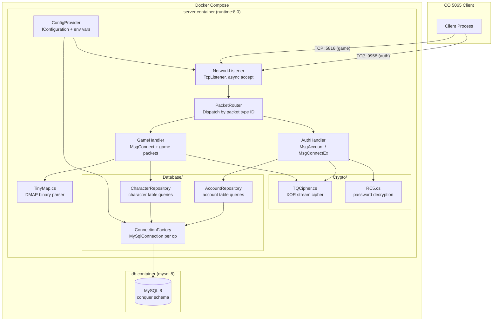
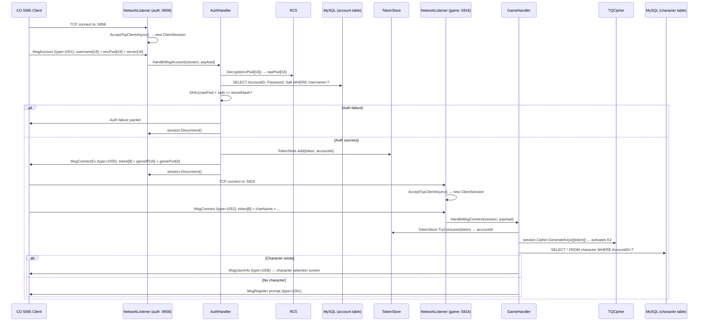

# Design: Conquer Online Server (5065 Modernization)

## Overview

Fork COServer Redux (CO patch 5065, .NET Framework 4.0, x86, NHibernate, ManagedOpenSsl.dll) and modernize it with surgical minimal changes to run on .NET 8 / MySQL 8 / Docker. The approach is Approach A: keep the single flat project layout, retarget the `.csproj`, strip native DLLs, swap NHibernate for Dapper, adapt crypto from the Comet@5017 reference, wrap the accept loop in thin async, and add Docker Compose. No architectural splits, no microservices, no multi-project restructuring.

M1 success gate: `dotnet build` exits 0, `docker compose up` brings both containers healthy, CO 5065 client completes the full three-message auth handshake (MsgAccount 1051 → MsgConnectEx 1055 → MsgConnect 1052), and the character selection screen is reachable. All Redux game logic (combat, items, guilds, NPCs) compiles under .NET 8 but is not acceptance-tested in M1.

---

## Architecture Diagram



---

## Components

### NetworkListener

| Field | Value |
|-------|-------|
| **Purpose** | Binds auth port (9958) and game port (5816), runs async accept loops, spawns per-client handler tasks |
| **Replaces** | Redux synchronous socket accept loop |
| **File** | `Network/NetworkListener.cs` (new) |

```csharp
public sealed class NetworkListener
{
    private readonly IConfiguration _config;
    private readonly PacketRouter _router;

    public NetworkListener(IConfiguration config, PacketRouter router) { ... }

    public async Task RunAuthAsync(CancellationToken ct)
    {
        var listener = new TcpListener(IPAddress.Any, _config.GetValue<int>("AuthPort"));
        listener.Start();
        Console.WriteLine($"[Startup] Auth listening on :{_config.GetValue<int>("AuthPort")}");
        while (!ct.IsCancellationRequested)
        {
            TcpClient client = await listener.AcceptTcpClientAsync(ct);
            _ = Task.Run(() => HandleClientAsync(client, isGame: false, ct), ct);
        }
    }

    public async Task RunGameAsync(CancellationToken ct) { /* same pattern, isGame: true */ }

    private async Task HandleClientAsync(TcpClient tcp, bool isGame, CancellationToken ct)
    {
        // synchronous handler body inside try/catch
        // reads 2-byte length prefix, then payload; dispatches to PacketRouter
    }
}
```

**Responsibilities:**
- Bind and listen on auth port + game port (separate `TcpListener` instances)
- `AcceptTcpClientAsync` in a `while` loop for each port
- Spawn each accepted connection as a fire-and-forget `Task.Run`
- Enforce per-client `try/catch` (see Error Handling)
- Log connect and disconnect events

---

### PacketRouter

| Field | Value |
|-------|-------|
| **Purpose** | Reads framed packets from a client stream and dispatches to the correct handler by packet type ID |
| **Replaces** | Redux packet dispatch switch |
| **File** | `Network/PacketRouter.cs` (modify/replace Redux equivalent) |

```csharp
public sealed class PacketRouter
{
    // Reads 2-byte little-endian length, then that many bytes.
    // First 2 bytes of payload = packet type ID (little-endian uint16).
    public (ushort typeId, byte[] payload) ReadPacket(NetworkStream stream);

    public void Dispatch(ClientSession session, ushort typeId, byte[] payload);
}
```

**Packet type → handler mapping:**

| Type ID | Packet Name | Handler |
|---------|-------------|---------|
| 1051 | MsgAccount | AuthHandler.HandleMsgAccount |
| 1052 | MsgConnect | GameHandler.HandleMsgConnect |
| 1055 | MsgConnectEx | (server-sent only) |
| 1006 | MsgUserInfo | (server-sent only) |
| others | Game packets | GameHandler dispatch |

---

### ClientSession

| Field | Value |
|-------|-------|
| **Purpose** | Holds per-connection state: TcpClient, NetworkStream, TQCipher instance, session token, account ID |
| **Replaces** | Redux client state object |
| **File** | `Network/ClientSession.cs` (new or modify Redux equivalent) |

```csharp
public sealed class ClientSession
{
    public TcpClient TcpClient { get; }
    public NetworkStream Stream { get; }
    public TQCipher Cipher { get; }          // one instance per session
    public ulong SessionToken { get; set; }
    public int AccountId { get; set; }
    public bool IsAuthenticated { get; set; }

    public ClientSession(TcpClient tcp)
    {
        TcpClient = tcp;
        Stream = tcp.GetStream();
        Cipher = new TQCipher();
    }

    public void Send(byte[] packet) { /* write to Stream, apply cipher encrypt */ }
    public void Disconnect() { TcpClient.Close(); }
}
```

---

### AuthHandler

| Field | Value |
|-------|-------|
| **Purpose** | Handles MsgAccount (1051): RC5-decrypt password, SHA1-validate, issue session token, send MsgConnectEx (1055) |
| **Replaces** | Redux auth logic (embedded in main loop) |
| **File** | `Packets/MsgAccount.cs` (new) |

```csharp
public sealed class AuthHandler
{
    private readonly RC5 _rc5 = new RC5();
    private readonly AccountRepository _accounts;
    private readonly IConfiguration _config;

    public void HandleMsgAccount(ClientSession session, byte[] payload)
    {
        // Parse: account[16], encryptedPassword[16], serverName[16]
        string username = Encoding.ASCII.GetString(payload, 4, 16).TrimEnd('\0');
        byte[] encPwd = payload[20..36];

        byte[] rawPwd = _rc5.Decrypt(encPwd);
        string password = Encoding.ASCII.GetString(rawPwd).TrimEnd('\0');

        var account = _accounts.FindByUsername(username);
        if (account == null || !ValidateSha1(password, account.Password, account.Salt))
        {
            Console.WriteLine($"[Auth] FAIL username={username}");
            SendAuthFail(session);
            return;
        }

        ulong token = GenerateToken(account.AccountId);
        TokenStore.Add(token, account.AccountId);

        Console.WriteLine($"[Auth] OK username={username}");
        SendMsgConnectEx(session, token);
        session.Disconnect();
    }

    private bool ValidateSha1(string password, string storedHash, string salt) { ... }
    private ulong GenerateToken(int accountId) { ... }
    private void SendMsgConnectEx(ClientSession session, ulong token) { ... }
}
```

**SHA1 validation:** `SHA1.HashData(Encoding.ASCII.GetBytes(password + salt))` compared to stored hex string. Exact format (hex/base64) must be verified against Redux `account` DDL during implementation — see Migration Notes item 8.

---

### GameHandler

| Field | Value |
|-------|-------|
| **Purpose** | Handles MsgConnect (1052): validate session token, activate TQCipher, load character, send MsgUserInfo (1006) |
| **Replaces** | Redux game server auth + game packet dispatch |
| **File** | `Packets/MsgConnect.cs` + `Packets/GamePacketHandler.cs` (modify Redux) |

```csharp
public sealed class GameHandler
{
    private readonly CharacterRepository _characters;

    public void HandleMsgConnect(ClientSession session, byte[] payload)
    {
        ulong token = BinaryPrimitives.ReadUInt64LittleEndian(payload[4..12]);

        if (!TokenStore.TryConsume(token, out int accountId))
        {
            session.Disconnect();
            return;
        }

        session.AccountId = accountId;
        session.Cipher.GenerateKeys(new object[] { token });  // activates TQCipher K2
        session.IsAuthenticated = true;

        Console.WriteLine($"[Game] Connect accountId={accountId} token={token}");

        var character = _characters.FindByAccountId(accountId);
        if (character != null)
            SendMsgUserInfo(session, character);
        else
            SendCharacterCreationPrompt(session);
    }
}
```

---

### TokenStore

| Field | Value |
|-------|-------|
| **Purpose** | In-memory dictionary mapping `ulong token → int accountId`; consumed on MsgConnect |
| **File** | `Network/TokenStore.cs` (new) |

```csharp
public static class TokenStore
{
    private static readonly ConcurrentDictionary<ulong, int> _tokens = new();
    public static void Add(ulong token, int accountId) => _tokens[token] = accountId;
    public static bool TryConsume(ulong token, out int accountId) => _tokens.TryRemove(token, out accountId);
}
```

---

### TQCipher

| Field | Value |
|-------|-------|
| **Purpose** | XOR stream cipher; encrypts all game traffic after MsgConnect |
| **Replaces** | Redux ManagedOpenSsl.dll crypto dependency |
| **Adapts from** | `Comet.Network/Security/TQCipher.cs` (Comet@5017 reference) |
| **File** | `Crypto/TQCipher.cs` (new) |

```csharp
public sealed class TQCipher
{
    private readonly byte[] _K1 = new byte[512];
    private readonly byte[] _K2 = new byte[512];
    private int _encryptPos;
    private int _decryptPos;

    // Static seed: {0x9D, 0x0F, 0xFA, 0x13, 0x62, 0x79, 0x5C, 0x6D}
    public TQCipher() { InitK1(); }

    // Called after MsgConnect token validation; seeds K2 from token
    public void GenerateKeys(object[] seeds) { /* derive K2 from ulong token */ }

    // Decrypt uses current K (K1 pre-auth, K2 post-auth)
    public void Decrypt(Span<byte> data) { /* XOR each byte with K */ }

    // Encrypt always uses K1
    public void Encrypt(Span<byte> data) { /* XOR each byte with K1 */ }

    private void InitK1() { /* expand static seed into 512-byte table */ }
}
```

**Key derivation (GenerateKeys):** derive K2 from token bytes by expanding the 8-byte token into the 512-byte K2 table. Exact expansion algorithm matches Comet@5017 `TQCipher.cs` — adapt directly (do not copy verbatim).

**XOR operation per byte:**
```
byte b = (src ^ 0xAB);
b = (b << 4) | (b >> 4);  // rotate 4 bits
b ^= K[x & 0xFF];
b ^= K[(x >> 8) + 0x100];
```

---

### RC5

| Field | Value |
|-------|-------|
| **Purpose** | RC5-32/12/16 block cipher; decrypts 16-byte password field in MsgAccount |
| **Replaces** | Redux ManagedOpenSsl.dll RC5 |
| **Adapts from** | `Comet.Network/Security/RC5.cs` (Comet@5017 reference) |
| **File** | `Crypto/RC5.cs` (new) |

```csharp
public sealed class RC5
{
    // RC5-32/12/16: 32-bit words, 12 rounds, 16-byte key
    // Hardcoded key from Redux source (same across all Redux installs)
    private static readonly byte[] HardcodedKey = { /* 16 bytes from Redux */ };

    private readonly uint[] _subkeys;  // 2*(rounds+1) = 26 subkeys

    public RC5() { _subkeys = ExpandKey(HardcodedKey); }

    // Decrypt one 8-byte block (two 32-bit words)
    public byte[] Decrypt(byte[] ciphertext)   // ciphertext.Length == 16 (two blocks)
    { /* standard RC5 decryption loop */ return plaintext; }

    private uint[] ExpandKey(byte[] key) { /* standard RC5 key schedule */ }
}
```

**Note:** RC5 is only used in AuthHandler.HandleMsgAccount. It is not used anywhere in the game connection path.

---

### TinyMap

| Field | Value |
|-------|-------|
| **Purpose** | Parses `.dmap` binary map files and answers passability queries |
| **Replaces** | `TinyMap.dll` (native Windows binary, P/Invoke) |
| **File** | `Maps/TinyMap.cs` (new) |

Full design in TinyMap Port Design section below.

---

### AccountRepository

| Field | Value |
|-------|-------|
| **Purpose** | All SQL queries against the `account` table |
| **Replaces** | NHibernate session + XML mapping files for accounts |
| **File** | `Database/AccountRepository.cs` (new) |

```csharp
public sealed class AccountRepository
{
    private readonly ConnectionFactory _factory;

    public AccountRepository(ConnectionFactory factory) { _factory = factory; }

    public DbAccount? FindByUsername(string username)
    {
        using var conn = _factory.Create();
        return conn.QueryFirstOrDefault<DbAccount>(
            "SELECT AccountID, Username, Password, Salt FROM account WHERE Username = @username LIMIT 1",
            new { username });
    }
}

public sealed class DbAccount
{
    public int AccountId { get; set; }
    public string Username { get; set; } = "";
    public string Password { get; set; } = "";  // SHA1 hex/base64 — verify format from DDL
    public string Salt { get; set; } = "";
}
```

---

### CharacterRepository

| Field | Value |
|-------|-------|
| **Purpose** | All SQL queries against the `character` table |
| **Replaces** | NHibernate session + XML mapping files for characters |
| **File** | `Database/CharacterRepository.cs` (new) |

```csharp
public sealed class CharacterRepository
{
    private readonly ConnectionFactory _factory;

    public DbCharacter? FindByAccountId(int accountId)
    {
        using var conn = _factory.Create();
        return conn.QueryFirstOrDefault<DbCharacter>(
            @"SELECT CharacterID, AccountID, Name, Mesh, Avatar, Level, MapID, X, Y,
                     Silver, Strength, Agility, Vitality, Spirit, HealthPoints, ManaPoints
              FROM character WHERE AccountID = @accountId LIMIT 1",
            new { accountId });
    }

    public void Insert(DbCharacter character)
    {
        using var conn = _factory.Create();
        conn.Execute(
            @"INSERT INTO character (AccountID, Name, Mesh, Avatar, Level, MapID, X, Y, Silver,
                                    Strength, Agility, Vitality, Spirit, HealthPoints, ManaPoints)
              VALUES (@AccountId, @Name, @Mesh, @Avatar, @Level, @MapID, @X, @Y, @Silver,
                      @Strength, @Agility, @Vitality, @Spirit, @HealthPoints, @ManaPoints)",
            character);
    }
}

public sealed class DbCharacter
{
    public int CharacterID { get; set; }
    public int AccountID { get; set; }
    public string Name { get; set; } = "";
    public int Mesh { get; set; }
    public int Avatar { get; set; }
    public int Level { get; set; } = 1;
    public int MapID { get; set; } = 1010;
    public int X { get; set; } = 61;
    public int Y { get; set; } = 109;
    public int Silver { get; set; } = 1000;
    public int Strength { get; set; } = 4;
    public int Agility { get; set; } = 6;
    public int Vitality { get; set; } = 12;
    public int Spirit { get; set; } = 0;
    public int HealthPoints { get; set; }
    public int ManaPoints { get; set; }
}
```

---

### ConnectionFactory

| Field | Value |
|-------|-------|
| **Purpose** | Creates `MySqlConnection` instances from IConfiguration connection string |
| **Replaces** | NHibernate `SessionFactory` |
| **File** | `Database/ConnectionFactory.cs` (new) |

```csharp
public sealed class ConnectionFactory
{
    private readonly string _connectionString;

    public ConnectionFactory(IConfiguration config)
    {
        _connectionString = config.GetConnectionString("Default")
            ?? throw new InvalidOperationException("Missing connection string 'Default'");
    }

    public MySqlConnection Create()
    {
        var conn = new MySqlConnection(_connectionString);
        conn.Open();
        return conn;
    }
}
```

**NuGet packages required:**
- `Dapper` (latest stable)
- `MySqlConnector` (not `MySql.Data` — MySqlConnector is async-native, MIT license)

---

### ConfigProvider

| Field | Value |
|-------|-------|
| **Purpose** | Loads configuration from `appsettings.json` with environment variable override |
| **Replaces** | Redux hardcoded config or app.config |
| **File** | `Program.cs` (wire-up via `Microsoft.Extensions.Configuration`) |

No custom class needed — use standard `IConfiguration` pipeline (see Configuration Design section).

---

## Auth Flow Sequence



---

## Dapper Integration Design

### Connection Per Operation Pattern

Each repository method opens a fresh `MySqlConnection`, uses it, and disposes it. No connection pool management needed — `MySqlConnector` handles pooling internally.

```csharp
// Pattern: using-scoped connection in every repository method
public SomeModel? GetById(int id)
{
    using var conn = _factory.Create();
    return conn.QueryFirstOrDefault<SomeModel>("SELECT ... WHERE ID = @id", new { id });
}
```

### No NHibernate Session Factory

| Redux (NHibernate) | Modernized (Dapper) |
|-------------------|---------------------|
| `SessionFactory.OpenSession()` | `_factory.Create()` → `MySqlConnection` |
| XML `.hbm.xml` mapping files | C# POCO classes (DbAccount, DbCharacter) |
| `session.Save(entity)` | `conn.Execute("INSERT ...", entity)` |
| `session.Get<T>(id)` | `conn.QueryFirstOrDefault<T>("SELECT ...", ...)` |
| `session.CreateCriteria<T>()` | `conn.Query<T>("SELECT ... WHERE ...")` |
| Lazy loading | Explicit SQL joins |

### Repository Classes

| Class | Table | Key Operations |
|-------|-------|----------------|
| `AccountRepository` | `account` | `FindByUsername` |
| `CharacterRepository` | `character` | `FindByAccountId`, `Insert` |

More repositories (items, guilds, etc.) inherit this pattern but are not required for M1.

### Connection String Format

```
Server=db;Port=3306;Database=conquer;User=conquer;Password=secret;CharSet=utf8mb4;
```

Note: `Server=db` uses the Docker Compose service name. For local dev: `Server=localhost`.

---

## Network Layer Design

### Packet Framing

CO uses a 2-byte little-endian length prefix followed by the payload. The first 2 bytes of the payload are the packet type ID (little-endian uint16). Total on-wire format:

```
[length: uint16 LE][typeId: uint16 LE][... payload bytes ...]
```

Where `length` = total byte count including the length field itself (i.e., `length = payload.Length + 2`).

```csharp
// Read one framed packet from NetworkStream
private static (ushort typeId, byte[] data) ReadPacket(NetworkStream stream)
{
    // Read 2-byte length
    Span<byte> lenBuf = stackalloc byte[2];
    stream.ReadExactly(lenBuf);
    ushort totalLen = BinaryPrimitives.ReadUInt16LittleEndian(lenBuf);

    // Read payload (totalLen - 2 bytes)
    byte[] payload = new byte[totalLen - 2];
    stream.ReadExactly(payload);

    // Decrypt if cipher is active
    // session.Cipher.Decrypt(payload);

    ushort typeId = BinaryPrimitives.ReadUInt16LittleEndian(payload.AsSpan(0, 2));
    return (typeId, payload);
}
```

### Accept Loop Structure

```csharp
// Auth listener (mirrored for game listener)
var listener = new TcpListener(IPAddress.Any, authPort);
listener.Start();
Console.WriteLine($"[Startup] Listening on auth :{authPort}");

while (!ct.IsCancellationRequested)
{
    TcpClient client = await listener.AcceptTcpClientAsync(ct);
    _ = Task.Run(() => ServeClientAsync(client, ct), ct);  // fire-and-forget per client
}
```

### Per-Client Handler Loop

```csharp
private async Task ServeClientAsync(TcpClient tcp, CancellationToken ct)
{
    using var session = new ClientSession(tcp);
    Console.WriteLine($"[Connect] {tcp.Client.RemoteEndPoint}");
    try
    {
        var stream = session.Stream;
        while (!ct.IsCancellationRequested && tcp.Connected)
        {
            var (typeId, payload) = ReadPacket(stream);
            _router.Dispatch(session, typeId, payload);
        }
    }
    catch (Exception ex)
    {
        Console.WriteLine($"[Disconnect] {tcp.Client.RemoteEndPoint} reason={ex.Message}");
    }
    finally
    {
        session.Disconnect();
    }
}
```

### TQCipher Integration Point

- Before MsgConnect is received: cipher is idle (no-op Decrypt/Encrypt calls or identity function).
- After GameHandler.HandleMsgConnect calls `session.Cipher.GenerateKeys(token)`: all subsequent reads call `session.Cipher.Decrypt(payload)` before parsing, and all subsequent writes call `session.Cipher.Encrypt(data)` before writing to stream.
- The cipher state is stored on `ClientSession` — one instance per client, never shared.

---

## TinyMap Port Design

### DMAP Binary Format

```
Offset  Size   Type      Field
0       4      int32     Width (in tiles)
4       4      int32     Height (in tiles)
8       W*H*2  uint16[]  Tile passability array (row-major, 0=passable, non-zero=blocked)
```

All values little-endian. The array has `Width * Height` entries. Entry at row `y`, column `x` is at index `y * Width + x`.

### TinyMap Class API

```csharp
// File: Maps/TinyMap.cs
public sealed class TinyMap
{
    private readonly int _width;
    private readonly int _height;
    private readonly ushort[] _tiles;  // [y * Width + x]

    // Load and parse a .dmap file
    public static TinyMap Load(string filePath)
    {
        using var fs = File.OpenRead(filePath);
        using var reader = new BinaryReader(fs, Encoding.ASCII, leaveOpen: false);
        int width  = reader.ReadInt32();
        int height = reader.ReadInt32();
        ushort[] tiles = new ushort[width * height];
        for (int i = 0; i < tiles.Length; i++)
            tiles[i] = reader.ReadUInt16();
        return new TinyMap(width, height, tiles);
    }

    private TinyMap(int width, int height, ushort[] tiles)
    {
        _width = width; _height = height; _tiles = tiles;
    }

    // Returns true if the tile at (x, y) can be walked on
    public bool IsPassable(int x, int y)
    {
        if (x < 0 || y < 0 || x >= _width || y >= _height) return false;
        return _tiles[y * _width + x] == 0;
    }

    public int Width  => _width;
    public int Height => _height;
}
```

### Map Loading at Startup

```csharp
// Maps are loaded once at startup into a static dictionary
// File: Maps/MapRegistry.cs
public static class MapRegistry
{
    private static readonly Dictionary<int, TinyMap> _maps = new();

    public static void LoadAll(string mapsDir)
    {
        foreach (string file in Directory.GetFiles(mapsDir, "*.dmap"))
        {
            // Parse map ID from filename (e.g., "1002.dmap" → 1002)
            if (int.TryParse(Path.GetFileNameWithoutExtension(file), out int mapId))
                _maps[mapId] = TinyMap.Load(file);
        }
        Console.WriteLine($"[Startup] Loaded {_maps.Count} maps");
    }

    public static TinyMap? Get(int mapId) => _maps.GetValueOrDefault(mapId);
}
```

**Map files (.dmap) are sourced from the CO 5065 client data directory.** They are not redistributed with the server — the operator provides them from their own client installation.

---

## Docker Topology

### Dockerfile (Multi-Stage)

```dockerfile
# File: Dockerfile
FROM mcr.microsoft.com/dotnet/sdk:8.0 AS build
WORKDIR /src
COPY *.csproj .
RUN dotnet restore
COPY . .
RUN dotnet publish -c Release -o /app/publish --no-restore

FROM mcr.microsoft.com/dotnet/runtime:8.0 AS runtime
WORKDIR /app
COPY --from=build /app/publish .
ENTRYPOINT ["dotnet", "ConquerServer.dll"]
```

Notes:
- `runtime:8.0` not `aspnet:8.0` — Redux is not ASP.NET; runtime image is ~200 MB smaller.
- No `--self-contained` — keeps image small, relies on the runtime base image.
- No Windows-specific artifacts in publish output (ManagedOpenSsl.dll removed, TinyMap.dll removed).

### docker-compose.yml

```yaml
# File: docker-compose.yml
services:
  db:
    image: mysql:8.0
    restart: unless-stopped
    environment:
      MYSQL_ROOT_PASSWORD: rootpass
      MYSQL_DATABASE: conquer
      MYSQL_USER: conquer
      MYSQL_PASSWORD: secret
    command: >
      --default-authentication-plugin=mysql_native_password
      --character-set-server=utf8mb4
      --collation-server=utf8mb4_unicode_ci
    volumes:
      - db_data:/var/lib/mysql
      - ./init.sql:/docker-entrypoint-initdb.d/init.sql:ro
    ports:
      - "3306:3306"   # expose for local dev tooling; remove in prod
    healthcheck:
      test: ["CMD", "mysqladmin", "ping", "-h", "localhost", "-uroot", "-prootpass"]
      interval: 5s
      timeout: 3s
      retries: 10

  server:
    build:
      context: .
      dockerfile: Dockerfile
    restart: unless-stopped
    depends_on:
      db:
        condition: service_healthy
    environment:
      ConnectionStrings__Default: "Server=db;Port=3306;Database=conquer;User=conquer;Password=secret;CharSet=utf8mb4;"
      AuthPort: "9958"
      GamePort: "5816"
      ServerName: "Conquer"
      GameServerIP: "0.0.0.0"   # override with public IP for remote clients
    ports:
      - "9958:9958"
      - "5816:5816"
    volumes:
      - ./maps:/app/maps:ro    # operator-supplied .dmap files

volumes:
  db_data:
```

### init.sql Placement

`init.sql` is mounted into `/docker-entrypoint-initdb.d/` — MySQL's official first-start init directory. Any `.sql` file there is executed as root on the first container start (when `/var/lib/mysql` is empty). Subsequent starts skip it.

```
./
├── init.sql          ← audited Redux DDL, MySQL 8 compatible
└── docker-compose.yml
```

### mysql_native_password

Required because `MySqlConnector` (Dapper) uses the native password plugin. MySQL 8 defaults to `caching_sha2_password` from 8.0.4+. The `--default-authentication-plugin=mysql_native_password` command arg in `docker-compose.yml` forces the old plugin. Verified with:

```bash
docker compose exec db mysql -u root -prootpass -e "SHOW VARIABLES LIKE 'default_authentication_plugin';"
```

---

## Configuration Design

### appsettings.json

```json
{
  "ConnectionStrings": {
    "Default": "Server=localhost;Port=3306;Database=conquer;User=conquer;Password=secret;CharSet=utf8mb4;"
  },
  "AuthPort": 9958,
  "GamePort": 5816,
  "ServerName": "Conquer",
  "GameServerIP": "127.0.0.1",
  "MapsDirectory": "./maps"
}
```

### Environment Variable Override

`Microsoft.Extensions.Configuration` automatically maps env vars with double-underscore separators:

| Environment Variable | Overrides |
|---------------------|-----------|
| `ConnectionStrings__Default` | `appsettings.json` → `ConnectionStrings.Default` |
| `AuthPort` | `appsettings.json` → `AuthPort` |
| `GamePort` | `appsettings.json` → `GamePort` |
| `ServerName` | `appsettings.json` → `ServerName` |
| `GameServerIP` | `appsettings.json` → `GameServerIP` |

### Program.cs Wire-Up

```csharp
// File: Program.cs
var config = new ConfigurationBuilder()
    .SetBasePath(AppContext.BaseDirectory)
    .AddJsonFile("appsettings.json", optional: false)
    .AddEnvironmentVariables()
    .Build();

var factory = new ConnectionFactory(config);
var accounts = new AccountRepository(factory);
var characters = new CharacterRepository(factory);
var router = new PacketRouter(accounts, characters, config);
var listener = new NetworkListener(config, router);

MapRegistry.LoadAll(config["MapsDirectory"] ?? "./maps");
Console.WriteLine("[Startup] Database connected");

using var cts = new CancellationTokenSource();
Console.CancelKeyPress += (_, e) => { e.Cancel = true; cts.Cancel(); };

await Task.WhenAll(
    listener.RunAuthAsync(cts.Token),
    listener.RunGameAsync(cts.Token)
);
```

---

## Error Handling Design

### Per-Client Exception Boundary

Every client handler runs inside `try/catch(Exception)`. Exceptions include: client disconnect (`IOException`), malformed packet (`EndOfStreamException`, `OverflowException`), auth errors, DB errors.

```csharp
try
{
    while (connected)
    {
        var (typeId, payload) = ReadPacket(stream);
        _router.Dispatch(session, typeId, payload);
    }
}
catch (EndOfStreamException)
{
    // Normal: client closed connection
    Console.WriteLine($"[Disconnect] {endpoint} clean");
}
catch (IOException ex)
{
    Console.WriteLine($"[Disconnect] {endpoint} io={ex.Message}");
}
catch (Exception ex)
{
    Console.WriteLine($"[Error] {endpoint} type={typeId} ex={ex.GetType().Name} msg={ex.Message}");
}
finally
{
    session.Disconnect();
}
```

### Packet Framing Errors

If `ReadPacket` reads a length of 0 or > 8192 (sanity limit), the connection is dropped without crashing the server:

```csharp
if (totalLen < 2 || totalLen > 8192)
    throw new IOException($"Invalid packet length {totalLen}");
```

### Unknown Packet Types

Unknown `typeId` values are logged and skipped — do not throw:

```csharp
default:
    Console.WriteLine($"[Warn] Unknown packet typeId={typeId} from {session.TcpClient.Client.RemoteEndPoint}");
    break;
```

### Structured Log Format

All log lines follow the pattern: `[Category] key=value key=value`. No external logging framework in M1 — `Console.WriteLine` is sufficient.

| Event | Format |
|-------|--------|
| Startup | `[Startup] Auth listening on :9958` |
| Startup | `[Startup] Game listening on :5816` |
| Startup | `[Startup] Database connected` |
| Startup | `[Startup] Loaded N maps` |
| Connect | `[Connect] 192.168.1.1:54321` |
| Auth OK | `[Auth] OK username=player1` |
| Auth FAIL | `[Auth] FAIL username=baduser` |
| Game connect | `[Game] Connect accountId=1001 token=1234567890` |
| Disconnect | `[Disconnect] 192.168.1.1:54321 reason=io` |
| Error | `[Error] 192.168.1.1:54321 type=1051 ex=FormatException msg=...` |

---

## File Structure

```
conquer-server/
├── ConquerServer.csproj          ← MODIFY: retarget net8.0, AnyCPU, add Dapper+MySqlConnector NuGet refs
├── Program.cs                    ← MODIFY: replace startup code, wire IConfiguration + Dapper + listeners
├── appsettings.json              ← NEW: DB connection string, ports, config
├── Dockerfile                    ← NEW: multi-stage sdk:8.0 → runtime:8.0
├── docker-compose.yml            ← NEW: db + server services
├── init.sql                      ← NEW: audited Redux DDL (MySQL 8 compatible)
├── README.md                     ← NEW: Getting Started section
│
├── Crypto/
│   ├── TQCipher.cs               ← NEW: adapted from Comet@5017 TQCipher.cs
│   └── RC5.cs                    ← NEW: adapted from Comet@5017 RC5.cs
│
├── Network/
│   ├── NetworkListener.cs        ← NEW: TcpListener async accept loops
│   ├── PacketRouter.cs           ← MODIFY: replace Redux sync dispatch with new routing
│   ├── ClientSession.cs          ← NEW: per-connection state (or modify Redux equivalent)
│   └── TokenStore.cs             ← NEW: in-memory token dictionary
│
├── Packets/
│   ├── MsgAccount.cs             ← NEW: auth packet 1051 handler
│   ├── MsgConnectEx.cs           ← NEW: auth response 1055 builder
│   ├── MsgConnect.cs             ← NEW: game auth packet 1052 handler
│   ├── MsgUserInfo.cs            ← MODIFY: adapt Redux equivalent, ensure .NET 8 compatible
│   └── [other Redux packet files] ← KEEP: compile under .NET 8, not tested in M1
│
├── Database/
│   ├── ConnectionFactory.cs      ← NEW: MySqlConnection factory
│   ├── AccountRepository.cs      ← NEW: Dapper queries for account table
│   ├── CharacterRepository.cs    ← NEW: Dapper queries for character table
│   └── [Redux .hbm.xml files]    ← DELETE: all NHibernate mapping XML
│
├── Maps/
│   ├── TinyMap.cs                ← NEW: managed DMAP binary parser
│   └── MapRegistry.cs            ← NEW: map loading + lookup by ID
│
├── [Redux game logic files]      ← KEEP: Combat/, Items/, Guilds/, NPCs/ etc.
│                                    compile under .NET 8; no behavior changes in M1
│
├── maps/                         ← NOT COMMITTED: operator-supplied .dmap files
│   └── *.dmap
│
# DELETED FILES:
# lib/ManagedOpenSsl.dll          ← DELETE: Windows-only, replaced by System.Security.Cryptography
# lib/TinyMap.dll                 ← DELETE: Windows-only native, replaced by TinyMap.cs
# *.hbm.xml                       ← DELETE: all NHibernate XML mapping files
```

---

## Technical Decisions

| Decision | Choice | Alternatives Rejected | Rationale |
|----------|--------|-----------------------|-----------|
| ORM | Dapper + explicit SQL | EF Core 8, keep NHibernate | EF Core adds complexity and migrations scaffolding; NHibernate doesn't support .NET 8; Dapper is minimal, explicit, easy to audit |
| MySQL driver | MySqlConnector | MySql.Data (Oracle) | MySqlConnector is async-native, MIT license, actively maintained; MySql.Data has LGPL and historical bugs |
| Crypto source | Adapt from Comet@5017 | Implement from scratch, use BCrypt.Net | Comet's TQCipher and RC5 are proven against real CO clients; implementing from scratch risks subtle key derivation bugs |
| Project layout | Single flat .csproj | Multi-project solution | Matches Redux layout; minimal restructuring; no inter-project dependency management needed |
| Async depth | Thin (accept loop only) | Full async handler bodies | Handler bodies in Redux are synchronous C#; full async rewrite is out of scope for M1 and carries risk of introducing bugs in game logic |
| Docker base image | `runtime:8.0` | `aspnet:8.0`, `sdk:8.0` | Redux is not ASP.NET — no Kestrel/middleware; runtime image is ~130 MB vs aspnet ~200 MB; SDK in final image is wasteful |
| MySQL auth plugin | `mysql_native_password` | `caching_sha2_password` | MySqlConnector supports both, but `mysql_native_password` avoids SHA2 round-trip overhead and is required by many community CO tools |
| Architecture | Monolith (single process) | Auth/Game server split | Redux is monolithic; split requires IPC/RPC layer (Comet uses gRPC); out of scope for M1 |
| Configuration | `IConfiguration` + env vars | Custom config parser, XML app.config | Standard .NET 8 pattern; works transparently in Docker (env vars) and locally (appsettings.json) |

---

## Migration Notes

Ordered list of what must happen to transform Redux into the modernized codebase:

1. **Retarget `.csproj`**: Change `<TargetFrameworkVersion>v4.0</TargetFrameworkVersion>` to `<TargetFramework>net8.0</TargetFramework>`; remove `<PlatformTarget>x86</PlatformTarget>`; remove Windows-only `<Platform>` conditions.

2. **Remove native DLLs**: Delete `ManagedOpenSsl.dll`, `TinyMap.dll`, and all references to them in `.csproj` (`<Reference>` elements, `<Content>` copy entries). Remove all `[DllImport]` / P/Invoke wrappers that called these.

3. **Remove NHibernate**: Remove all NHibernate NuGet package references from `.csproj`. Delete all `.hbm.xml` mapping files. Remove `SessionFactory` setup code and `ISession` usages.

4. **Add Dapper + MySqlConnector**: Add to `.csproj`:
   ```xml
   <PackageReference Include="Dapper" Version="2.*" />
   <PackageReference Include="MySqlConnector" Version="2.*" />
   <PackageReference Include="Microsoft.Extensions.Configuration" Version="8.*" />
   <PackageReference Include="Microsoft.Extensions.Configuration.Json" Version="8.*" />
   <PackageReference Include="Microsoft.Extensions.Configuration.EnvironmentVariables" Version="8.*" />
   ```

5. **Fix .NET 8 API breaks in Redux game logic**: Run `dotnet build` and fix compilation errors in the retained Redux code. Expected issues: removed .NET Framework APIs, Windows-only types (e.g., `System.Windows.Forms.*` if referenced), threading API changes. Warnings are acceptable in M1.

6. **Adapt crypto (TQCipher + RC5)**: Create `Crypto/TQCipher.cs` and `Crypto/RC5.cs` by adapting Comet@5017 source — adapt, do not copy verbatim. Integrate cipher into `ClientSession`.

7. **Port TinyMap**: Create `Maps/TinyMap.cs` with `BinaryReader`-based DMAP parser. Create `Maps/MapRegistry.cs`. Remove all P/Invoke calls to `TinyMap.dll`.

8. **Audit and fix MySQL DDL (`init.sql`)**: Extract Redux `Nov_16_Backup.sql` (or equivalent), audit for MySQL 5.6-only syntax:
   - `utf8` → `utf8mb4` (MySQL 8 deprecates 3-byte utf8)
   - Remove `ZEROFILL` on non-integer columns
   - Explicit `DEFAULT` on NOT NULL columns (MySQL 8 strict mode)
   - Confirm `account.Password` column type and format (hex string? base64? raw SHA1 bytes?) — this determines SHA1 comparison logic in AuthHandler
   - Replace `AUTO_INCREMENT` start values if needed

9. **Add Docker files**: Create `Dockerfile`, `docker-compose.yml`, and mount `init.sql`.

10. **Add configuration**: Create `appsettings.json`; wire `IConfiguration` in `Program.cs`.

11. **Implement auth handshake**: Create `Network/NetworkListener.cs`, `Network/ClientSession.cs`, `Network/TokenStore.cs`, `Packets/MsgAccount.cs`, `Packets/MsgConnectEx.cs`, `Packets/MsgConnect.cs`, `Database/AccountRepository.cs`, `Database/CharacterRepository.cs`, `Database/ConnectionFactory.cs`.

12. **Verify M1**: `dotnet build` exits 0; `docker compose up` brings containers healthy; CO 5065 client authenticates and character selection screen appears.

---

## Risks and Mitigations

| Risk | Severity | Mitigation |
|------|----------|------------|
| **MySQL 8 strict mode rejects Redux DDL** | High | Audit `init.sql` as first implementation task (Migration Notes item 8); test `docker compose up` with empty volume before writing any app code |
| **SHA1 password storage format unknown** | High | Run `DESCRIBE account;` against a Redux MySQL 5.6 dump; check column type (VARCHAR(40) = hex SHA1, VARCHAR(64) = base64, BINARY(20) = raw bytes); adapt ValidateSha1() accordingly |
| **TQCipher K2 key derivation byte layout** | Medium | Comet@5017 `TQCipher.cs` and `MsgConnect.cs` together define the exact token-to-K2 derivation; read both files carefully before implementing `GenerateKeys`; use a test token and verify cipher output matches expected decrypted packet |
| **Redux .NET Framework APIs not in .NET 8** | Medium | Run `dotnet build` immediately after `.csproj` retarget; fix compilation errors before any new code; most issues are Windows-only types or removed threading APIs |
| **Windows-only code in Redux game logic** | Medium | Search for `System.Windows`, `System.Threading.Thread.Abort`, `Registry`, `Environment.SpecialFolder` in Redux source; remove or stub references before running Linux Docker build |
| **Character encoding (Latin-1 vs UTF-8)** | Medium | CO 5065 uses Latin-1 (ISO-8859-1) for usernames and character names; use `Encoding.Latin1` not `Encoding.UTF8` when parsing string fields from packets; set `CharSet=utf8mb4` in DB but store names as ASCII-safe |
| **Port conflicts on dev machine** | Low | Default ports 9958 and 5816 are not common; `netstat -ano | findstr 9958` before starting; configure via env var if conflict exists |
| **Two TcpListener instances in one process** | Low | No architectural issue; each runs its own `while` loop in a separate async task; both started via `Task.WhenAll` in `Program.cs` |
| **Docker `depends_on` health check timing** | Low | MySQL 8 takes 10–20s on first start to initialize schema; `server` service must wait; `healthcheck` + `condition: service_healthy` in docker-compose.yml handles this |

---

## Existing Patterns to Follow

Since this is a fork of Redux (not a greenfield project), implementation must preserve Redux's existing conventions:

- **Namespace**: `Conquer.Network`, `Conquer.Game`, `Conquer.Database` — new files use the same namespace pattern
- **Packet layout**: CO 5065 packets use little-endian byte order throughout; use `BinaryPrimitives.ReadUInt16LittleEndian` / `ReadUInt32LittleEndian` etc., not `BitConverter` (which is platform-dependent)
- **String encoding in packets**: ASCII / Latin-1 null-terminated fixed-width fields (not length-prefixed)
- **No dependency injection container**: M1 wires dependencies manually in `Program.cs`; no `Microsoft.Extensions.DependencyInjection` needed
- **No async handler bodies**: Redux game logic handlers are synchronous; leave them that way in M1
- **No unit test project**: M1 has no test project; verification is manual client connection test

---

## Unresolved Questions

- **SHA1 storage format**: Hex-encoded VARCHAR(40), base64 VARCHAR(64), or raw BINARY(20)? Determines `ValidateSha1()` comparison. Must check Redux `account` DDL.
- **TQCipher K2 derivation**: Exact byte extraction from `ulong token` into 512-byte K2 table. Comet@5017 `TQCipher.cs` is the authoritative reference — read before implementing.
- **Redux port layout**: Confirm exact auth port (9958) and game port (5816) from Redux source before configuring Docker Compose.
- **Latin-1 vs ASCII for packet strings**: CO 5065 client may send extended Latin characters in names; confirm encoding from Redux packet parsing code.

---

## Implementation Steps

1. Fork Redux repo; create new branch `modernize/m1`
2. Retarget `.csproj` to `net8.0` / AnyCPU; run `dotnet build`; record all errors
3. Delete `ManagedOpenSsl.dll`, `TinyMap.dll`, all `.hbm.xml` files, all NHibernate refs
4. Fix all compilation errors in Redux game logic (step 2 error list)
5. Add Dapper, MySqlConnector, Microsoft.Extensions.Configuration NuGet packages
6. Create `Crypto/RC5.cs` adapted from Comet@5017
7. Create `Crypto/TQCipher.cs` adapted from Comet@5017
8. Create `Maps/TinyMap.cs` (BinaryReader DMAP parser)
9. Create `Maps/MapRegistry.cs`
10. Create `Database/ConnectionFactory.cs`, `AccountRepository.cs`, `CharacterRepository.cs`
11. Create `Network/ClientSession.cs`, `TokenStore.cs`
12. Create `Network/NetworkListener.cs` (auth + game async accept loops)
13. Create `Network/PacketRouter.cs`
14. Create `Packets/MsgAccount.cs`, `MsgConnectEx.cs`, `MsgConnect.cs`
15. Create `appsettings.json`
16. Rewrite `Program.cs` (IConfiguration wire-up, listener startup, map loading)
17. Audit Redux DDL → create MySQL 8 compatible `init.sql`
18. Create `Dockerfile` (multi-stage)
19. Create `docker-compose.yml`
20. Create `README.md` with `## Getting Started` section
21. Run `docker compose up`; verify containers healthy
22. Connect CO 5065 client via CIDLoader; verify auth handshake and character screen
