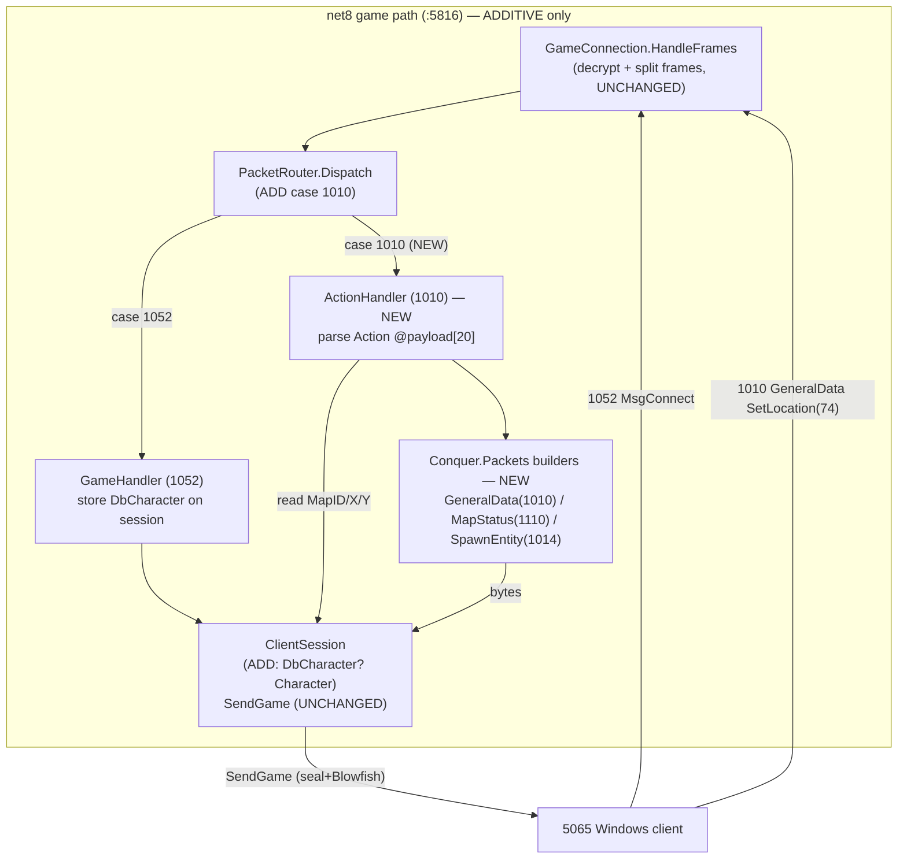
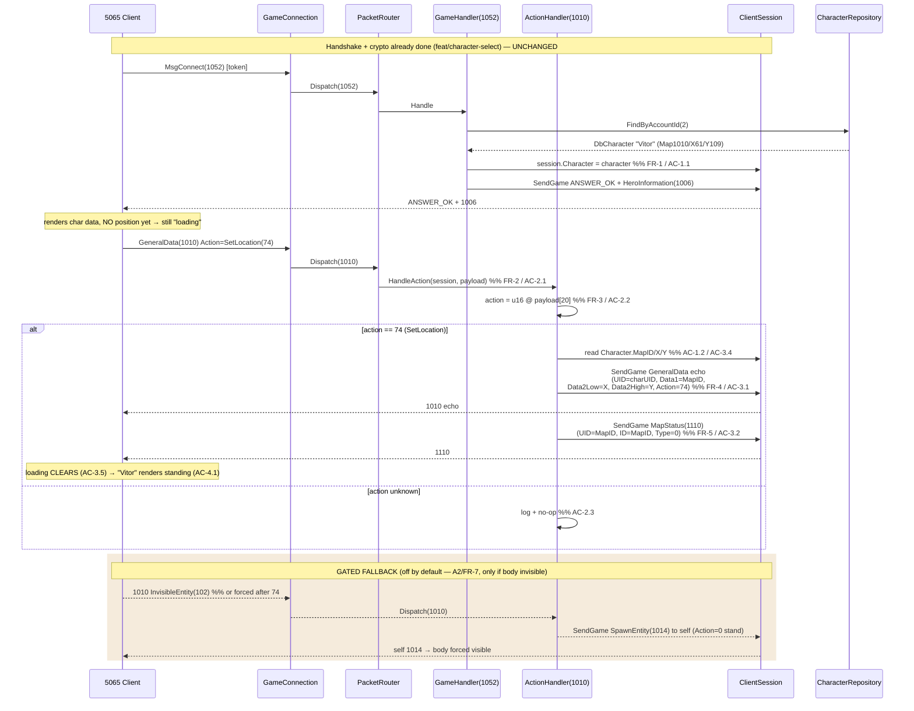

# Design: enter-world

## Overview

Additive net8 game-frame handling: persist the authenticated `DbCharacter` on `ClientSession` at MsgConnect(1052), route inbound GeneralData(1010) through a new `ActionHandler`, and on `SetLocation(74)` echo the 1010 with map+X/Y then send MapStatus(1110) to clear the client's post-login loading freeze. Auth/handshake/crypto are untouched (FR-11); all outbound reuses `ClientSession.SendGame`. Self-spawn(1014) and GetSurroundings(114) are built but gated off by default (live-observation fallbacks A2/FR-7, FR-8).

## Architecture



## Enter-World Flow



## Components

### ClientSession (modify — `src/Network/ClientSession.cs`)

Add one nullable field. Minimal/additive (FR-1, US-1).

```csharp
/// <summary>Authenticated character, set at MsgConnect(1052); null until then or if none found.</summary>
public DbCharacter? Character { get; set; }
```

- `Network.csproj` must reference `Database.csproj` (where `DbCharacter` lives). Confirm reference exists; if not, add it — this is the only structural change to ClientSession.
- `SendGame` (seal + Blowfish) reused unchanged (AC-3.3, NFR-5).

### GameHandler (modify — `src/Packets/MsgConnect.cs`)

Keep responsibility = MsgConnect(1052) only. One added line.

| Change | Detail |
|---|---|
| Store char | After `FindByAccountId`, set `session.Character = character;` before sending ANSWER_OK + 1006 (AC-1.1). |
| No-char path | Unchanged (NEW_ROLE). `session.Character` stays null (AC-1.3). |

The 1010/SetLocation logic does **NOT** go here — it lives in a new `ActionHandler` (separation of concerns; GameHandler stays the 1052 handler).

### ActionHandler (create — `src/Packets/ActionHandler.cs`)

Handles GeneralData(1010). Parses `Action` and branches.

```csharp
public sealed class ActionHandler
{
    public void HandleAction(ClientSession session, byte[] payload)
    {
        if (payload.Length < 22) { /* log "[Game] short 1010" + no-op (AC-2.3 edge) */ return; }
        ushort action = BinaryPrimitives.ReadUInt16LittleEndian(payload.AsSpan(20, 2)); // FR-3/AC-2.2
        switch (action)
        {
            case 74: HandleSetLocation(session, payload); break;          // FR-4/FR-5
            // GATED (off by default — uncomment per live obs):
            // case 102: HandleInvisibleEntity(session); break;           // FR-7 self-1014
            // case 114: /* no-op empty surroundings */ break;            // FR-8
            default:
                Console.WriteLine($"[Game] 1010 Action={action} unhandled — no-op"); // AC-2.3
                break;
        }
    }
}
```

`HandleSetLocation`: read `session.Character` (no DB query — AC-1.2); if null → log + no-op (edge). Build + `SendGame` the 1010 echo, then `SendGame` MapStatus(1110). Log `[Game] SetLocation -> map={MapID} x={X} y={Y}` (FR-9).

**Wiring options considered:**

| Option | Choice | Rationale |
|---|---|---|
| Fold 1010 into GameHandler | ✗ | GameHandler = 1052 token/connect; mixing action dispatch bloats it |
| New ActionHandler class, owned by PacketRouter | ✓ | Clear boundary; mirrors AuthHandler/GameHandler pattern already in PacketRouter |
| Generic action-dispatch registry | ✗ | Over-engineered for one live subtype (Karpathy: minimal) |

### PacketRouter (modify — `src/Redux/PacketRouter.cs`)

```csharp
private readonly ActionHandler _action;          // ctor: new ActionHandler()
// in ctor: _action = new ActionHandler();

// in Dispatch switch:
case 1010:
    _action.HandleAction(session, payload);      // FR-2 / AC-2.1
    break;
```

Other cases (1051, 1052, default) unchanged (AC-2.4).

### Packet builders (create — `src/Packets/`, namespace `Conquer.Packets`)

Mirror the **original** byte layouts. Convention identical to existing `MsgTalk`/`HeroInformation`: builder returns **body only**; header length field = `bodyLength` (written as `size-8` where `size=bodyLength+8`); `SendGame` appends the 8-byte seal. Use `BinaryPrimitives` LE (no `unsafe`).

- `src/Packets/GeneralData.cs` — `GeneralData.BuildSetLocation(uint uid, uint mapId, ushort x, ushort y)` → 1010 echo.
- `src/Packets/MapStatus.cs` — `MapStatus.Build(uint mapId)` → 1110.
- `src/Packets/SpawnEntity.cs` — `SpawnEntity.BuildSelf(DbCharacter ch)` → 1014 (fallback; built, not wired by default).

## Exact Packet Layouts

### Offset math (authoritative)

`GameConnection.HandleFrames` builds `payload = frame[2..]` — the 2-byte length prefix is stripped (`payloadLen = frameLen - 2`, copy from `off+2`). So **payload offset = original body offset − 2**:

| Field | Original body offset | Dispatch payload offset |
|---|---|---|
| type (1010) | 2 | 0 |
| Timestamp | 4 | 2 |
| UID | 8 | 6 |
| Data1 | 12 | 10 |
| Data2 | 16 | 14 |
| Data3 | 20 | 18 |
| **Action (u16)** | **22** | **20** ✅ FR-3 |

Source: `[1010] GeneralData.cs:86-96` (`Action = *(DataAction*)(ptr+22)`); GameConnection split at `src/Redux/GameConnection.cs:128-130`.

### Reply A — GeneralData(1010) SetLocation echo  (FR-4 / AC-3.1)

Body 28 bytes (+8 seal = 36). Source: `[1010] GeneralData.cs:98-112`; values from `GameServer.cs:431-433`.

| Offset | Field | Type | Value | DbCharacter |
|---|---|---|---|---|
| 0 | length | u16 | `bodyLen` (=28; AppendHeader writes `(28+8)-8`) | — |
| 2 | type | u16 | 1010 | — |
| 4 | Timestamp | u32 | 0 | — |
| 8 | UID | u32 | charUID | `CharacterID` |
| 12 | Data1 | u32 | MapID | `MapID` |
| 16 | Data2 | u32 | `(Y<<16) \| X` | Data2Low=`X`, Data2High=`Y` |
| 20 | Data3 | u16 | 0 | — |
| 22 | Action | u16 | 74 (SetLocation) | — |
| 24-27 | pad | — | 0 | — |

`Data2 = (uint)((Y<<16) | (X & 0xFFFF))` — matches `Data2Low=value` (low16=X) / `Data2High=value` (high16=Y) from the original struct.

### Reply B — MapStatus(1110)  (FR-5 / AC-3.2)

Body 16 bytes (+8 seal = 24). Source: `[1110] MapStatus.cs:23-34`. net8 has no `DbMap` → minimal: `UID=ID=MapID, Type=0`.

| Offset | Field | Type | Value |
|---|---|---|---|
| 0 | length | u16 | bodyLen (=16) |
| 2 | type | u16 | 1110 |
| 4 | UID | u32 | MapID |
| 8 | ID | u32 | MapID |
| 12 | Type | u32 | 0 |

### Fallback — SpawnEntity(1014) self  (FR-7, GATED)

Body 100 + names (+8 seal). Source: `[1014] SpawnEntity.cs:95-131`. Stand-still self-spawn = `Action=0` (stand), `Direction=0`.

| Offset | Field | Type | Value | DbCharacter |
|---|---|---|---|---|
| 0 | length | u16 | bodyLen | — |
| 2 | type | u16 | 1014 | — |
| 4 | UID | u32 | charUID | `CharacterID` |
| 8 | Lookface | u32 | mesh | `Mesh` |
| 48 | Life | u16 | HP | `HealthPoints` |
| 50 | Level | u16 | level | `Level` |
| 52 | PositionX | u16 | X | `X` |
| 54 | PositionY | u16 | Y | `Y` |
| 56 | Hair | u16 | avatar | `Avatar` |
| 58 | Direction | u8 | 0 | — |
| 59 | Action | u8 | 0 (stand) | — |
| 60 | RebornCount | u8 | 0 | — |
| 62 | Level | u16 | level | `Level` |
| 90 | Names | NetStringPacker | [Name] | `Name` |

Bytes 12-47, 61, 63-89 zero (no equipment/guild/status in minimal self-spawn). Equipment fields (24-44), helmet/armor color (84/86), nobility (68/76) left 0.

## File Structure

| File | Action | Purpose | FR / AC |
|---|---|---|---|
| `src/Network/ClientSession.cs` | Modify | Add `DbCharacter? Character` field | FR-1 / AC-1.1-1.3 |
| `src/Network/Network.csproj` | Modify (if needed) | Reference `Database.csproj` for `DbCharacter` | FR-1 |
| `src/Packets/MsgConnect.cs` | Modify | `session.Character = character;` at 1052 | FR-1 / AC-1.1 |
| `src/Packets/ActionHandler.cs` | Create | 1010 dispatch: parse Action@20, SetLocation(74) → echo + 1110; gated 102/114 | FR-2,3,4,5,7,8,9 / AC-2.2,2.3,3.1,3.2,3.4 |
| `src/Redux/PacketRouter.cs` | Modify | `case 1010:` → `ActionHandler.HandleAction` | FR-2 / AC-2.1,2.4 |
| `src/Packets/GeneralData.cs` | Create | 1010 SetLocation-echo builder | FR-4,6 / AC-3.1 |
| `src/Packets/MapStatus.cs` | Create | 1110 builder | FR-5,6 / AC-3.2 |
| `src/Packets/SpawnEntity.cs` | Create | 1014 self builder (gated fallback) | FR-6,7 / AC-4.3 |
| `src/Packets.Tests/Packets.Tests.csproj` | Create | xUnit test project for builder + parse assertions | NFR-2 |
| `src/Packets.Tests/*.cs` | Create | Byte-layout + Action-parse unit tests | NFR-2,4 |
| `src/Conquer.sln` | Modify | Add `Packets.Tests` project | NFR-2 |

No change to: auth path, crypto, `GameConnection`, `SendGame`, `HeroInformation`, `MsgTalk`, DB schema/seed (FR-11, NFR-3, NFR-5; A1 = no re-seed).

## Error Handling

| Scenario | Strategy | Effect |
|---|---|---|
| No character on session (1010 before/without 1052, or NEW_ROLE) | `HandleSetLocation`: null-check `session.Character` → log `[Game] 1010 SetLocation but no session character` + no-op | No crash, no reply (AC-1.3) |
| Unknown Action subtype | `default:` log `[Game] 1010 Action={n} unhandled` + no-op | No crash, no reply (AC-2.3) |
| Malformed / short 1010 (`payload.Length < 22`) | Guard at top of `HandleAction` → log + no-op (do NOT disconnect; SetLocation is non-fatal) | Frame loop survives |
| Body doesn't render after echo+1110 (A2 fails) | Enable gated `case 102` → self-1014 (FR-7/AC-4.3); re-verify live | Body forced visible |
| Client sends follow-up subtype (GetSurroundings 114 / CompleteLogin 130) and blocks | `case 114` gated no-op (FR-8); 130 stays in `default` no-op unless live-confirmed blocking | Deferred; enabled only if observed |
| Wrong/empty map at 1010/61/109 (A1 risk) | DB-coords echo as-is; documented fallback = override echo or re-seed to TC 1002/438/381 (NOT in this design) | Operator decision live |

## Edge Cases

- **Action at exactly offset 20**: `payload.Length` must be ≥ 22 to read u16@20. Frame is 34 bytes (36 − 2 seal-stripped... seal stays in frame; payload = 28-body + 8-seal − 2-len = 34) — ample; guard is defensive.
- **Data2 endianness**: write `Data2` as a single u32 = `(Y<<16)|X` (LE), equivalent to Data2Low@16=X then Data2High@18=Y. Test asserts both byte pairs.
- **MapID > 65535**: `MapID`/`X`/`Y` are `int` in DbCharacter; X/Y cast to `ushort` (coords < 1024), MapID written as u32 — no truncation.
- **Multiple frames in one buffer**: handled by existing `HandleFrames` loop; ActionHandler is per-frame stateless.

## Test Strategy

### Unit Tests (CI — NFR-2, NFR-4) — host in new `src/Packets.Tests` (xUnit, mirrors `Crypto.Tests`)

| Test | Asserts | FR/AC |
|---|---|---|
| `GeneralData_SetLocationEcho_Layout` | type@2=1010, UID@8, Data1@12=MapID, Data2@16=`(Y<<16)\|X`, Action@22=74, body=28, length@0=28 | FR-4 / AC-3.1 / NFR-4 |
| `MapStatus_Layout` | type@2=1110, UID@4=ID@8=MapID, Type@12=0, body=16 | FR-5 / NFR-4 |
| `SpawnEntity_SelfLayout` | type@2=1014, UID@4, Lookface@8, X@52, Y@54, Hair@56, Action@59=0, name@90 | FR-6,7 / NFR-4 |
| `ActionParse_Offset20` | given a synthetic 1010 dispatch payload, `u16@20 == 74` | FR-3 / AC-2.2 |

`Packets.Tests.csproj` references `Packets.csproj` (+ `Database.csproj` for `DbCharacter` fixtures). Add to `Conquer.sln`.

### Operator-Manual (out-of-CI — definitive)

| Check | AC |
|---|---|
| Real 5065 client leaves loading after SetLocation echo + 1110 | AC-3.5 |
| "Vitor" renders standing in-world at spawn map/coords | AC-4.1 |
| **A3 live-confirm**: dump full inbound 1010 frame, verify `Action@payload[20] == 74` (FR-9 log) before locking the 74 branch | A3 / FR-9 |

Loop: `scripts/dotnet build src/Conquer.sln` → `docker compose -f src/docker-compose.yml up -d --build` (192.168.0.252) → operator logs in → watch screen + `docker compose ... logs -f server` for `[Game] SetLocation -> map/x/y` + reply flow.

## Diagnostics / Cleanup (FR-9, FR-10)

| Log | Location | Lifecycle |
|---|---|---|
| `[Game] SetLocation -> map={MapID} x={X} y={Y}` | `ActionHandler.HandleSetLocation` | New (FR-9) — strip before final PR (FR-10) |
| `[Game] 1010 Action={n} unhandled` / short / no-char | `ActionHandler` | New (FR-9) — strip before final PR |
| Full inbound 1010 frame dump (28 body bytes hex) | `ActionHandler.HandleAction` entry | New (A3 confirm) — strip before final PR |
| `[Game][DH]`, `[Game][frame]` | `GameConnection` | Keep through this work; strip before final PR (FR-10) |

## Traceability

| Component | FR | NFR | US | AC |
|---|---|---|---|---|
| `ClientSession.Character` | FR-1 | — | US-1 | AC-1.1, 1.2, 1.3 |
| `GameHandler` store char | FR-1 | NFR-3 | US-1 | AC-1.1 |
| `PacketRouter case 1010` | FR-2 | — | US-2 | AC-2.1, 2.4 |
| `ActionHandler` parse @20 | FR-3 | — | US-2 | AC-2.2, 2.3 |
| `ActionHandler` SetLocation | FR-4, FR-5, FR-9 | — | US-3 | AC-3.1, 3.2, 3.3, 3.4, 3.5 |
| `GeneralData` builder | FR-4, FR-6 | NFR-4 | US-3 | AC-3.1 |
| `MapStatus` builder | FR-5, FR-6 | NFR-4 | US-3 | AC-3.2 |
| `SpawnEntity` builder (gated) | FR-6, FR-7 | NFR-4 | US-4 | AC-4.3 |
| GetSurroundings no-op (gated) | FR-8 | — | US-4 | — |
| Diagnostics / cleanup | FR-9, FR-10 | — | — | — |
| Additive-only constraint | FR-11 | NFR-1, NFR-3, NFR-5 | — | AC-4.2 |
| Unit tests | — | NFR-2, NFR-4 | — | — |

## Existing Patterns Followed

- **Builder convention** (`MsgTalk`/`HeroInformation`): return body only; `AppendHeader(span, bodyLen+8, type)` writes length=`bodyLen`; `BinaryPrimitives` LE; `SendGame` adds seal. New builders match byte-for-byte.
- **Handler ownership** (`AuthHandler`/`GameHandler` in `PacketRouter`): `ActionHandler` is a sibling field constructed in the router ctor.
- **Payload contract**: 2-byte length prefix stripped before `Dispatch` — offsets = original−2 (proven by existing `GameHandler` token@payload[2]).
- **No `unsafe`**: net8 builders use `Span`/`BinaryPrimitives`, unlike the original `unsafe` structs.

## Unresolved Questions

- Exact `Action` in the client's first post-1006 1010 — expected 74; confirm via FR-9 full-frame dump before locking. [A3]
- Whether SetLocation echo + 1110 alone clears loading, or the client needs self-1014 (FR-7) / CompleteLogin first. [A2 / FR-7-8 gating]
- Whether map 1010/61/109 renders in the operator's client or the TC 1002/438/381 fallback is needed. [A1]

## Implementation Steps

1. Add `DbCharacter? Character` to `ClientSession` (`src/Network/ClientSession.cs`); ensure `Network.csproj` → `Database.csproj` reference.
2. In `GameHandler.Handle` (`src/Packets/MsgConnect.cs`), set `session.Character = character;` after `FindByAccountId` (before sends).
3. Create `Conquer.Packets.GeneralData.BuildSetLocation(uid, mapId, x, y)` → 1010 echo (layout table above).
4. Create `Conquer.Packets.MapStatus.Build(mapId)` → 1110.
5. Create `Conquer.Packets.SpawnEntity.BuildSelf(DbCharacter)` → 1014 (gated fallback, not wired by default).
6. Create `ActionHandler` (`src/Packets/ActionHandler.cs`): guard `len<22`; parse `u16@20`; `case 74` → echo + 1110 via `SendGame` (read `session.Character`); gated `102`/`114`; default log+no-op; FR-9 logs + full-frame dump.
7. Wire `case 1010:` in `PacketRouter.Dispatch`; construct `_action` in ctor.
8. Create `src/Packets.Tests` xUnit project + add to `Conquer.sln`; write the 3 builder-layout tests + the Action-parse@20 test.
9. `scripts/dotnet build src/Conquer.sln` (NFR-1) + `scripts/dotnet test src/Conquer.sln` (NFR-2).
10. Live bring-up (M1): deploy, operator logs in, dump 1010 → confirm Action=74 (A3), observe loading clear (AC-3.5) + Vitor standing (AC-4.1). Apply A1/A2/FR-7/FR-8 fallbacks only if triggered.
11. Before final PR: strip `[Game][DH]`/`[Game][frame]` + new diagnostic logs (FR-10).
