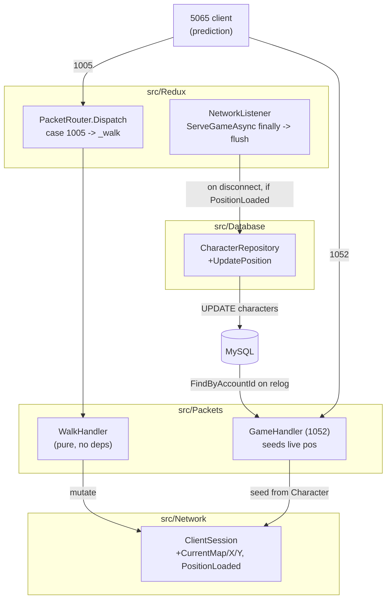

# Design: Server-Authoritative Movement (MsgWalk 1005)

## Overview

Add `case 1005:` → a new pure-in-memory `WalkHandler` (src/Packets) that parses MsgWalk, validates (length / dir / bounds), applies the literal 8-direction delta table, and mutates per-session live coords on `ClientSession`. Live position is the in-memory authoritative source (zero DB per step); one `CharacterRepository.UpdatePosition` UPDATE flushes on disconnect (`ServeGameAsync` finally) so relog spawns at the last tile via the unchanged enter-world path. Additive only — mirrors the `ActionHandler`/`RegisterHandler` guard-first pattern; no echo, no collision, no broadcast.

## Architecture



## Data Flow

### Walk hot path (1005) — in-memory only

```mermaid
sequenceDiagram
    participant C as 5065 Client
    participant PR as PacketRouter.Dispatch
    participant WH as WalkHandler
    participant CS as ClientSession (live pos)
    C->>PR: MsgWalk(1005) [UID, Direction, Mode]
    PR->>WH: Handle(session, payload)
    WH->>WH: guard payload.Length < 8
    WH->>WH: guard Character != null && PositionLoaded
    WH->>WH: dir = payload[6]; guard dir > 7
    WH->>WH: ComputeStep(CurrentX, CurrentY, dir) -> (nx, ny)
    WH->>WH: guard 0 <= nx,ny <= ushort.MaxValue
    WH->>CS: CurrentX = nx; CurrentY = ny
    WH-->>WH: log "[Game] walk dir=N -> (x,y)"
    Note over WH,C: NO outbound packet (client prediction already moved). NO DB write.
```

### Persistence path — disconnect → flush → relog → spawn

```mermaid
sequenceDiagram
    participant NL as NetworkListener.ServeGameAsync (finally)
    participant CR as CharacterRepository
    participant DB as MySQL
    participant GH as GameHandler (1052)
    participant AH as ActionHandler (SetLocation 74)
    NL->>NL: if PositionLoaded && Character != null
    NL->>CR: UpdatePosition(CharacterID, CurrentMap, CurrentX, CurrentY)
    CR->>DB: UPDATE characters SET MapID,X,Y WHERE CharacterID
    Note over NL,DB: exactly ONE UPDATE per session
    GH->>DB: FindByAccountId -> reads saved MapID/X/Y
    GH->>GH: session.Character = character; seed CurrentMap/X/Y; PositionLoaded = true
    AH->>AH: SetLocation echo reads Character.MapID/X/Y (seed SOURCE, unchanged)
    Note over GH,AH: player spawns at last tile, no spawn-logic change
```

## Architecture Decisions (Scalability & Performance)

The user's explicit priority. Each decision states the choice, alternatives weighed, the scalability/perf rationale, the forward-looking implication, and the CLAUDE.md principle it serves.

### AD-1 — Where the live position lives: plain mutable fields on `ClientSession`, kept per-player addressable

| | |
|---|---|
| **Decision** | Add four mutable fields to `ClientSession`: `CurrentMap (int)`, `CurrentX (ushort)`, `CurrentY (ushort)`, `PositionLoaded (bool)`. No separate entity/state object in v1. |
| **Alternatives** | (a) Plain fields on `ClientSession` (chosen). (b) A dedicated `PlayerState`/`Entity` object owned by the session that a future surroundings/entity-registry would extend. |
| **Scalability/perf rationale** | The walk hot path (~4 pkts/s × N players) must touch the smallest, cache-friendliest state with zero indirection and zero allocation. Plain value-type fields on the already-live `ClientSession` are read/written directly — no object graph, no boxing, no extra GC roots. Option (b) adds an allocation and a pointer hop per session for capability v1 does not use. |
| **Forward-looking (NFR-7)** | The position stays **per-player addressable**: it hangs off the one object (`ClientSession`) that the connection already owns and that any future registry will key on. When the surroundings/broadcast spec arrives, it adds — without reworking v1 — a **global concurrent entity registry keyed by character/UID** (e.g. `ConcurrentDictionary<uint, ClientSession>` populated at 1052, removed in the same `finally` that flushes) plus a **spatial query** (grid/region bucketing) to answer "who is near (x,y)?". That spec promotes these fields (or wraps them in a small `PlayerState`) into the registry's value. We name the seam now; we do **not** build the registry. This is the minimal-now / forward-clean balance the interview called for. |
| **CLAUDE.md** | "Live world state … held in memory as the authoritative source." Rule 6 (smallest scope) — don't introduce a wider abstraction than v1 needs. |

### AD-2 — Persistence cadence: disconnect-flush only (one UPDATE per session)

| | |
|---|---|
| **Decision** | Persist exactly once, in the `ServeGameAsync` `finally`, guarded by `PositionLoaded && Character != null`. Zero DB I/O on the walk path. |
| **Alternatives** | (a) Disconnect-only (chosen). (b) Periodic flush (every 30–60 s/session). (c) Per-step UPDATE. |
| **Scalability/perf rationale** | A DB round-trip per movement packet would not scale to a populated world (the explicit CLAUDE.md MMO rule). Per-step (c) is forbidden by NFR-1/NFR-2. Disconnect-only collapses a whole session of walks into a single `UPDATE … WHERE CharacterID`, keeping the hot path pure in-memory and the DB write count at **1/session**. |
| **Tradeoff (crash-loss window)** | Disconnect-only loses the session's unsaved walks on a **hard crash/kill** (the `finally` never runs). Accepted for v1: single player, manual E2E, no durability SLA. |
| **Forward-looking** | Periodic flush is the documented future hardening for crash durability / populated worlds. It hooks as a per-session timer (or a single sweep task iterating the future entity registry) calling the **same** `UpdatePosition`; the contract added in v1 is exactly what it would reuse. No v1 work. |
| **CLAUDE.md** | "Persistence is async and batched; there is NEVER a database round-trip per movement." Rule 5 (guard the flush — never write a never-loaded/null position). |

### AD-3 — Concurrency model: v1 is per-session, no shared mutable state, no locking

| | |
|---|---|
| **Decision** | No locks. Each game connection runs its own `ServeGameAsync` task (`Task.Run` per accept); `GameConnection.OnReceive` drives parsing on that one task. The live-position fields are owned and mutated by a **single** session task — no cross-task sharing in v1. |
| **Alternatives** | (a) Lock-free per-session (chosen, valid because nothing is shared). (b) `ConcurrentDictionary` / per-region lock / actor-style serialization — only needed once state is shared. |
| **Threading reality** | One async read loop per connection (`NetworkListener.RunGameAsync` → `Task.Run(ServeGameAsync)`); a session's `CurrentX/Y` is written only by its own `WalkHandler.Handle` invocation on that task. The disconnect flush runs in the same task's `finally` — no race with the walk path. |
| **Forward-looking (what surroundings changes)** | The moment surroundings adds a **shared** entity registry queried across sessions (session A reads session B's position to build a "who's near me" list), v1's no-lock assumption ends. That spec must pick a concurrency-control strategy — `ConcurrentDictionary` for the registry map, **per-region locks** or **actor-style serialization** for read-consistent spatial snapshots — so concurrent walks don't tear a neighbor's coordinates mid-read. Documenting this now ensures v1 doesn't paint us into a corner: the position is a plain field today, trivially promotable to a guarded/atomic read later. |
| **CLAUDE.md** | Rule 1 (simple control flow) — no speculative locking. "Do not pre-split / premature sharding; profile first." |

### AD-4 — Hot-path allocation discipline: zero per-packet heap allocation in `WalkHandler`

| | |
|---|---|
| **Decision** | `WalkHandler.Handle` allocates nothing per packet: reads via index/`BinaryPrimitives` over the existing `payload`, computes through `static` methods returning value tuples, mutates value-type fields in place. No echo buffer (v1 sends nothing), no `new byte[]`, no LINQ, delta tables are `static readonly`. |
| **Alternatives** | (a) Zero-alloc static parse/compute (chosen). (b) Instance helpers / per-call scratch arrays / an echo buffer. |
| **Scalability/perf rationale** | At N players × ~4 walk pkts/s, any per-packet allocation becomes sustained GC pressure on the game loop → gen-0 churn and pause jitter under load. Static methods + value tuples + in-place field writes keep the walk path allocation-free (NFR-3). The original handler's `SendToScreen` echo buffer is deliberately omitted (out of scope and an avoidable per-packet alloc). |
| **Forward-looking** | When broadcast lands and an outbound buffer is unavoidable, use `ArrayPool<byte>` (CLAUDE.md Rule 3) rather than per-packet `new byte[]` — "measure first." |
| **CLAUDE.md** | Rule 3 managed spirit ("avoid per-packet `new byte[]` in the game loop"), Rule 9 (no `unsafe`; `ReadOnlySpan<byte>` + `BinaryPrimitives`). |

## Components

| Component | File | Action | Responsibility |
|-----------|------|--------|----------------|
| `WalkHandler` | `src/Packets/WalkHandler.cs` | Create | Parse/validate/compute 1005; mutate session live pos; log. Pure in-memory, no repo, no `SendGame`. |
| `ClientSession` live-pos fields | `src/Network/ClientSession.cs` | Modify | Hold `CurrentMap/CurrentX/CurrentY/PositionLoaded` (mutable, nullable-clean). |
| `GameHandler` seed | `src/Packets/MsgConnect.cs` | Modify | Seed live pos from `Character` on 1052, set `PositionLoaded = true`. |
| `CharacterRepository.UpdatePosition` | `src/Database/CharacterRepository.cs` | Modify | Single Dapper UPDATE of MapID/X/Y. |
| `NetworkListener` flush | `src/Redux/NetworkListener.cs` | Modify | Inject `CharacterRepository`; flush in `ServeGameAsync` finally. |
| `PacketRouter` wiring | `src/Redux/PacketRouter.cs` | Modify | `_walk = new WalkHandler()`; `case 1005:`. |
| `Program.cs` wiring | `src/Redux/Program.cs` | Modify | Pass `characters` to the `NetworkListener` ctor. |
| `WalkParseTests` | `src/Packets.Tests/WalkParseTests.cs` | Create | xUnit: 1005 parse offsets + delta/bounds math. |

### WalkHandler (interfaces)

```csharp
public sealed class WalkHandler
{
    // index 0..7 (drop Common.cs index-8 no-move entry); CCW from due-south (+Y)
    private static readonly sbyte[] DeltaX = { 0, -1, -1, -1, 0, 1, 1, 1 };
    private static readonly sbyte[] DeltaY = { 1,  1,  0, -1, -1, -1, 0, 1 };

    // Guard-first; mutate session live pos; no SendGame, no repo. ~<=40 lines (Rule 4).
    public void Handle(ClientSession session, byte[] payload);

    // Pure parse (no socket/DB). Caller guards payload.Length >= 8.
    public static (uint uid, byte dir, byte mode) ParseWalk(byte[] payload);

    // Pure delta apply. Caller guards dir in 0..7. Returns candidate ints for bound-check.
    public static (int nx, int ny) ComputeStep(int curX, int curY, byte dir);
}
```

### ClientSession additions

```csharp
/// <summary>Live authoritative position (in-memory). Seeded from Character at 1052,
/// mutated by WalkHandler, flushed once on disconnect. NOT the Character (init-only) store.</summary>
public int    CurrentMap     { get; set; }
public ushort CurrentX       { get; set; }
public ushort CurrentY       { get; set; }
public bool   PositionLoaded { get; set; }
```
Value types — no null handling, nullable-clean (NFR-4).

### GameHandler seed (MsgConnect.cs, in the `character != null` branch, immediately after `session.Character = character`)

```csharp
session.Character = character;
if (character != null)
{
    session.CurrentMap     = character.MapID;
    session.CurrentX       = (ushort)character.X;
    session.CurrentY       = (ushort)character.Y;
    session.PositionLoaded = true;
    // ... existing ANSWER_OK + HeroInformation, unchanged ...
}
```

**Regression invariant (AC-4.2):** `ActionHandler.HandleSetLocation` (ActionHandler.cs:49-52) MUST keep reading `ch.MapID/X/Y` (i.e. `session.Character`) for the spawn echo — it is the **seed SOURCE**, not the live store. Do NOT repoint it at `CurrentX/Y`. Test asserts the read targets `Character` (see Test Strategy).

### CharacterRepository.UpdatePosition

```csharp
public void UpdatePosition(int characterId, int mapId, int x, int y)
{
    using var conn = _factory.Create();
    conn.Execute(
        "UPDATE characters SET MapID=@MapID, X=@X, Y=@Y WHERE CharacterID=@Id",
        new { MapID = mapId, X = x, Y = y, Id = characterId });
}
```
`characters.MapID/X/Y` are `INT NOT NULL` (init.sql) — `ushort` widens to `int` cleanly.

### NetworkListener flush + wiring

```csharp
// ctor: add CharacterRepository
private readonly CharacterRepository _characters;
public NetworkListener(IConfiguration config, PacketRouter router, CharacterRepository characters)
{ _config = config; _router = router; _characters = characters; }

// ServeGameAsync finally — flush BEFORE Disconnect:
finally
{
    if (session.PositionLoaded && session.Character != null)
        _characters.UpdatePosition(session.Character.CharacterID,
                                   session.CurrentMap, session.CurrentX, session.CurrentY);
    session.Disconnect();
    Console.WriteLine($"[Disconnect] (game) {endpoint}");
}
```
`Program.cs`: `new NetworkListener(config, router, characters)` — `characters` already constructed at line 32.

### PacketRouter wiring

```csharp
private readonly Conquer.Packets.WalkHandler _walk;
// ctor (no deps — pure in-memory):
_walk = new Conquer.Packets.WalkHandler();
// Dispatch:
case 1005:
    _walk.Handle(session, payload);
    break;
```

## Payload Offsets (net8 dispatch payload = body − 2)

| Field | Type | payload offset | Notes |
|-------|------|----------------|-------|
| Type (1005) | u16 | 0 | already used by Dispatch |
| UID | u32 | 2 | `BinaryPrimitives.ReadUInt32LittleEndian(payload.AsSpan(2,4))` |
| Direction | u8 | 6 | `payload[6]`, valid 0..7 |
| Mode | u8 | 7 | `payload[7]`, logging only |
| Unknown1 | u16 | 8 | unused |

**Length guard:** `payload.Length < 8` → log + return (must read Direction@6 and Mode@7).

## Delta Table (index = Direction, 0..7)

| dir | DeltaX | DeltaY |
|-----|--------|--------|
| 0 | 0 | +1 |
| 1 | −1 | +1 |
| 2 | −1 | 0 |
| 3 | −1 | −1 |
| 4 | 0 | −1 |
| 5 | +1 | −1 |
| 6 | +1 | 0 |
| 7 | +1 | +1 |

`(nx, ny) = (CurrentX + DeltaX[dir], CurrentY + DeltaY[dir])`. Source: `Redux/Common.cs:21-22` (index-8 no-move entry dropped).

**Bounds rule (reject, do not clamp):** compute `nx, ny` as `int`; if `nx < 0 || ny < 0 || nx > ushort.MaxValue || ny > ushort.MaxValue` → log + ignore, leave live pos unchanged. Rejecting (not clamping) keeps a bad input visible and never silently teleports the player to an edge. No `.cqmap` → no walkability check (out of scope).

**Run-mode:** `Mode` is read for the log line only. Walk and run apply the **same single-tile delta** — run is client animation speed, not a larger server step.

## Error Handling

| Scenario | Handling | Player impact |
|----------|----------|---------------|
| `payload.Length < 8` | `[Game] short 1005`; return (Rule 7 guard before indexing) | none — packet ignored |
| `Character == null \|\| !PositionLoaded` | return early (no live pos to move) | none |
| `Direction > 7` | `[Game] 1005 bad dir=N`; return (reject before indexing) | none — no move |
| `(nx,ny)` out of ushort/negative | `[Game] 1005 oob (nx,ny)`; return; pos unchanged | none — no move |
| valid walk | `[Game] walk dir=N -> (x,y)`; mutate live pos | server now tracks position |

Never disconnect on a bad walk (US-3). Malformed-length framing is already handled upstream by `GameConnection.HandleFrames`.

## File Structure

| File | Action | Purpose |
|------|--------|---------|
| `src/Packets/WalkHandler.cs` | Create | Parse/validate/compute 1005; mutate live pos; log |
| `src/Packets.Tests/WalkParseTests.cs` | Create | xUnit parse offsets + delta/bounds math |
| `src/Redux/PacketRouter.cs` | Modify | `_walk` field/ctor + `case 1005:` |
| `src/Network/ClientSession.cs` | Modify | `CurrentMap/X/Y/PositionLoaded` fields |
| `src/Database/CharacterRepository.cs` | Modify | `UpdatePosition` Dapper UPDATE |
| `src/Packets/MsgConnect.cs` | Modify | Seed live pos on 1052 |
| `src/Redux/NetworkListener.cs` | Modify | Inject repo + disconnect flush |
| `src/Redux/Program.cs` | Modify | Pass `characters` to listener ctor |

## Test Strategy

### Unit (xUnit, `src/Packets.Tests/WalkParseTests.cs` — mirror `ActionParseTests`, no socket/DB)
- **ParseWalk offsets**: synth payload, write Direction@6 / Mode@7 / UID@2; assert `ParseWalk` returns them.
- **Delta math (all 8 dirs)**: `ComputeStep(x, y, dir)` for dir 0..7 against the table.
- **Bounds reject**: `ComputeStep` from (0,0) dir 3 (−1,−1) → candidate negative → assert handler-side reject leaves pos unchanged; from (65535,65535) dir 7 → over-max → reject.
- **Short-packet guard**: `payload.Length == 7` → `Handle` no-ops (no throw).
- **Dir>7 guard**: `Direction = 8` → no move.
- **Seed-source regression (AC-4.2)**: assert `ActionHandler.HandleSetLocation` reads `Character.MapID/X/Y` — keep `ActionParseTests` green and add a guard test/comment that the SetLocation echo source is `Character`, not `CurrentX/Y`. (Static assertion: the spawn echo must not reference the live store.)

### Integration / E2E
- No socket/DB in unit tests. Build + test dockerized:
  - `scripts/dotnet build src/Conquer.sln` → 0 warnings / 0 errors (NFR-4 strict gate).
  - `scripts/dotnet test  src/Conquer.sln` → green.
- **Operator-manual live E2E (authoritative):** walk in the real 5065 client → `[Game] walk dir=N -> (x,y)` logs; log off at a non-spawn tile → relog → spawn at the LAST position (one UPDATE/session), not the spawn tile.

## Performance Considerations
- Walk path: 0 DB I/O, 0 heap alloc per packet (AD-2, AD-4). Persistence: 1 UPDATE/session (AD-2).
- No locking on the hot path (AD-3, per-session ownership).

## Security Considerations
- All wire reads bounds-guarded before indexing (Rule 7): length, dir, computed coords.
- Bad input is logged + ignored, never fatal (US-3) — a single malformed 1005 cannot kick a session.
- v1 trusts the client move and only bound-checks coords (no server collision/anti-cheat — out of scope; future surroundings/collision spec).

## Existing Patterns to Follow
- Guard-first handler shape with `payload.Length < N` early return (`ActionHandler`, `RegisterHandler`).
- `static` testable parse/compute methods returning value tuples (`RegisterHandler.ParseRegister`).
- `BinaryPrimitives` LE reads over `ReadOnlySpan<byte>`; no `unsafe` (NFR-5).
- Local literal tables in `src/Packets` (no `Redux.Common` import — Packets.csproj refs Crypto+Network+Database only), mirroring `RegisterHandler`'s re-declared regex/sets.
- Manual `new` handler injection in `PacketRouter` ctor + `case` in `Dispatch` (`_action`/`_register`).
- xUnit static-method tests, no socket/DB (`ActionParseTests`).

## Unresolved Questions (LIVE-only — operator-capture)
- Exact 1005 wire bytes vs a real 5065-client capture: confirm Direction@payload[6], Mode@payload[7] (offsets derived from in-repo `WalkPacket`).
- Whether the 5065 client needs ANY server confirm under prediction (recommend none; revert to the original `SendToScreen(...,true)` echo only if the avatar visibly desyncs).
- Direction→delta mapping vs what the 5065 client expects (the `{0,-1,-1,-1,0,1,1,1}` / `{1,1,0,-1,-1,-1,0,1}` table is the fork's own convention — verify a few directions visually).
- Crash durability: disconnect-only flush loses unsaved walks on a hard crash/kill. Accepted v1; periodic flush is the documented future hardening (AD-2).

## Implementation Steps
1. Add `CurrentMap/CurrentX/CurrentY/PositionLoaded` to `ClientSession` (`src/Network`).
2. Create `WalkHandler` (`src/Packets`): `ParseWalk`, `ComputeStep`, guard-first `Handle` (length / null+loaded / dir>7 / bounds → log+ignore; valid → mutate + log; no send, no repo).
3. Seed live pos in `GameHandler.Handle` (`src/Packets/MsgConnect.cs`) after `session.Character = character`; set `PositionLoaded = true`. Leave `ActionHandler.HandleSetLocation` reading `Character` (seed source).
4. Wire `PacketRouter`: `_walk = new WalkHandler()` + `case 1005: _walk.Handle(session, payload); break;`.
5. Add `CharacterRepository.UpdatePosition` (Dapper UPDATE).
6. Inject `CharacterRepository` into `NetworkListener`; flush in `ServeGameAsync` finally (guard `PositionLoaded && Character != null`) before `Disconnect()`. Update `Program.cs` ctor call.
7. Add `WalkParseTests` (parse offsets + all-8-dir deltas + bounds reject + short/dir guards + seed-source regression).
8. `scripts/dotnet build src/Conquer.sln` (0/0) and `scripts/dotnet test src/Conquer.sln` (green); then operator-manual live walk-and-relog.
