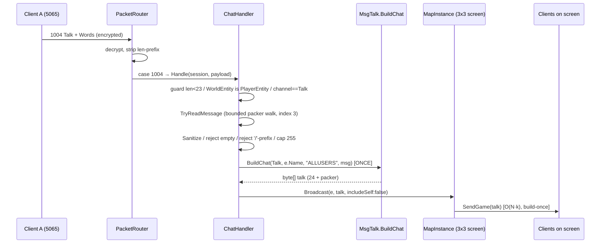

# Design: screen-chat (EPIC 2)

## Overview

Inbound `MsgTalk(1004)` `ChatType.Talk` → a new World-injected `ChatHandler` (mirror of `WalkHandler`) parses + bounds-checks the string-list, validates/sanitizes the message, rebuilds the 1004 **once** with a trusted `From = PlayerEntity.Name`, and fans it to the sender's 3×3 screen via the existing `MapInstance.Broadcast`. No new fan-out, no persistence — purely a second consumer of the DONE EPIC-1 broadcast layer. Additive: new `ChatHandler.cs`, a `MsgTalk.BuildChat` overload (existing `Build` byte-identical), `ChatType.Talk=2000`, one `PacketRouter` case.

## Architecture



`Program.cs` already builds `world` and injects it into `PacketRouter` (EPIC 1) — **no Program.cs change**.

## Components

| Component | File | Action | Responsibility |
|-----------|------|--------|----------------|
| `ChatHandler` | `src/Packets/ChatHandler.cs` | Create | World-injected. Guard → resolve `PlayerEntity` → channel==Talk → bounded parse → sanitize/cap/reject → `BuildChat` once → `Broadcast`. Never disconnects. |
| `MsgTalk.BuildChat` | `src/Packets/MsgTalk.cs` | Modify (add overload) | Pure builder of the 1004 with `[from, to, "", message]` (count=4) at verified offsets. **Existing `Build` untouched.** |
| `ChatType.Talk` | `src/Packets/ChatType.cs` | Modify (add value) | Add `Talk = 2000`; keep `Register=2100`, `Entrance=2101`. |
| `PacketRouter` wiring | `src/Redux/PacketRouter.cs` | Modify | Add `_chat` field, `_chat = new ChatHandler(world)` in ctor, `case 1004: _chat.Handle(session, payload); break;`. |

### ChatHandler (shape — mirror WalkHandler)

```csharp
public sealed class ChatHandler
{
    private readonly Conquer.World.World _world;
    public ChatHandler(Conquer.World.World world) => _world = world;

    public void Handle(ClientSession session, byte[] payload)
    {
        if (payload.Length < 23) return;                              // AC-3.1 (Rule 7 guard)
        if (session.WorldEntity is not Conquer.World.PlayerEntity e)  // AC-2.3
            return;

        ushort channel = BinaryPrimitives.ReadUInt16LittleEndian(payload.AsSpan(6, 2));
        if (channel != (ushort)ChatType.Talk) return;                // AC-3.3 non-Talk no-op

        if (!TryReadMessage(payload, out string raw)) return;        // AC-3.2 bounds-checked
        string message = Sanitize(raw);                              // AC-4.2 strip <0x20
        if (message.Length == 0) return;                             // AC-3.4 reject empty
        if (message[0] == '/') return;                               // AC-3.5 GM-cmd (future)
        if (message.Length > MaxLen) message = message[..MaxLen];    // AC-4.3 cap (255)

        // Trusted From (AC-1.2/AC-4.1). Build ONCE. Fan to 3x3 screen.
        byte[] talk = MsgTalk.BuildChat(ChatType.Talk, e.Name, AllUsers, message);
        _world.GetOrAdd(e.MapId).Broadcast(e, talk, includeSelf: false); // AC-2.2 (live-toggle)
    }

    // Pure + static (test target, mirrors WalkHandler.ParseWalk). String-list @ payload[22].
    public static bool TryReadMessage(byte[] p, out string msg)
    {
        msg = string.Empty;
        int o = 22; if (o >= p.Length) return false;
        int count = p[o++];
        for (int i = 0; i < count && i < 8; i++)   // Rule 2 bounded (CO uses 4..6 strings)
        {
            if (o >= p.Length) return false;       // bound the length byte
            int len = p[o++];
            if (o + len > p.Length) return false;  // never read past payload (Rule 7)
            if (i == 3) { msg = Encoding.ASCII.GetString(p, o, len); return true; } // Words
            o += len;
        }
        return false;                              // no Words index present
    }
}
```

`MaxLen = 255` (wire cap; tighten per AC-6.3 capture). `AllUsers = "ALLUSERS"`. `Sanitize` = drop chars `< 0x20`, ASCII. Guard-first, ~≤60 lines (NFR-7). `session.Character` is **never** touched — the name comes from `e.Name`.

### MsgTalk.BuildChat (add — keep Build byte-identical)

```csharp
public static byte[] BuildChat(ChatType channel, string from, string to, string message)
{
    var packer = new NetStringPacker(from, to, string.Empty, message); // count=4
    int bodyLength = 24 + packer.Length;
    var buffer = new byte[bodyLength];
    Span<byte> span = buffer;
    PacketBuilder.AppendHeader(span, (ushort)(bodyLength + 8), MsgTalkType); // len=bodyLen
    BinaryPrimitives.WriteUInt32LittleEndian(span.Slice(4),  DefaultColor);  // 0x00FFFFFF
    BinaryPrimitives.WriteUInt16LittleEndian(span.Slice(8),  (ushort)channel);
    BinaryPrimitives.WriteUInt16LittleEndian(span.Slice(10), 0);  // Unknown0
    BinaryPrimitives.WriteUInt32LittleEndian(span.Slice(12), 0);  // Time
    BinaryPrimitives.WriteUInt32LittleEndian(span.Slice(16), 0);  // HearerLookface
    BinaryPrimitives.WriteUInt32LittleEndian(span.Slice(20), 0);  // SpeakerLookface
    packer.Write(span.Slice(24));
    return buffer;
}
```

Only difference vs `Build`: the From/To strings are parameters (Build hardcodes `SYSTEM`/`ALLUSERS`). Same offsets, same `AppendHeader` semantics, same count=4. **`Build`'s signature and bytes are unchanged** (NFR-8 — shared with the ANSWER_OK/NEW_ROLE handshake). Optionally `Build` could delegate to `BuildChat` for DRY; keep separate to minimize handshake regression risk.

## 1004 Wire Layout (verified — original body offset; payload = body − 2)

`PacketRouter.ReadPacket` strips the 2-byte length prefix, so **payload offset = body − 2**. The `MsgTalk` builder returns the **body** (`24 + packer`); `SendGame` adds the 8-byte seal; `AppendHeader` writes `size − 8 = bodyLength` into the length field.

| Field | Type | Body off | Inbound payload off | Outbound value |
|-------|------|----------|---------------------|----------------|
| Length | u16 LE | 0 | (stripped) | bodyLength (= frame−8) |
| Type id | u16 LE | 2 | 0 | 1004 |
| Color | u32 LE | 4 | 2 | `0x00FFFFFF` white |
| **ChatType** | u16 LE | 8 | **6** | **2000 Talk** |
| Unknown0 | u16 LE | 10 | 8 | 0 |
| Time | u32 LE | 12 | 10 | 0 |
| HearerLookface | u32 LE | 16 | 14 | 0 |
| SpeakerLookface | u32 LE | 20 | 18 | 0 |
| **StringList** | packer | 24 | **22** | see below |

Min inbound payload = 22 (fixed) + 1 (count byte) = **23** → guard `payload.Length < 23`.

### String-list packing (NetStringPacker — `[u8 count][u8 len][ASCII]…`)

| Index | Field | Outbound value (local chat) |
|-------|-------|-----------------------------|
| 0 | Speaker (From) | `e.Name` (trusted) |
| 1 | Hearer (To) | `"ALLUSERS"` |
| 2 | Emotion (suffix) | `""` |
| 3 | Words (message) | sanitized message |

`count = 4` (net8 handshake ships 4 live). Per-string cap 255 (`AddString` rejects `>255`). Inbound parse reads **index 3** = the message; indices 0–2 are skipped (client Speaker never trusted).

## Architecture / Scalability Notes

- **Reuses EPIC-1 broadcast 1:1** — `MapInstance.Broadcast(center, packet, includeSelf)` over `QueryScreen(CellX, CellY)`. No new fan-out code (NFR-1).
- **Build-once, O(N·k):** one `BuildChat` per message, N screen recipients (NFR-6). No per-recipient build.
- **Pure in-memory, ephemeral** — no persisted structures (NFR-2). Reuses the existing roster/grid.
- **Validate-all-input (Rule 7):** length guard + per-string bound + bounded loop (`i < 8`, Rule 2) + cap + control-char strip + reject-empty.
- **Trusted From (build-once):** server-owned `e.Name`, anti-spoof. White color, fixed To="ALLUSERS", empty suffix.
- **No `unsafe`** (Rule 9) — `Span<T>` + `BinaryPrimitives` + `Encoding.ASCII`.
- **Rate-limit / anti-spam:** explicit future hardening, NOT v1.

## Error Handling (all → log + return, NEVER disconnect — AC-3.6)

| Scenario | Guard | Result |
|----------|-------|--------|
| `payload.Length < 23` | length guard | ignore (AC-3.1) |
| per-string len reads past `payload.Length` | bound check in `TryReadMessage` | ignore (AC-3.2) |
| channel ≠ Talk (Whisper/Team/World…) | `channel != Talk` | silent no-op (AC-3.3) |
| empty after sanitize | `message.Length == 0` | ignore (AC-3.4) |
| `/`-prefixed (GM command) | `message[0] == '/'` | ignore (AC-3.5) |
| oversized (> 255) | clamp `message[..MaxLen]` | broadcast clamped (AC-4.3) |
| `WorldEntity` not `PlayerEntity` | type guard | ignore, no crash (AC-2.3) |
| control chars (`< 0x20`) | `Sanitize` strip | broadcast cleaned (AC-4.2) |

Matches `WalkHandler`/`ActionHandler`: bad input is logged + returned, connection stays up.

## File Structure

| File | Action | Purpose |
|------|--------|---------|
| `src/Packets/ChatHandler.cs` | Create | The handler (Handle + static `TryReadMessage` + `Sanitize`). |
| `src/Packets/MsgTalk.cs` | Modify | Add `BuildChat` overload. Keep `Build` byte-identical. |
| `src/Packets/ChatType.cs` | Modify | Add `Talk = 2000`. |
| `src/Redux/PacketRouter.cs` | Modify | Add `_chat` field + ctor init + `case 1004:`. |
| `src/Packets.Tests/MsgTalkBuildChatTests.cs` | Create | `BuildChat` byte-layout tests. |
| `src/Packets.Tests/ChatParseTests.cs` | Create | Bounded inbound `TryReadMessage` tests. |

## Test Strategy

Dockerized: `scripts/dotnet build|test src/Conquer.sln` (must stay 0/0). Both new targets are pure (no socket).

### Unit — `MsgTalkBuildChatTests` (AC-5.1, AC-5.2)
- Header length field = `bodyLength` (= frame − 8); body = `24 + packer.Length`.
- ChatType u16 @ body offset 8 = 2000; Color u32 @ 4 = `0x00FFFFFF`; type id @ 2 = 1004.
- String-list order/count: parse the packer back → `[from, "ALLUSERS", "", message]`, count=4.
- Regression: a known `Build(Entrance, "...")` produces the same bytes as before (handshake unchanged).

### Unit — `ChatParseTests` (AC-5.3, AC-3.2)
- Valid 1004 payload (4 strings) → `TryReadMessage` extracts index 3 (`Words`).
- Short payload (`< 23`) → `false`, no throw.
- A per-string length byte that runs past `payload.Length` → `false`, no read past bound.
- `count` with fewer than 4 strings (no Words index) → `false`.
- Bounded loop: pathological `count = 255` does not over-iterate (capped at `i < 8`).
- `Handle(null!, shortPayload)` → no throw (length guard returns first, mirror WalkParseTests).

### Operator E2E (US-6, two 5065 clients on Map 1010, same screen)
- A types local message → B sees A's name + message in the chat box (AC-6.1).
- **Live-unknown #1 — self-echo (AC-6.2):** `includeSelf=false` default; if A sees the message twice → keep false; if A sees nothing → flip to `true`. Operator-capture.
- **Live-unknown #2 — client max length (AC-6.3):** type a progressively longer message; record the chatbox truncation point to confirm/tighten the 255 cap. Operator-capture.

## Unresolved Questions (operator-capture, non-blocking for design)

- **Self-echo (#1):** does the 5065 client self-display local Talk (`includeSelf:false`) or render only on server echo (`includeSelf:true`)? Default `false` (matches original `Player.SendToScreen` `_self:false`). Resolve at AC-6.2.
- **Client max chat length (#2):** wire cap 255; exact 5065 chatbox limit unknown. Use 255 until AC-6.3.

## Implementation Steps

1. `ChatType.cs` — add `Talk = 2000` (keep Register/Entrance).
2. `MsgTalk.cs` — add `BuildChat(ChatType, from, to, message)` overload at the verified offsets; leave `Build` untouched.
3. `src/Packets/ChatHandler.cs` — create: World-injected; `Handle` (guard `<23` → `PlayerEntity` → channel==Talk → `TryReadMessage` → `Sanitize`/reject-empty/`/`-prefix/cap → `BuildChat` once → `Broadcast(e, talk, includeSelf:false)`); static `TryReadMessage` + `Sanitize`.
4. `PacketRouter.cs` — add `_chat` field, `_chat = new Conquer.Packets.ChatHandler(world)` in ctor, `case 1004: _chat.Handle(session, payload); break;`. No `Program.cs` change.
5. `MsgTalkBuildChatTests.cs` + `ChatParseTests.cs` — pure xUnit (build layout + bounded parse).
6. `scripts/dotnet build|test src/Conquer.sln` → 0/0; confirm handshake regression-free.
7. Operator E2E: rebuild with BOTH compose files, two clients → resolve self-echo + max-length, set `includeSelf` + final cap.
