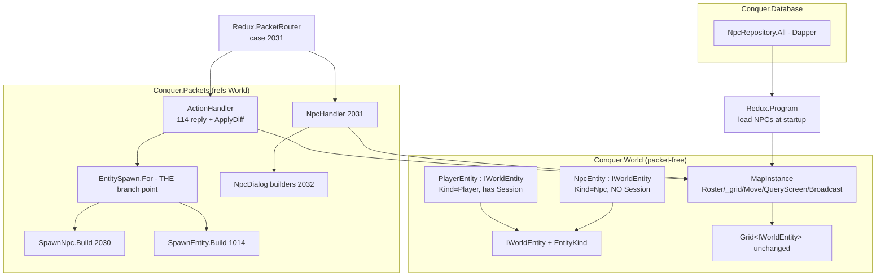
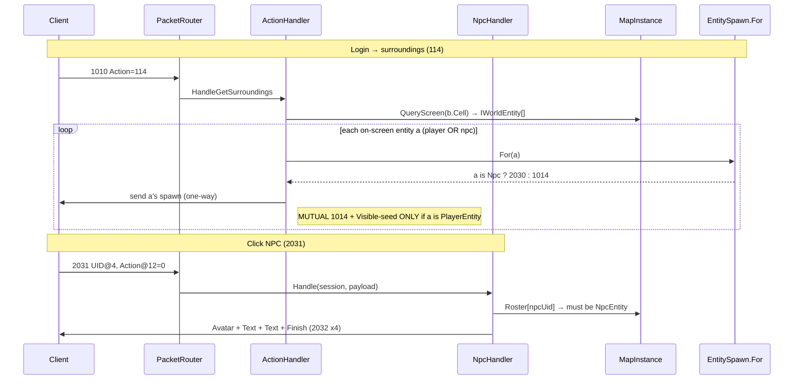

# Design: static-npcs (EPIC 3)

## Overview
Generalize the EPIC-1 World layer from concrete `PlayerEntity` to an `IWorldEntity` discriminator interface so the roster/grid/broadcast hold non-players. NPCs load once from a new `cq_npc` table into each `MapInstance` and ride the existing `QueryScreen`; the 2 spawn sites in `ActionHandler` branch player→1014 / npc→2030 via a new `EntitySpawn.For` helper in the Packets project (no World→Packets cycle). Clicking an NPC arrives as MsgNpc(2031)/Activate(0); `NpcHandler` validates the UID against the map roster and sends a static NpcDialog(2032) control sequence to the clicker only.

## Architecture



## Data Flow



## Components

### IWorldEntity (CREATE `src/World/IWorldEntity.cs`)
**Purpose**: Common shape every world entity exposes so the grid/roster/broadcast are kind-agnostic. The crux of EPIC 3; reused by EPIC 4 monsters.

**Design notes**:
- `Kind` is a cheap byte discriminator — the "players only" branch (`is PlayerEntity`) and the spawn-builder branch (`EntitySpawn.For`) avoid a builder living on the entity (which would force a World→Packets ref = cycle).
- `CellX`/`CellY` are settable on the interface because `MapInstance.Move` writes them (`MapInstance.cs:76-77`). NPCs never Move, so their setters are never called — but the interface must expose set for the player path. Kept as `{ get; set; }` to match `PlayerEntity.CellX { get; internal set; }` → widened to `set` on the interface (NpcEntity gives a trivial auto-prop).
- NO `BuildSpawn()` on the interface (Option B from research) — that would invert the packet-free World invariant and create a cycle.

```csharp
public enum EntityKind : byte { Player = 0, Npc = 1, Monster = 2, GroundItem = 3 }

public interface IWorldEntity
{
    uint Uid { get; }
    int MapId { get; }
    ushort X { get; }
    ushort Y { get; }
    int CellX { get; set; }   // Move() writes these for players; NPCs never Move
    int CellY { get; set; }
    EntityKind Kind { get; }
}
```

### PlayerEntity (MODIFY `src/World/PlayerEntity.cs`)
**Purpose**: Unchanged behavior; now implements `IWorldEntity`.

**Changes** (additive — no field/behavior change):
- `public sealed class PlayerEntity : IWorldEntity`
- Add `public EntityKind Kind => EntityKind.Player;`
- `CellX`/`CellY` change from `{ get; internal set; }` → `{ get; set; }` to satisfy the interface (MapInstance is in the same assembly, so this is not a real widening of surface for callers — but interface members can't be `internal set`). Keep all other fields (`Session`, `Mesh`, `Avatar`, `Level`, `Hp`, `Name`, `Visible`, `SetPosition`) exactly as-is.

### NpcEntity (CREATE `src/World/NpcEntity.cs`)
**Purpose**: Static non-player `IWorldEntity`. No `ClientSession`; sender-of-spawn-only; registered once, never moved/re-indexed.

```csharp
public sealed class NpcEntity : IWorldEntity
{
    public uint Uid { get; }
    public int MapId { get; }
    public ushort X { get; }
    public ushort Y { get; }
    public int CellX { get; set; }   // set once at construction; Move() never called
    public int CellY { get; set; }
    public EntityKind Kind => EntityKind.Npc;

    // 2030 spawn-source fields (public for EntitySpawn.For in Packets)
    public ushort Mesh { get; }
    public ushort NpcType { get; }
    public string Name { get; }

    public NpcEntity(uint uid, int mapId, ushort x, ushort y,
                     ushort mesh, ushort npcType, string name)
    {
        Uid = uid; MapId = mapId; X = x; Y = y;
        CellX = Grid<IWorldEntity>.CellOf(x);
        CellY = Grid<IWorldEntity>.CellOf(y);
        Mesh = mesh; NpcType = npcType; Name = name ?? string.Empty;
    }
}
```

> No cached spawn byte[] on the entity (research considered it). Caching the 2030 here would put a Packets call in World = cycle. The build cost is paid in `EntitySpawn.For` on the player's screen query — negligible (handful of NPCs per screen, NFR-8). If profiling ever shows it, cache the byte[] **in Packets** keyed by UID, not on the entity.

### MapInstance / World / ScreenDiff retype (MODIFY)
Mechanical `PlayerEntity` → `IWorldEntity`. Grid is already `Grid<T>` — only the instantiation type changes. The ONLY non-mechanical edit is the `Broadcast` recipient guard.

**`MapInstance.cs` exact diffs**:

```diff
-        public ConcurrentDictionary<uint, PlayerEntity> Roster { get; } = new();
-        private readonly Grid<PlayerEntity> _grid = new();
+        public ConcurrentDictionary<uint, IWorldEntity> Roster { get; } = new();
+        private readonly Grid<IWorldEntity> _grid = new();
```
```diff
-        public void Register(PlayerEntity e)
+        public void Register(IWorldEntity e)
         {
             Roster[e.Uid] = e;
-            _grid.TryAdd(Grid<PlayerEntity>.CellKey(e.CellX, e.CellY), e.Uid, e);
+            _grid.TryAdd(Grid<IWorldEntity>.CellKey(e.CellX, e.CellY), e.Uid, e);
         }
```
```diff
-        public IReadOnlyCollection<PlayerEntity> Deregister(uint uid)
+        public IReadOnlyCollection<IWorldEntity> Deregister(uint uid)
         {
-            if (!Roster.TryRemove(uid, out var e)) return System.Array.Empty<PlayerEntity>();
-            var screen = new List<PlayerEntity>();
+            if (!Roster.TryRemove(uid, out var e)) return System.Array.Empty<IWorldEntity>();
+            var screen = new List<IWorldEntity>();
             foreach (var other in QueryScreen(e.CellX, e.CellY)) { if (other.Uid != uid) screen.Add(other); }
-            _grid.TryRemove(Grid<PlayerEntity>.CellKey(e.CellX, e.CellY), uid);
+            _grid.TryRemove(Grid<IWorldEntity>.CellKey(e.CellX, e.CellY), uid);
             return screen;
         }
```
```diff
-        public ScreenDiff Move(PlayerEntity e, ushort newX, ushort newY)
+        public ScreenDiff Move(IWorldEntity e, ushort newX, ushort newY)
         {
-            int newCx = Grid<PlayerEntity>.CellOf(newX);
-            int newCy = Grid<PlayerEntity>.CellOf(newY);
+            int newCx = Grid<IWorldEntity>.CellOf(newX);
+            int newCy = Grid<IWorldEntity>.CellOf(newY);
             ...
-            e.SetPosition(newX, newY);
+            ((PlayerEntity)e).SetPosition(newX, newY);   // Move is player-only (WalkHandler/jump)
             ...
-            var entered = new List<PlayerEntity>();
-            var left = new List<PlayerEntity>();
+            var entered = new List<IWorldEntity>();
+            var left = new List<IWorldEntity>();
             ... (Cells3x3 / CellKey → Grid<IWorldEntity>)
         }
```
> `SetPosition` is `internal` on `PlayerEntity` and NOT on the interface (NPCs have no live mutation). `Move` is only ever invoked for players (`WalkHandler`, `HandleJump`), so the cast is sound; add a guard comment. Alternative: keep `SetPosition` callable via a tiny `IMovableEntity`—rejected as over-engineering (Karpathy: NPCs never move; one cast at the single call site is simpler than a second interface).

```diff
-        public IEnumerable<PlayerEntity> QueryScreen(int cellX, int cellY)
+        public IEnumerable<IWorldEntity> QueryScreen(int cellX, int cellY)
```
```diff
-        public void Broadcast(PlayerEntity center, byte[] packet, bool includeSelf)
+        public void Broadcast(IWorldEntity center, byte[] packet, bool includeSelf)
         {
             foreach (var e in QueryScreen(center.CellX, center.CellY))
             {
                 if (!includeSelf && e.Uid == center.Uid) continue;
-                e.Session.SendGame(packet);
+                if (e is PlayerEntity p) p.Session.SendGame(packet);   // NPCs never receive
             }
         }
```

**`ScreenDiff.cs` diff**:
```diff
-    public readonly record struct ScreenDiff(
-        IReadOnlyList<PlayerEntity> Entered, IReadOnlyList<PlayerEntity> Left)
+    public readonly record struct ScreenDiff(
+        IReadOnlyList<IWorldEntity> Entered, IReadOnlyList<IWorldEntity> Left)
     {
         public static ScreenDiff Empty { get; } =
-            new(System.Array.Empty<PlayerEntity>(), System.Array.Empty<PlayerEntity>());
+            new(System.Array.Empty<IWorldEntity>(), System.Array.Empty<IWorldEntity>());
     }
```

**`World.cs` diffs**: retype `Register(IWorldEntity)`, `Deregister(...) → IReadOnlyCollection<IWorldEntity>`, `Move(int, IWorldEntity, ...)`, `QueryScreen(...) → IEnumerable<IWorldEntity>`, and the two `System.Array.Empty<PlayerEntity>()` → `<IWorldEntity>()`. Pure type substitution, no logic change.

### EntitySpawn (CREATE `src/Packets/EntitySpawn.cs`)
**Purpose**: THE single kind→spawn-builder branch point. Lives in Packets (which already refs World, `ActionHandler.cs:17`) so no World→Packets edge is introduced (NFR-7).

```csharp
public static class EntitySpawn
{
    public static byte[] For(IWorldEntity e) => e switch
    {
        NpcEntity n    => SpawnNpc.Build(n.Uid, n.Mesh, n.NpcType, n.X, n.Y, n.Name),
        PlayerEntity p => SpawnEntity.Build(p.Uid, p.Mesh, p.Avatar, p.Level, p.Hp, p.X, p.Y, p.Name),
        _ => throw new ArgumentOutOfRangeException(nameof(e), e?.Kind, "unknown entity kind"),
    };
}
```
> **Regression invariant (AC-2.1):** `EntitySpawn.For(player)` calls `SpawnEntity.Build` with the identical arg order as today's inline `ActionHandler.cs:91,98,124-130` → byte-identical 1014. xUnit asserts this.

### SpawnNpc (CREATE `src/Packets/SpawnNpc.cs`)
**Purpose**: 2030 wire builder. Net8 sizes the body exactly `18 + names.Length` (original over-allocates a fixed `byte[48]`, `[2030] SpawnNpc.cs:50`).

```csharp
public static class SpawnNpc
{
    private const ushort MsgNpcSpawnType = 2030;
    private const int NameOffset = 18;

    public static byte[] Build(uint uid, ushort mesh, ushort type, ushort x, ushort y, string name)
    {
        var names = new NetStringPacker(name ?? string.Empty);
        int bodyLength = NameOffset + names.Length;
        var buffer = new byte[bodyLength];
        Span<byte> span = buffer;
        PacketBuilder.AppendHeader(span, (ushort)(bodyLength + 8), MsgNpcSpawnType);
        BinaryPrimitives.WriteUInt32LittleEndian(span.Slice(4),  uid);
        BinaryPrimitives.WriteUInt16LittleEndian(span.Slice(8),  x);
        BinaryPrimitives.WriteUInt16LittleEndian(span.Slice(10), y);
        BinaryPrimitives.WriteUInt16LittleEndian(span.Slice(12), mesh);
        BinaryPrimitives.WriteUInt16LittleEndian(span.Slice(14), type);
        BinaryPrimitives.WriteUInt32LittleEndian(span.Slice(16), 0u);   // Unknown1
        names.Write(span.Slice(NameOffset));
        return buffer;
    }
}
```

### NpcDialog (CREATE `src/Packets/NpcDialog.cs`)
**Purpose**: 2032 control builders. Each control is one 2032 packet; a window = a SEQUENCE. Net8 sizes the body exactly `12 + names.Length` (original `[2032] NpcDialog.cs:50` over-allocates `24 + Strings.Length`; the 12 header region is real, the extra 12 is slack — confirm live, flagged).

```csharp
public static class NpcDialog
{
    private const ushort Type = 2032;
    private enum Action : byte { Dialog = 1, Option = 2, Avatar = 4, Finish = 100 }

    private static byte[] Build(byte action, ushort id, byte linkback, string? text)
    {
        var names = new NetStringPacker();
        if (!string.IsNullOrEmpty(text)) names.AddString(text);
        int body = 12 + (names.Count > 0 ? names.Length : 0);
        var buf = new byte[body]; Span<byte> s = buf;
        PacketBuilder.AppendHeader(s, (ushort)(body + 8), Type);
        BinaryPrimitives.WriteUInt32LittleEndian(s.Slice(4), 0u);   // UID = window pos (0 = default-place v1)
        BinaryPrimitives.WriteUInt16LittleEndian(s.Slice(8), id);   // ID = avatar face
        s[10] = linkback;                                            // Linkback (255 = close on Finish)
        s[11] = action;                                             // Action = DialogAction
        if (names.Count > 0) names.Write(s.Slice(12));             // Strings
        return buf;
    }

    public static byte[] Avatar(ushort face)            => Build((byte)Action.Avatar, face, 0,   null);
    public static byte[] Text(string line)              => Build((byte)Action.Dialog, 0,    0,   line);
    public static byte[] Option(string label, byte id)  => Build((byte)Action.Option, 0,    id,  label);
    public static byte[] Finish()                       => Build((byte)Action.Finish, 0,    255, null);
}
```
**v1 static sequence (≥3 controls so the client renders):** `Avatar(face)` → `Text(...)` → `Text(...)` → `Finish()` — 4 packets to the clicker only.

### NpcHandler (CREATE `src/Packets/NpcHandler.cs`)
**Purpose**: Inbound 2031/Activate(0) → static dialog to the clicker. World-injected, guard-first (Rule 7).

```csharp
public sealed class NpcHandler
{
    private readonly Conquer.World.World _world;
    public NpcHandler(Conquer.World.World world) => _world = world;

    public void Handle(ClientSession session, byte[] payload)
    {
        if (payload.Length < 16) return;                                   // Rule 7
        if (session.WorldEntity is not Conquer.World.PlayerEntity p) return;

        uint   npcUid = BinaryPrimitives.ReadUInt32LittleEndian(payload.AsSpan(4, 4));
        ushort action = BinaryPrimitives.ReadUInt16LittleEndian(payload.AsSpan(12, 2));
        if (action != 0) return;                                           // Activate only (AC-6.3)
        // @14 linkback read-but-unused in v1 (no branching)

        var map = _world.GetOrAdd(p.MapId);
        if (!map.Roster.TryGetValue(npcUid, out var e) ||
            e is not Conquer.World.NpcEntity npc) return;                  // validate UID (AC-6.4)

        session.SendGame(NpcDialog.Avatar(1));                             // face=1 placeholder (live-capture)
        session.SendGame(NpcDialog.Text($"Hello, I am {npc.Name}."));
        session.SendGame(NpcDialog.Text("Welcome, traveler."));
        session.SendGame(NpcDialog.Finish());
    }
}
```

### NpcRepository (CREATE `src/Database/NpcRepository.cs`)
**Purpose**: Dapper read of `cq_npc`, mirroring `CharacterRepository`. Includes a `DbNpc` POCO.

```csharp
public sealed class DbNpc
{
    public int UID { get; init; }
    public string Name { get; init; } = "";
    public int MapID { get; init; }
    public int X { get; init; }
    public int Y { get; init; }
    public int Mesh { get; init; }
    public int Type { get; init; }
    public int? BaseId { get; init; }
}

public sealed class NpcRepository
{
    private readonly ConnectionFactory _factory;
    public NpcRepository(ConnectionFactory factory) => _factory = factory;

    public IReadOnlyList<DbNpc> All()
    {
        using var conn = _factory.Create();
        return conn.Query<DbNpc>(
            "SELECT UID, Name, MapID, X, Y, Mesh, Type, BaseId FROM cq_npc").AsList();
    }
}
```

## ActionHandler spawn-site branches (MODIFY — the 2 sites)

### Site 1: HandleGetSurroundings (`ActionHandler.cs:86-104`)
```diff
         private void HandleGetSurroundings(ClientSession session)
         {
             if (session.WorldEntity is not Conquer.World.PlayerEntity b) return;
             byte[] bSpawn = SpawnEntity.Build(b.Uid, b.Mesh, b.Avatar, b.Level, b.Hp, b.X, b.Y, b.Name);

             foreach (var a in _world.GetOrAdd(b.MapId).QueryScreen(b.CellX, b.CellY))
             {
                 if (a.Uid == b.Uid) continue;
-                session.SendGame(SpawnEntity.Build(a.Uid, a.Mesh, a.Avatar, a.Level, a.Hp, a.X, a.Y, a.Name));
-                a.Session.SendGame(bSpawn);
-                b.Visible[a.Uid] = 1;
-                a.Visible[b.Uid] = 1;
+                session.SendGame(EntitySpawn.For(a));            // a's 1014 OR 2030 (one-way to B)
+                if (a is Conquer.World.PlayerEntity ap)          // MUTUAL only for players
+                {
+                    ap.Session.SendGame(bSpawn);
+                    b.Visible[a.Uid] = 1;
+                    ap.Visible[b.Uid] = 1;
+                }
             }
         }
```

### Site 2: ApplyDiff (`ActionHandler.cs:115-152`)
```diff
-        public static void ApplyDiff(Conquer.World.PlayerEntity mover, Conquer.World.ScreenDiff diff)
+        public static void ApplyDiff(Conquer.World.PlayerEntity mover, Conquer.World.ScreenDiff diff)
         {
             byte[]? moverSpawn = null;
             foreach (var other in diff.Entered)
             {
                 if (other.Uid == mover.Uid) continue;
                 moverSpawn ??= SpawnEntity.Build(mover.Uid, mover.Mesh, ... mover.Name);
-                other.Session.SendGame(moverSpawn);
-                mover.Session.SendGame(SpawnEntity.Build(other.Uid, ...));
-                mover.Visible[other.Uid] = 1;
-                other.Visible[mover.Uid] = 1;
+                mover.Session.SendGame(EntitySpawn.For(other));   // mover sees other (1014 OR 2030)
+                if (other is Conquer.World.PlayerEntity op)        // MUTUAL only for players
+                {
+                    op.Session.SendGame(moverSpawn);
+                    mover.Visible[other.Uid] = 1;
+                    op.Visible[mover.Uid] = 1;
+                }
             }

             byte[]? moverRemove = null;
             foreach (var other in diff.Left)
             {
                 if (other.Uid == mover.Uid) continue;
                 moverRemove ??= GeneralData.BuildRemoveEntity(mover.Uid);
-                other.Session.SendGame(moverRemove);
-                mover.Session.SendGame(GeneralData.BuildRemoveEntity(other.Uid));
-                mover.Visible.TryRemove(other.Uid, out _);
-                other.Visible.TryRemove(mover.Uid, out _);
+                mover.Session.SendGame(GeneralData.BuildRemoveEntity(other.Uid)); // 132 for player OR npc (FR-13)
+                if (other is Conquer.World.PlayerEntity op2)        // reverse only for players
+                {
+                    op2.Session.SendGame(moverRemove);
+                    mover.Visible.TryRemove(other.Uid, out _);
+                    op2.Visible.TryRemove(mover.Uid, out _);
+                }
             }
         }
```
> NPC in `diff.Left` → mover gets a 132 (symmetry, FR-13; operator-capture whether the client needs it). `moverSpawn`/`moverRemove` are still built once (build-once preserved). NPCs never `Move`, so they never appear as `mover` — only ever as `other`.

## Wire Layouts

### SpawnNpc (2030) — outbound, body `18 + name`
| Offset | Size | Field | Value |
|--------|------|-------|-------|
| 0 | 2 | length | bodyLen − 8 (AppendHeader) |
| 2 | 2 | type | 2030 |
| 4 | 4 | UID (u32) | NPC uid |
| 8 | 2 | X (u16) | tile X |
| 10 | 2 | Y (u16) | tile Y |
| 12 | 2 | Mesh (u16) | lookface/model (live-capture) |
| 14 | 2 | Type (u16) | NpcType (Task=2) |
| 16 | 4 | Unknown1 (u32) | 0 |
| 18 | … | Name | NetStringPacker `[count][len][ascii]` |

### MsgNpc (2031) — inbound, min payload 16
| Offset | Size | Field | Read |
|--------|------|-------|------|
| 0 | 2 | type | 2031 (payload[0..1], len prefix stripped by router) |
| 4 | 4 | UID (u32) | clicked NPC uid → `ReadUInt32LE(@4)` |
| 8 | 4 | Data (u32) | ignored |
| 12 | 2 | Action (u16) | NpcEvent; Activate=0 → `ReadUInt16LE(@12)` |
| 14 | 2 | Type (u16) | linkback (read-but-unused v1) |

### NpcDialog (2032) — outbound control, body `12 + strings`
| Offset | Size | Field | Value |
|--------|------|-------|-------|
| 0 | 2 | length | bodyLen − 8 |
| 2 | 2 | type | 2032 |
| 4 | 4 | UID (u32) | window pos `(Y<<16)|X`; **0 = default-place (v1)** |
| 8 | 2 | ID (u16) | avatar face (Avatar control only) |
| 10 | 1 | Linkback (u8) | button/option id; 255 = close (Finish) |
| 11 | 1 | Action (u8) | DialogAction: Dialog=1, Option=2, Avatar=4, Finish=100 |
| 12 | … | Strings | NetStringPacker (omitted if Count==0) |

### v1 dialog control sequence (clicker only)
| # | Builder | Action | ID | Linkback | Strings |
|---|---------|--------|-----|----------|---------|
| 1 | `Avatar(1)` | 4 | 1 (face) | 0 | — |
| 2 | `Text("Hello, I am <Name>.")` | 1 | 0 | 0 | [line] |
| 3 | `Text("Welcome, traveler.")` | 1 | 0 | 0 | [line] |
| 4 | `Finish()` | 100 | 0 | 255 | — |

## DB Schema (MODIFY `src/init.sql`)
```sql
CREATE TABLE IF NOT EXISTS `cq_npc` (
    `UID`    INT          NOT NULL,
    `Name`   VARCHAR(32)  NOT NULL DEFAULT '',
    `MapID`  INT          NOT NULL,
    `X`      INT          NOT NULL,
    `Y`      INT          NOT NULL,
    `Mesh`   INT          NOT NULL DEFAULT 1,   -- lookface (live-capture)
    `Type`   INT          NOT NULL DEFAULT 2,   -- NpcType.Task = clickable dialog
    `BaseId` INT          NULL,                 -- reserved (EPIC-8), unused v1
    PRIMARY KEY (`UID`),
    INDEX `idx_npc_map` (`MapID`)
) ENGINE=InnoDB DEFAULT CHARSET=latin1;

INSERT IGNORE INTO `cq_npc` (UID, Name, MapID, X, Y, Mesh, Type, BaseId) VALUES
    (90001, 'Guide',   1010, 63, 109, 1, 2, NULL),
    (90002, 'Greeter', 1010, 60, 111, 1, 2, NULL);
```
Placed before `SET FOREIGN_KEY_CHECKS = 1;`. UID band ≥ 90000 avoids collision with character AUTO_INCREMENT (roster keyed by UID across all kinds, AC-4.5). Apply non-destructively: `docker compose -f src/docker-compose.yml exec -T db mysql conquer < src/init.sql` (idempotent), NOT `down -v` (AC-4.6).

## Startup Load (MODIFY `src/Redux/Program.cs`)
After `var world = new World();` (`Program.cs:34`), before listeners start:
```csharp
var npcs = new NpcRepository(factory).All();
foreach (var n in npcs)
{
    var npc = new Conquer.World.NpcEntity((uint)n.UID, n.MapID, (ushort)n.X, (ushort)n.Y,
                                          (ushort)n.Mesh, (ushort)n.Type, n.Name);
    world.GetOrAdd(npc.MapId).Register(npc);   // roster + grid, ONCE
}
Console.WriteLine($"[Startup] Loaded {npcs.Count} NPCs");
```

## Router Wiring (MODIFY `src/Redux/PacketRouter.cs`)
```diff
         private readonly Conquer.Packets.ChatHandler _chat;
+        private readonly Conquer.Packets.NpcHandler _npc;
         ...
             _chat     = new Conquer.Packets.ChatHandler(world);
+            _npc      = new Conquer.Packets.NpcHandler(world);
         ...
             case 1004:
                 _chat.Handle(session, payload); break;
+            case 2031:
+                _npc.Handle(session, payload); break;
```

## Technical Decisions
| Decision | Options | Choice | Rationale |
|----------|---------|--------|-----------|
| Entity generalization | (A) `BuildSpawn()` on entity; (B) `Kind`+`EntitySpawn.For` in Packets; (C) separate NPC structure | **B** | A inverts packet-free World → **World→Packets cycle** (Packets→World already exists, `ActionHandler.cs:17`). C double-queries the grid. B is minimal, acyclic (NFR-7), reused by monsters. |
| `SetPosition` on Move | interface member / `IMovableEntity` / cast | **cast `(PlayerEntity)e`** | Move is player-only (Walk/jump). A 2nd interface for one call site is over-engineering (Karpathy). |
| NPC spawn caching | cache byte[] on entity / build in Packets | **build in Packets per query** | Caching on entity = World→Packets cycle. Build cost is O(NPCs-in-screen), negligible (NFR-8). |
| 2030/2032 body size | fixed (orig 48/24) / exact | **exact `18+name` / `12+strings`** | Cleaner; original fixed sizes are upper-bound slack. |
| NPC dialog | static helper / scripted | **static Avatar+Text+Text+Finish** | v1 scope; scripting is EPIC-8. |
| 132 on NPC scroll-off | send / skip | **send (FR-13)** | Symmetry with players, cheap; operator-confirms if needed. |

## Architecture Decisions (Scalability & Performance)

**AD-1 — `IWorldEntity` generalization (discriminator + `EntitySpawn.For` in Packets).**
`Grid<T>` is already generic (`Grid.cs:15`), so the spatial index is reused verbatim — only the type argument changes. The kind-branch lives in Packets via `EntitySpawn.For`, NOT as a `BuildSpawn()` method on the entity: Packets already references World (`ActionHandler.cs:17`), so putting a builder on the entity would force a World→Packets ref and a **cycle**. Alternatives rejected: a builder-on-entity (cycle), or a parallel NPC registry (double grid-query per screen, double roster). This is the minimal change that satisfies the same interface EPIC-4 monsters reuse. *Ties to CLAUDE.md "acyclic layering / one process today" + Rule 6 (smallest scope — the branch lives in exactly the 2 sites that already build spawns).*

**AD-2 — static NPCs: load-once, never re-index, zero ongoing cost.**
Each `NpcEntity` is `Register`ed into its `MapInstance` roster + cell ONCE at startup (`Program.cs`) and never `Move`d — no cell churn, no tick, no broadcast, no per-packet DB. NPCs ride the existing 3×3 `QueryScreen`; they are spawn-senders only (no `ClientSession`), so `Broadcast` skips them via `is PlayerEntity`. Added screen cost is O(NPCs-in-9-cells) — a handful, negligible (NFR-1/NFR-8). *Ties to CLAUDE.md "MMO scalability rule" (in-memory authoritative, NEVER a DB hit per surroundings packet) — NPCs are loaded once and dialog is in-memory/static.*

**AD-3 — player-path regression safety: byte-identical 1014, same cost, type-only retype.**
The `PlayerEntity`→`IWorldEntity` change is a pure type substitution: `EntitySpawn.For(player)` calls `SpawnEntity.Build` with the identical arg order as today's inline build → **byte-identical 1014** (AC-2.1, xUnit-asserted). Mutual-spawn, Visible-seed, and movement/jump/chat broadcast are unchanged for players; the only added code is `is PlayerEntity` guards (NPCs never receive). Broadcast stays O(N·k) build-once-per-packet; no new per-recipient allocations (`moverSpawn`/`moverRemove` still built once). *Ties to CLAUDE.md Rule 3 (managed spirit — no new hot-path allocations) + Rule 10 (strict gate: the retype is nullable-clean, 0/0).*

## File Structure
| File | Action | Purpose |
|------|--------|---------|
| `src/World/IWorldEntity.cs` | Create | `IWorldEntity` + `EntityKind` enum |
| `src/World/NpcEntity.cs` | Create | Static NPC entity (Kind=Npc, no Session) |
| `src/World/PlayerEntity.cs` | Modify | `: IWorldEntity`; add `Kind`; `CellX/Y` set |
| `src/World/MapInstance.cs` | Modify | Roster/_grid/Register/Deregister/Move/QueryScreen/Broadcast → IWorldEntity; Broadcast guard |
| `src/World/World.cs` | Modify | Retype Register/Deregister/Move/QueryScreen → IWorldEntity |
| `src/World/ScreenDiff.cs` | Modify | Entered/Left/Empty → IWorldEntity |
| `src/Packets/EntitySpawn.cs` | Create | `For(IWorldEntity)` — the one branch point |
| `src/Packets/SpawnNpc.cs` | Create | 2030 builder |
| `src/Packets/NpcDialog.cs` | Create | 2032 control builders (Avatar/Text/Option/Finish) |
| `src/Packets/NpcHandler.cs` | Create | Inbound 2031/Activate → static dialog |
| `src/Packets/ActionHandler.cs` | Modify | 2 spawn sites branch via EntitySpawn.For + `is PlayerEntity` guards |
| `src/Database/NpcRepository.cs` | Create | `DbNpc` + `All()` (Dapper) |
| `src/Redux/PacketRouter.cs` | Modify | `_npc` field + `case 2031` |
| `src/Redux/Program.cs` | Modify | Load NPCs after `new World()`, Register once |
| `src/init.sql` | Modify | `cq_npc` table + 2 seed NPCs |
| `src/World.Tests/*` | Create | IWorldEntity grid coexistence tests |
| `src/Packets.Tests/*` | Create | EntitySpawn.For branch, byte-identical 1014, 2030/2032 layouts, NpcHandler |

> Do NOT touch `GeneralData.cs` — `BuildRemoveEntity(uid)` already works for any UID (used as-is for NPC 132). No modification needed.

## Error Handling
| Scenario | Strategy | Impact |
|----------|----------|--------|
| 2031 payload < 16 | early `return` (Rule 7) | ignored, no read |
| 2031 Action != 0 | `return` | non-Activate ignored |
| 2031 UID not in roster / not NpcEntity | `return` | bad/unknown/non-NPC UID ignored, no dialog |
| 2031 from session with no PlayerEntity | `return` | pre-login click ignored |
| `EntitySpawn.For` unknown kind | `throw ArgumentOutOfRangeException` | fail-fast (impossible state, Rule 5) |
| NPC name null/empty | `NetStringPacker` defaults to `""` | empty-name NPC spawns fine |
| Inbound 2032 (option follow-up) | unrouted → `[Warn] Unknown typeId` | logged, ignored (out of scope v1) |

## Edge Cases
- **NPC UID collides with a CharacterID**: prevented by the ≥90000 seed band; roster `Roster[e.Uid] = e` would otherwise overwrite — operator must keep the band.
- **Player walks onto an NPC's tile**: no collision check (out of scope, same as jump); NPC stays, player overlaps visually.
- **NPC in `diff.Left`**: mover gets 132; NPC gets nothing (no Session). Re-entry re-sends 2030 (idempotent).
- **Two NPCs same cell**: both returned by QueryScreen, both spawned — fine.
- **NpcEntity never appears as `mover`**: NPCs never Move, so `ApplyDiff(mover, …)` mover is always a PlayerEntity — the existing `(PlayerEntity)` typing of `ApplyDiff`/`HandleJump` is sound.

## Test Strategy

### Unit (xUnit, dockerized `scripts/dotnet test src/Conquer.sln`)
**World.Tests**
- IWorldEntity grid coexistence: register a PlayerEntity + an NpcEntity near each other → `QueryScreen` returns BOTH (AC-1.5).
- `Broadcast` skips NPCs: a map with 1 player + 1 NPC → broadcast hits only the player (NPC has no Session; no throw).
- Existing `GridMathTests`/`ScreenDiffTests` compile + stay green after retype (AC-1.6).

**Packets.Tests**
- `EntitySpawn.For(player)` == old `SpawnEntity.Build(player fields)` byte-for-byte (AC-2.1 regression).
- `EntitySpawn.For(npc)` returns a 2030 (type @2 == 2030, UID @4, branch AC-5.4).
- `SpawnNpc.Build` layout: assert every offset (UID/X/Y/Mesh/Type/Unknown1/Name), body == `18 + names.Length` (AC-5.3).
- `NpcDialog.{Avatar,Text,Option,Finish}` per-control layout: Action @11, ID @8 (Avatar), Linkback @10 (Finish=255), Strings @12, body == `12 + strings` (AC-6.6).
- `NpcHandler`: payload<16 → no send; Action≠0 → no send; unknown UID → no send; valid NPC → 4 sends in order Avatar/Text/Text/Finish (AC-6.2–6.5). Use a fake/captured ClientSession sink.
- Existing `Spawn*`/`Chat*`/`Walk*` stay green.

### Integration / E2E (operator, dockerized + compose)
- Apply seed (`mysql < src/init.sql`), rebuild both compose files, log in `testplayer/password123` → SEE 2 NPCs near spawn (61/109) on Map 1010.
- Click an NPC → a dialog window opens with text.
- Walk away → NPC despawns (132); walk back → reappears (2030).

## Performance Considerations
- Screen query unchanged: O(entities-in-9-cells); NPCs add O(NPCs-in-screen), negligible (NFR-8).
- Build-once preserved: `bSpawn`/`moverSpawn`/`moverRemove` built once per fan-out (NFR-2).
- No per-packet DB: NPCs loaded once at startup; dialog static/in-memory (NFR-3).
- Player hot path: type-only retype; no new allocations, O(N·k) broadcast intact (NFR-4).

## Security Considerations
- All inbound 2031 reads bounds-guarded (`< 16`) before any offset read (Rule 7, NFR-5).
- Clicked UID validated against the roster + kind (must be NpcEntity) — no out-of-bounds or cross-kind lookup; unknown UID silently ignored.
- No NPC ever receives a packet (no Session) — no path to send to a non-player.

## Existing Patterns to Follow
- `Span<byte>` + `BinaryPrimitives` for all wire I/O (no `unsafe`, Rule 9) — as `SpawnEntity`/`GeneralData`.
- `PacketBuilder.AppendHeader(span, bodyLen+8, type)` (writes `size-8` @0, type @2).
- `NetStringPacker` for names/strings (`[count][len][ascii]`).
- Handler shape: world-injected ctor, guard-first, cast `session.WorldEntity` (`object?`) to `PlayerEntity` — as `WalkHandler`/`ChatHandler`.
- Repository: `ConnectionFactory.Create()` + Dapper `Query<T>().AsList()` — as `CharacterRepository`.
- init.sql: latin1/InnoDB, `CREATE TABLE IF NOT EXISTS` + `INSERT IGNORE` (idempotent).

## Unresolved Questions (operator-capture during M1/M2 E2E — all LOW risk)
- Exact visible `Mesh`/lookface id that renders a humanoid NPC in the 5065 client (seed uses `1` placeholder).
- Whether minimal Avatar+Text+Text+Finish opens the window, or the client needs an Option / a non-zero UID window-position.
- Whether static NPCs require RemoveEntity(132) on scroll-off, or tolerate persistence (ship 132 for symmetry).
- Exact `NpcType` the client expects for a clickable dialog NPC (likely Task=2; confirm).
- 2032 body slack: original over-allocates `24 + strings` vs our `12 + strings` — confirm the client tolerates the exact size.

## Implementation Steps (M1 = visible, M2 = click)
**M1 — NPCs visible**
1. Create `src/World/IWorldEntity.cs` (`IWorldEntity` + `EntityKind`).
2. Modify `PlayerEntity.cs`: `: IWorldEntity`, add `Kind`, widen `CellX/Y` to `set`.
3. Create `src/World/NpcEntity.cs`.
4. Retype `MapInstance.cs`/`World.cs`/`ScreenDiff.cs` → `IWorldEntity`; add `Broadcast` `is PlayerEntity` guard; cast in `Move`.
5. Create `src/Packets/SpawnNpc.cs` (2030) + `src/Packets/EntitySpawn.cs`.
6. Modify `ActionHandler.cs` Site 1 (114) + Site 2 (ApplyDiff): branch via `EntitySpawn.For` + `is PlayerEntity` guards.
7. Create `src/Database/NpcRepository.cs`; add `cq_npc` table + 2 seed NPCs to `init.sql`.
8. Modify `Program.cs` to load + Register NPCs after `new World()`.
9. Tests: grid coexistence, byte-identical 1014, SpawnNpc layout, EntitySpawn.For branch.
10. E2E M1: apply seed, rebuild, log in → SEE 2 NPCs.

**M2 — click → dialog**
11. Create `src/Packets/NpcDialog.cs` (2032 builders) + `src/Packets/NpcHandler.cs`.
12. Modify `PacketRouter.cs`: `_npc` field + `case 2031`.
13. Tests: NpcDialog control layouts, NpcHandler guard/validate/sequence.
14. E2E M2: click an NPC → dialog window opens.
