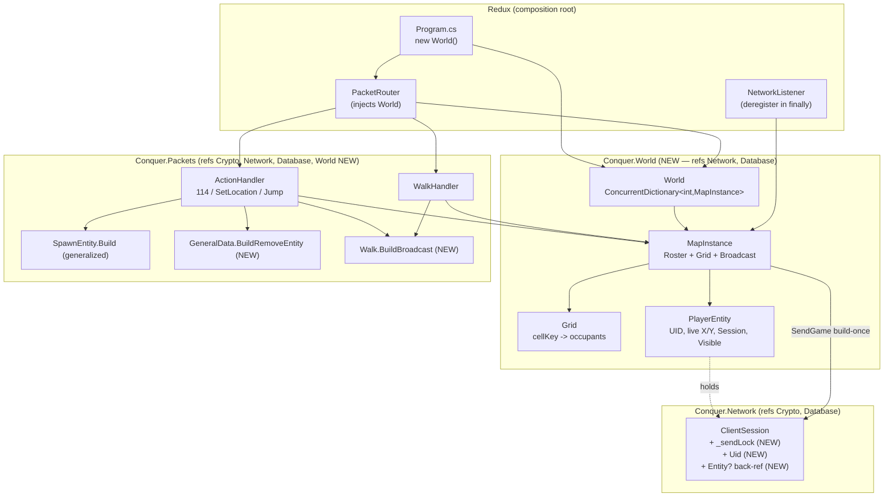

# Design: world-surroundings (EPIC 1)

## Overview

Add a new in-memory **`src/World`** project (a `World` → per-map `MapInstance` → `Roster` + fixed-cell `Grid`) that holds every connected player as a `PlayerEntity` and answers screen queries from a 3×3 cell block — never a LINQ full-scan. Handlers (Packets) own the injected `World`, register/move/deregister entities at existing hooks, and **build each broadcast packet once** then fan it out to the on-screen block via each recipient's `ClientSession.SendGame`. Broadcast is made safe by a single additive change in Network — a per-session send lock serializing the existing encrypt+write — so foreign-thread sends can't corrupt the stateful cipher.

## Architecture



Project-reference direction (confirmed from csproj): `Network → Crypto, Database`; `Packets → Crypto, Network, Database`. **New: `World → Network, Database`; `Packets → World`.** No cycle: Network never references World or Packets.

## Components

| Component | Project | Kind | Responsibility |
|-----------|---------|------|----------------|
| `PlayerEntity` | World | new class | A connected player's world presence: `Uid`, `MapId`, live `X/Y`, cached `CellX/CellY`, `ClientSession Session`, appearance (`Mesh/Avatar/Level/Hp/Name`), `Visible` set. `BuildSpawn()` → `SpawnEntity.Build(...)` from LIVE X/Y. |
| `MapInstance` | World | new class | One map's `Roster` (UID→entity), `Grid`, plus `Register/Deregister/Move/QueryScreen/Broadcast`. The unit of concurrency — no global lock. |
| `Grid` | World | new class | The fixed 18-tile cell index: `ConcurrentDictionary<long, ConcurrentDictionary<uint,PlayerEntity>>`. Pure cell math (`CellKey`, `Cells3x3`), atomic per-cell `TryAdd`/`TryRemove`. |
| `World` | World | new class | `ConcurrentDictionary<int,MapInstance>` + `GetOrAdd(mapId)`. The injected service (like `CharacterRepository`). |
| `SpawnEntity.Build(...)` | Packets | generalize | `BuildSelf(DbCharacter)` → delegates to `Build(uid,mesh,avatar,level,hp,x,y,name)` taking LIVE coords. Produces the 1014 for self AND others. |
| `GeneralData.BuildRemoveEntity(uid)` | Packets | new builder | 1010 despawn: `UID@8=uid`, `Action@22=132`, no coords (clone of `BuildJump`). |
| `Walk.BuildBroadcast(uid,dir,mode)` | Packets | new builder | Framed outbound 1005 (`UID@4/Dir@8/Mode@9`, body 20) — NOT the prefix-stripped inbound. |
| per-session send lock | Network | modify `ClientSession.SendGame` | `lock(_sendLock)` around the existing encrypt+write. Additive; serializes foreign-thread sends. |
| handler hooks | Packets | modify | `ActionHandler` (114 reply, SetLocation register, Jump broadcast), `WalkHandler` (Move + walk broadcast + diff). |
| wiring | Redux | modify | `Program.cs` `new World()`; `PacketRouter` injects it into handlers; `NetworkListener` finally deregisters + broadcasts 132. |

### PlayerEntity (interface sketch)

```csharp
public sealed class PlayerEntity
{
    public uint Uid { get; }
    public int MapId { get; }
    public ushort X { get; private set; }
    public ushort Y { get; private set; }
    public int CellX { get; private set; }   // X / 18, cached to detect boundary cross
    public int CellY { get; private set; }
    public ClientSession Session { get; }     // World refs Network → legal field type
    public int Mesh { get; }
    public int Avatar { get; }
    public int Level { get; }
    public int Hp { get; }
    public string Name { get; }
    public ConcurrentDictionary<uint, byte> Visible { get; } // current visible-set, for diffing
    public byte[] BuildSpawn();               // SpawnEntity.Build(Uid, Mesh, ..., X, Y, Name)
    internal void SetPosition(ushort x, ushort y); // MapInstance.Move only
}
```

### MapInstance (interface sketch)

```csharp
public sealed class MapInstance
{
    public ConcurrentDictionary<uint, PlayerEntity> Roster { get; }       // whole-map roster
    public void Register(PlayerEntity e);                                  // roster + grid add
    public IReadOnlyCollection<PlayerEntity> Deregister(uint uid);         // returns last screen to notify
    public ScreenDiff Move(PlayerEntity e, ushort newX, ushort newY);      // grid delta + enter/leave diff
    public IEnumerable<PlayerEntity> QueryScreen(int cellX, int cellY);    // 3×3 cell union
    public void Broadcast(PlayerEntity center, byte[] packet, bool includeSelf);
}

public readonly record struct ScreenDiff(
    IReadOnlyList<PlayerEntity> Entered,   // newly visible → mutual 1014
    IReadOnlyList<PlayerEntity> Left);     // no longer visible → RemoveEntity(132)
```

## Data Flow

### Login → register → 114 → mutual spawn

```mermaid
sequenceDiagram
    participant B as Client B
    participant AHB as ActionHandler (B's loop)
    participant MI as MapInstance
    participant CSA as ClientSession A
    Note over B,AHB: B already enter-world'd; CurrentX/Y seeded
    B->>AHB: 1010 SetLocation(74)
    AHB->>AHB: existing SetLocation echo + MapStatus (unchanged)
    AHB->>MI: Register(PlayerEntity B @ live X/Y)
    B->>AHB: 1010 GetSurroundings(114)
    AHB->>MI: QueryScreen(B.cell)  // 3×3 union
    loop each OTHER player A on B's screen
        AHB->>B: SendGame(A.BuildSpawn())   // 1014, A's LIVE X/Y
        AHB->>CSA: SendGame(B.BuildSpawn()) // mutual 1014
        AHB->>AHB: B.Visible+=A ; A.Visible+=B
    end
```

### Walk → Move → broadcast + enter/leave diff

```mermaid
sequenceDiagram
    participant A as Client A
    participant WH as WalkHandler (A's loop)
    participant MI as MapInstance
    participant Scr as A's 3×3 screen
    A->>WH: 1005 MsgWalk
    WH->>WH: existing bound-checked CurrentX/Y update (unchanged)
    WH->>MI: Move(A, newX, newY)
    alt within same cell
        MI-->>WH: ScreenDiff.Empty (no grid mutation)
    else cell boundary crossed
        MI->>MI: TryRemove(oldCell) + TryAdd(newCell); diff old-9 vs new-9
        MI-->>WH: ScreenDiff(Entered, Left)
    end
    WH->>MI: Broadcast(A, Walk.BuildBroadcast(A.Uid,dir,mode), includeSelf:true)
    MI->>Scr: SendGame(walk) to each (built ONCE)
    loop Entered (newly visible)
        WH->>Scr: mutual 1014 (A→viewer, viewer→A); seed both Visible sets
    end
    loop Left (no longer visible)
        WH->>Scr: RemoveEntity(132) to viewer (and A), prune Visible
    end
```

Jump (Action 133) is identical, substituting the existing `GeneralData.BuildJump(uid,x,y)` for the walk packet (it is already self-sent at `ActionHandler.cs:75`; we ALSO broadcast it).

---

## Architecture Decisions (Scalability & Performance)

> The user's explicit priority. Target: **hundreds of concurrent connections.** Each decision states alternatives weighed, the concrete scalability rationale, the forward-look for later epics, and the CLAUDE.md tie.

### AD-1 — Registry + 18-tile cell grid (vs the O(n²) LINQ QueryScreen)

**Decision.** Per-map state = a roster `ConcurrentDictionary<uint,PlayerEntity>` (authoritative who-is-here) plus a spatial `Grid` of fixed **18-tile cells**: `ConcurrentDictionary<long, ConcurrentDictionary<uint,PlayerEntity>>`, key = `((long)cellX<<32)|(uint)cellY`, `cellX = X/18`. A screen query = the union of the **9 cells** around the entity's cell (`cellX-1..+1`, `cellY-1..+1`).

**Alternatives weighed.**
- *Reference's `Map.QueryScreen`* (`src/Redux/Space/Map.cs:73`): LINQ `where area.AreaContains(x.Location)` over `Objects.Values` — **O(entities-on-map) per query**. With surroundings driven every move, that is O(N) per move × N movers = **O(N²) world-wide**. Rejected — the exact anti-pattern the roadmap flagged.
- *Quadtree / k-d tree.* Sub-linear queries but rebalancing cost, allocation, and lock complexity under constant movement. Over-engineered for a uniform tile world. Rejected (CLAUDE.md "no premature… measure first").
- *Per-tile buckets (cell=1).* Exact, but a 36×36 screen = 1,296 cell lookups per query. Rejected — too fine.
- **Chosen: 18-tile cells.** The reference screen is a 36×36 box (`GetEntityScreenArea`, `Map.cs:116`). Cell=18 ⇒ screen spans **exactly 3×3 cells**. Query touches **≤9 cell dictionaries regardless of map population** — O(occupants of 9 cells), not O(N).

**Why 18.** 36÷2 = 18-tile radius ⇒ a cell edge equals the screen radius ⇒ the 3×3 block always covers the screen with ≤1 cell of over-cover per edge (acceptable; tighten to an exact 36×36 filter only if a later epic needs it — flagged as a live-only pop-in check).

**Cell-set type.** Each cell is itself a `ConcurrentDictionary<uint,PlayerEntity>` (used as a thread-safe set). Chosen over `HashSet+lock` (a per-cell lock would serialize a busy cell) and over `ConcurrentBag` (no keyed removal). `TryAdd`/`TryRemove` are atomic and lock-free; enumeration is snapshot-ish — exactly the query primitive we need.

**Scalability.** At 300 players the roster has 300 entries; a query reads ≤9 cells holding only the locally-clustered players (single digits typically), **independent of the other 290**. No structure scales with total population on the hot path.

**Forward-look.** EPICs 3/4/7 (NPCs, monsters, ground items) register into the SAME roster + grid as additional entity kinds; chat/combat reuse the same 3×3 query for their fan-out target. Generalizing `PlayerEntity` to a base `WorldEntity` later is additive — the grid stores references, not player-specific data.

**CLAUDE.md tie.** MMO-scalability rule (in-memory authoritative hot state, no DB on the movement/surroundings path); "measure before optimizing" (cells, not a tree).

### AD-2 — Concurrency model: lock-free reads, atomic per-cell writes, no global map lock

**Decision.** Reads (roster lookup, 9-cell screen query) take **no lock** — `ConcurrentDictionary` enumeration is safe and snapshot-ish. Writes are **atomic per-cell**: a cell move = `TryRemove(oldCell)` + `TryAdd(newCell)` on two cell dictionaries. **No global per-map lock.** Concurrency is scoped per-`MapInstance` only because maps are naturally disjoint (different dictionaries) — not via locking.

**Alternatives weighed.**
- *Global `lock` per map around every read/write.* Simplest, but serializes a whole busy map → throughput cliff at exactly the scale we target. Rejected (NFR-3/4).
- *Striped locks over cells.* Defensible, but unnecessary for players-only v1 where each entity is mutated only by its OWN serve loop; revisit if EPIC 5 combat introduces cross-entity writes. Deferred.
- **Chosen: lock-free reads + atomic per-cell CAS-style writes.**

**Race analysis (A moving while B queries).**
- *A's cell move vs B's query.* `TryRemove(old)` then `TryAdd(new)` leaves a sub-microsecond window where A is in neither cell. A concurrent query may miss A for that one frame. **Acceptable, eventually consistent**: B's next move (or A's next) re-diffs and spawns A. No torn state — A is a whole reference present-or-absent, never half-written.
- *Two threads adding to the same cell.* `ConcurrentDictionary.TryAdd` is atomic; no lost update.
- *A's `Visible` set is mutated only by A's own loop's diff* (B's loop mutates B's `Visible`), so the per-entity visible-set has a single writer — no contention.
- *Roster `GetOrAdd(mapId)`* is atomic; first arrival on a map creates the `MapInstance` race-free.

**Scalability.** N serve loops each touch their own entity's two cells per boundary cross and read 9 cells per query — **zero cross-loop blocking** on the hot path. Throughput scales with cores, not bottlenecked on a shared lock.

**Forward-look.** The "single writer per entity" invariant is the property combat will have to relax carefully (damage = a foreign write to your HP) — calling it out here means EPIC 5 knows exactly where striped locks/actor-mailboxes go.

**CLAUDE.md tie.** "Do not pre-split / no premature sharding — measure first"; Rule 5 (fail-fast guards on impossible state at entry).

### AD-3 — Per-session send lock (correctness prerequisite; queue only if profiled)

**Decision.** Add `private readonly object _sendLock = new();` to `ClientSession` and wrap the existing encrypt+write in `SendGame` (and `Send`) in `lock(_sendLock)`. Purely additive.

**Why a lock is mandatory now.** `SendGame` (`ClientSession.cs:85-94`) does `Cipher.Encrypt(buffer)` then `Stream.Write(buffer)` on a **stateful CFB stream cipher with a per-session counter**. Today only the owning loop calls it → never contended. **Broadcast makes every session a target of foreign broadcaster threads.** Two concurrent calls would (a) interleave the cipher's keystream advance → corrupt ciphertext, and (b) interleave bytes on the `NetworkStream`. This is a correctness bug, not an optimization (FR-1, highest priority).

**Thread-safety proof for build-once + per-recipient encrypt.** Confirmed from code (`ClientSession.cs:88-90`): `SendGame` allocates its **own** `buffer = new byte[len+8]` and `BlockCopy`s the input `packet` into it, then encrypts `buffer` in place. **The input `packet` is never mutated.** Therefore a single build-once broadcast `byte[]` handed to N recipients is safe — each recipient encrypts its own copy. The `_sendLock` then guarantees that copy+stamp+encrypt+write executes atomically per session.

**Alternatives weighed.**
- *Per-session drained `Channel<byte[]>` + single writer task* (the reference's `Player.Send → ToSend.Enqueue`, `Player.cs:1347`). Scales better — broadcasters never block on a slow socket. But adds a writer task per connection, backpressure policy, and lifecycle. Deferred: start with the lock (correctness-first, cheap), upgrade to a queue ONLY if profiling shows send contention. Out of scope per requirements.
- *Lock per send-buffer / lock-free ring.* Premature.
- **Chosen: per-session lock.** Smallest correct change; zero new threads.

**Scalability.** Contention on `_sendLock` is per-recipient, only when that recipient is simultaneously targeted by its own loop and a broadcaster — brief (one encrypt+write). At hundreds of connections the lock is almost always uncontended (a player is rarely written by two threads in the same microsecond). If profiling later shows the socket write dominating under the lock, that is the trigger to adopt the queue.

**Forward-look.** Every later epic (chat, combat, drops) sends from foreign threads through this same `SendGame` — fixing it here makes all of them safe with no further work.

**CLAUDE.md tie.** Rule 10 (keep build strict / correct); "measure before optimizing" (lock now, queue only if measured).

### AD-4 — Broadcast fan-out: build once, 9-cell target, O(N·k)

**Decision.** Build each outbound packet (1005 / 1014 / 1010-132) **exactly once**; `MapInstance.Broadcast` iterates the entity's 3×3 block and calls each recipient's `SendGame(samePacket)`, skipping self when appropriate. Cost per broadcast = **O(k)**, k = players on the mover's screen — never O(N), never O(N²).

**Alternatives weighed.**
- *Rebuild the packet per recipient.* k allocations + k serializations per move. Rejected.
- *Broadcast to the whole map roster.* O(N) per move. Rejected (NFR-1).
- **Chosen: build-once + 9-cell fan-out.**

**Allocation discipline.** One `byte[]` per broadcast (the build), reused across all k recipients (safe per AD-3). `SendGame` allocates one per-recipient buffer (already does, unavoidable — it stamps the seal + encrypts in place). **No `ArrayPool` yet** — measure the per-walk build allocation first; pool only if GC pressure shows (CLAUDE.md Rule 3, "managed spirit: measure first"). The 3×3 enumeration uses a small pre-sized list, no LINQ on the hot path.

**Scalability.** A move at 300 players touches only the ≤k on-screen players (typically single digits in a clustered area), not the other ~290. Aggregate cost is O(total-moves × average-screen-density), bounded by local clustering, not by N².

**Forward-look.** Chat (EPIC 2) is literally this `Broadcast` with a chat packet; combat damage numbers, drop spawns, monster moves all fan out through the same primitive.

**CLAUDE.md tie.** Rule 3 (minimize hot-path allocation — build once, pool only if measured); MMO-scalability rule (O(N·k) not O(N²)).

### AD-5 — `src/World` project boundary + injection seam (no static singleton; Network↛World)

**Decision.** A new `src/World` project referencing **Network + Database** (so `PlayerEntity` can hold a `ClientSession` and the spawn builder can take live coords). `World` is **constructed in `Program.cs` and injected into `PacketRouter`** (which passes it to `ActionHandler`/`WalkHandler`) and into `NetworkListener` — exactly mirroring how `CharacterRepository` is wired. **No static singleton.**

**The Network↛World seam.** `ClientSession` lives in Network; Network must NOT reference World (would invert the dependency and risk a cycle). So `ClientSession` cannot hold a `PlayerEntity`-typed field. Two options weighed:
- *(a) `IWorldEntity` interface defined in Network, `PlayerEntity : IWorldEntity`, `ClientSession.WorldEntity` typed as the interface.* Keeps an O(1) session→entity back-ref without a roster lookup, but bleeds a world abstraction into Network.
- **(b, CHOSEN) Handlers own `World`; the session→entity link lives in the handler/World layer.** `ClientSession` gains only two **primitive** fields — `uint Uid` (already effectively `Character.CharacterID`) and a **nullable `object?` back-ref slot** the handlers cast to `PlayerEntity` (or, equivalently, the handler looks the entity up by `World.GetOrAdd(session.CurrentMap).Roster[session.Uid]`). This keeps Network ignorant of World's types, keeps `World` a pure constructible/testable service, and matches the existing manual-DI pattern.

**Recommended concrete link.** Store the back-ref on the session as `object? WorldEntity` (typed `object` so Network needs no World reference); `NetworkListener.finally` reads it via `as PlayerEntity` for deregister. This avoids a roster lookup during teardown and keeps the hot disconnect path allocation-free. (If even the `object?` slot is undesirable, fall back to a roster lookup by `session.Uid` — same correctness, one extra dictionary read.)

**Alternatives weighed.** Static `World.Instance` singleton — rejected: hidden global state, hard to unit-test the grid in isolation, no per-test world. The whole point of injection here is that `Grid`/`MapInstance` math is unit-testable with a fresh `World` per test.

**Scalability.** Irrelevant to throughput, but decisive for testability and for the layering that lets later epics extend the world without touching Network.

**Forward-look.** Every later epic injects this same `World`; none of them touch Network's types. The boundary set here is the one all of EPICs 2-8 build against.

**CLAUDE.md tie.** Rule 6 (smallest scope — primitives on the session, world types confined to World/Packets); Rule 10 (strict, nullable-clean new code); roadmap §3 (the four shared structures live in one injected layer).

---

## Grid / cell math + screen-block algorithm

```
CELL = 18                                   // tiles per cell edge (= screen radius)
cellX = X / 18                              // integer division
cellY = Y / 18
cellKey(cx, cy) = ((long)cx << 32) | (uint)cy   // pack two ints into one long key

Cells3x3(cx, cy):                           // the 9-cell screen block
    for dx in {-1, 0, +1}:
        for dy in {-1, 0, +1}:
            yield cellKey(cx + dx, cy + dy)

QueryScreen(cx, cy):                        // union of occupants of the 9 cells
    for key in Cells3x3(cx, cy):
        if Grid.TryGet(key, out cell): yield each value in cell

Move(e, newX, newY):                        // boundary-cross only
    newCx = newX/18 ; newCy = newY/18
    e.SetPosition(newX, newY)               // always update live coords
    if (newCx, newCy) == (e.CellX, e.CellY):
        return ScreenDiff.Empty             // no grid mutation (common case)
    old9 = set(Cells3x3(e.CellX, e.CellY))
    Grid[cellKey(e.CellX,e.CellY)].TryRemove(e.Uid)
    Grid.GetOrAdd(cellKey(newCx,newCy)).TryAdd(e.Uid, e)
    e.CellX = newCx ; e.CellY = newCy
    new9 = set(Cells3x3(newCx, newCy))
    Entered = occupants in (new9 \ old9)    // newly visible → mutual 1014
    Left    = occupants in (old9 \ new9)    // no longer visible → RemoveEntity(132)
    return ScreenDiff(Entered, Left)
```

Enter/leave-diff is **minimal-correct**: it diffs the two 3×3 blocks by cell-set difference, so only the strip of cells that scrolled in/out is examined — not the whole screen. Within-cell steps (the common case) produce no diff and no grid write.

## Wire layouts (exact)

`AppendHeader(span, size, type)` writes length `= size - 8` at @0 and `type` at @2, where `size` = body + 8-byte seal. `SendGame` appends the seal.

### 1014 SpawnEntity — `SpawnEntity.Build(uid,mesh,avatar,level,hp,x,y,name)`

Identical layout to today's `BuildSelf` (`SpawnEntity.cs:47-59`); only the source of X/Y changes to LIVE coords. `BuildSelf(DbCharacter ch)` delegates: `Build((uint)ch.CharacterID, ch.Mesh, ch.Avatar, ch.Level, ch.HealthPoints, (ushort)ch.X, (ushort)ch.Y, ch.Name)`.

| Field | Offset | Type | Value |
|-------|--------|------|-------|
| length/type | @0 | 2×u16 | body, 1014 |
| UID | @4 | u32 | uid |
| Lookface | @8 | u32 | mesh |
| Life | @48 | u16 | hp |
| Level | @50 | u16 | level |
| PositionX | @52 | u16 | **live X** |
| PositionY | @54 | u16 | **live Y** |
| Hair | @56 | u16 | avatar |
| Direction | @58 | u8 | 0 (live-verify facing) |
| Action | @59 | u8 | 0 (stand) |
| Level | @62 | u16 | level |
| Names | @90 | NetStringPacker | [name] |

Body length = `90 + name.Length` (NameOffset + encoded name).

### 1005 MsgWalk broadcast — `Walk.BuildBroadcast(uint uid, byte dir, byte mode)`

Framed 20-byte body (matches reference `[1005] Walk.cs:32-44`), NOT the inbound stripped layout.

| Field | Offset | Type | Value |
|-------|--------|------|-------|
| length/type | @0 | 2×u16 | 12, 1005 (`AppendHeader(span,20,1005)`) |
| UID | @4 | u32 | uid (the mover) |
| Direction | @8 | u8 | dir (0..7) |
| Mode | @9 | u8 | mode |
| Unknown1 | @10 | u16 | 0 |

Body length = 20.

### 1010 RemoveEntity — `GeneralData.BuildRemoveEntity(uint uid)`

Clone of `BuildJump` with Action=132 and no coords.

| Field | Offset | Type | Value |
|-------|--------|------|-------|
| length/type | @0 | 2×u16 | 28, 1010 |
| Timestamp | @4 | u32 | 0 |
| UID | @8 | u32 | uid (entity to despawn) |
| Data1 | @12 | u32 | 0 |
| Data2 | @16 | u32 | 0 |
| Data3 | @20 | u16 | 0 |
| Action | @22 | u16 | **132** |
| pad | @24 | 4 bytes | 0 |

Body length = 28.

## Handler hooks (additive — exact)

| Hook | File:line | Change |
|------|-----------|--------|
| Un-gate 114 | `ActionHandler.cs:36` | `case 114: HandleGetSurroundings(session); break;` — QueryScreen B's 3×3; for each OTHER player A: `session.SendGame(A.BuildSpawn())` + `A.Session.SendGame(B.BuildSpawn())`; seed both `Visible` sets (mutual). |
| Register | `ActionHandler.cs:54` (after SetLocation echo + MapStatus) | build `PlayerEntity` from `session.Character` + live `CurrentX/Y/CurrentMap`; `_world.GetOrAdd(map).Register(e)`; set `session.WorldEntity = e`, `session.Uid = e.Uid`. |
| Jump broadcast | `ActionHandler.cs:75` (after existing self-send of `BuildJump`) | `var diff = mi.Move(e, x, y); mi.Broadcast(e, GeneralData.BuildJump(uid,x,y), includeSelf:false); ApplyDiff(diff);` |
| Walk broadcast | `WalkHandler.cs:51` (after `CurrentX/Y` update) | `var diff = mi.Move(e, nx, ny); mi.Broadcast(e, Walk.BuildBroadcast(uid,dir,mode), includeSelf:true); ApplyDiff(diff);` |
| Deregister | `NetworkListener.cs:153` (finally, beside position flush, own try/catch) | `if (session.WorldEntity is PlayerEntity e) { var screen = mi.Deregister(e.Uid); mi.Broadcast over screen → BuildRemoveEntity(e.Uid); }` |
| Inject World | `PacketRouter.cs:20`, `Program.cs:33` | `new World()` in Program; pass into `PacketRouter` ctor → `new ActionHandler(world)`, `new WalkHandler(world)`; pass into `NetworkListener`. |

`ApplyDiff(diff)`: for each `Entered` → mutual 1014 + seed both `Visible`; for each `Left` → send `BuildRemoveEntity(other.Uid)` to the mover and `BuildRemoveEntity(mover.Uid)` to the other, prune both `Visible`. **Spawn-before-move ordering (FR-15):** in `ApplyDiff`, send the 1014 BEFORE any walk/jump is forwarded to a newly-entered viewer — enforced by ordering Register/114 spawn ahead of the move broadcast within the same loop iteration.

## Concurrency / race analysis (summary)

| Scenario | Outcome | Why safe |
|----------|---------|----------|
| A moves while B queries A's cell | B sees A or not, this frame | `TryRemove`+`TryAdd` atomic; reference is whole; next move re-diffs (eventually consistent) |
| Two broadcasters target session C | Serialized | `_sendLock` around encrypt+write |
| Shared build-once buffer to N recipients | No mutation | `SendGame` copies input before encrypt (`ClientSession.cs:88`) |
| `GetOrAdd(mapId)` first arrival | One MapInstance | `ConcurrentDictionary.GetOrAdd` atomic |
| A's `Visible` set | Single writer (A's loop) | each loop mutates only its own entity's set |
| Disconnect during a broadcast to A | Send no-ops | `SendGame` guards `Stream.CanWrite`; deregister removes A from grid |

## Error Handling

| Scenario | Strategy | Impact |
|----------|----------|--------|
| Short/oversized 1010/1005 | existing guard-first (`payload.Length < N`) unchanged | logged, ignored (Rule 7) |
| Register with null `Character`/`!PositionLoaded` | guard, skip register | player simply not in world yet; 114 returns nothing |
| Broadcast to a torn-down session | `SendGame` `Stream.CanWrite` guard → no-op | no throw; entity removed on its own disconnect |
| Deregister throws (e.g. broadcast mid-teardown) | wrapped in its own try/catch beside the position flush | teardown never throws; **position flush still runs** (AC-4.4) |
| Move out-of-bounds | existing bound-check rejects step before Move | no grid mutation |
| Entity not found on Deregister (double-fire) | `TryRemove` returns false | idempotent, no-op |

## File Structure

| File | Action | Purpose |
|------|--------|---------|
| `src/World/World.csproj` | Create | refs Network + Database; under src strict gate |
| `src/World/World.cs` | Create | `ConcurrentDictionary<int,MapInstance>` + `GetOrAdd` |
| `src/World/MapInstance.cs` | Create | Roster + Grid + Register/Deregister/Move/QueryScreen/Broadcast |
| `src/World/Grid.cs` | Create | cell math (`CellKey`,`Cells3x3`) + per-cell atomic add/remove |
| `src/World/PlayerEntity.cs` | Create | UID/MapId/live X-Y/cell/Session/appearance/Visible + `BuildSpawn()` |
| `src/World/ScreenDiff.cs` | Create | `record struct ScreenDiff(Entered, Left)` |
| `src/World.Tests/World.Tests.csproj` | Create | xUnit, mirrors Packets.Tests |
| `src/World.Tests/GridMathTests.cs` | Create | cell-key packing, X/18, 3×3 enumeration, transition |
| `src/World.Tests/ScreenDiffTests.cs` | Create | enter/leave diff on cell cross |
| `src/Network/ClientSession.cs` | Modify | add `_sendLock` (lock in SendGame+Send); add `uint Uid`, `object? WorldEntity` |
| `src/Packets/SpawnEntity.cs` | Modify | add `Build(uid,mesh,avatar,level,hp,x,y,name)`; `BuildSelf` delegates |
| `src/Packets/GeneralData.cs` | Modify | add `BuildRemoveEntity(uid)` (Action=132) |
| `src/Packets/Walk.cs` | Create | `Walk.BuildBroadcast(uid,dir,mode)` framed 1005 |
| `src/Packets/ActionHandler.cs` | Modify | ctor takes World; un-gate 114; register at SetLocation; broadcast jump |
| `src/Packets/WalkHandler.cs` | Modify | ctor takes World; Move + walk broadcast + diff |
| `src/Packets/Packets.csproj` | Modify | add `../World/World.csproj` reference |
| `src/Redux/PacketRouter.cs` | Modify | ctor takes World; pass to ActionHandler/WalkHandler |
| `src/Redux/NetworkListener.cs` | Modify | ctor takes World; deregister + RemoveEntity in finally |
| `src/Redux/Program.cs` | Modify | `new World()`; wire into PacketRouter + NetworkListener |
| `src/Packets.Tests/SpawnEntityBuildTests.cs` | Create/extend | live-coord 1014, BuildRemoveEntity, Walk.BuildBroadcast byte layout |
| `src/Conquer.sln` | Modify | add World + World.Tests projects |

**Project-ref note:** `Packets → World` and `World → Network,Database` introduce no cycle (Network stays referencing only Crypto+Database). `Walk.BuildBroadcast` lives in **Packets** (not World) so World keeps no packet-builder dependency beyond what `PlayerEntity.BuildSpawn` needs — `PlayerEntity.BuildSpawn` calls `SpawnEntity.Build`, which is in Packets. To avoid `World → Packets`, **keep `BuildSpawn` building bytes via a small builder injected into the entity, OR move `SpawnEntity.Build` to World.** Recommended: `PlayerEntity` stores raw appearance fields and the **114/diff handlers (in Packets) call `SpawnEntity.Build(e.Uid, e.Mesh, …, e.X, e.Y, e.Name)`** — so World holds data, Packets holds builders, `World → Packets` is avoided. (`BuildSpawn()` on the entity is then a convenience that the handler layer supplies, or dropped in favor of the handler building from the entity's public fields.)

## Test Strategy

### Unit (xUnit, pure — no socket/DB) — NFR-13

| Test | Asserts |
|------|---------|
| cell-key packing | `CellKey(cx,cy)` round-trips; distinct cells → distinct keys; negative-safe via `(uint)` cast |
| X/18 cell math | boundary values (17→0, 18→1, 35→1, 36→2) |
| 3×3 enumeration | `Cells3x3` yields exactly 9 keys centered on the cell |
| cell transition | within-cell move ⇒ `ScreenDiff.Empty`, no grid mutation; boundary cross ⇒ atomic remove+add |
| screen query | `QueryScreen` returns only occupants of the 9 cells; excludes far players |
| visible-set diff | scroll-in cells → `Entered`; scroll-out cells → `Left`; stationary overlap → neither |
| 1014 live-coord | `Build(...)` writes X@52/Y@54 from live args; `BuildSelf` == `Build(ch.*)` byte-identical |
| `Walk.BuildBroadcast` | UID@4/Dir@8/Mode@9, type@2=1005, len@0=12 |
| `BuildRemoveEntity` | UID@8, Action@22=132, len@0=20 |

All run under `scripts/dotnet test src/Conquer.sln` (dockerized, strict gate, 0 warnings).

### Integration

- Concurrent `SendGame` stress: two threads send to one session under `_sendLock` → assert no interleaved/corrupted output (validates AC-5.1).
- Build-once broadcast: hand one `byte[]` to N `SendGame`s → assert the source buffer is unmutated (AC-5.2).

### Operator E2E (the real acceptance)

Two clients on `192.168.0.252` (vitor=hawkk, account1=hawkk2): log in same map → SEE each other (114 mutual 1014) → see each other WALK (1005) and JUMP (133) live → one walks out of the 3×3 screen → vanishes (132), walks back → reappears (fresh 1014) → one logs off → vanishes for the other.

## Performance Considerations

- Screen query = ≤9 cell lookups, independent of N (AD-1).
- Broadcast = O(k) on-screen players, packet built once (AD-4).
- No DB on the surroundings/move path — pure in-memory (MMO-scalability rule); position still flushes once on disconnect, unchanged.
- `ArrayPool` deferred until the per-walk build is measured as GC pressure.

## Security Considerations

- All wire offsets bounds-checked before read (Rule 7) — existing guards unchanged.
- Movement still trusts the client (no range/collision validation — out of scope, unchanged).
- The send lock prevents cipher-keystream corruption across foreign threads (a confidentiality/integrity property of the transport).

## Existing Patterns to Follow

- Manual DI via `PacketRouter` ctor (like `CharacterRepository`) — no static singleton (`PacketRouter.cs:20`).
- Guard-first handler shape (`payload.Length < N`) — `ActionHandler.cs:19`.
- `Span<byte>` + `BinaryPrimitives` packet building, `PacketBuilder.AppendHeader(span,size,type)` — no `unsafe` (the reference `[1005] Walk.cs` uses `unsafe`; the new `Walk.BuildBroadcast` must NOT — use spans).
- Disconnect teardown's wrapped-try/catch beside the position flush — `NetworkListener.cs:153-162`.
- New code nullable-clean, 0 warnings (strict gate, `Directory.Build.props`).

## Unresolved Questions (live-only — flagged for operator capture)

- **Other-player 1014 pose**: Direction/Action 0 (stand) on spawn vs the mover's live facing — low risk; verify on enter-screen during E2E.
- **Screen-edge pop-in**: the 18-tile 3×3 block slightly over-covers the 36×36 box — confirm no visible artifact live; tighten to an exact-box filter only if seen.
- **Move-before-spawn under race**: client tolerance of a forwarded foreign-UID 1005/133 arriving before its 1014 — FR-15 mandates spawn-first; confirm ordering holds live under load.

## Implementation Steps

1. **Send-safety first (FR-1).** Add `_sendLock` to `ClientSession`; wrap encrypt+write in `SendGame` and `Send`. Add `uint Uid` + `object? WorldEntity` fields. Integration-test concurrent sends.
2. **Create `src/World`** project (refs Network+Database): `Grid` (cell math), `PlayerEntity`, `ScreenDiff`, `MapInstance` (Roster+Grid+Register/Deregister/Move/QueryScreen/Broadcast), `World`. Add to `src/Conquer.sln`. Unit-test the pure math (Step's tests).
3. **Generalize builders (Packets).** `SpawnEntity.Build(...)` + `BuildSelf` delegate; `GeneralData.BuildRemoveEntity(uid)`; new `Walk.BuildBroadcast(uid,dir,mode)` (spans, no unsafe). Byte-layout tests. Add `Packets → World` ref.
4. **Wire World (Redux).** `new World()` in `Program.cs`; inject into `PacketRouter` → `ActionHandler`/`WalkHandler`; inject into `NetworkListener`.
5. **Milestone 1 — see who's there.** Register at `HandleSetLocation`; un-gate 114 → mutual 1014 per on-screen player. E2E: B logs in where A stands → mutual visibility.
6. **Milestone 2 — see movement.** Walk: `Move` + `Walk.BuildBroadcast` broadcast (includeSelf). Jump: `Move` + broadcast existing `BuildJump`. E2E: A walks/jumps → B sees it.
7. **Milestone 3 — enter/leave + disconnect.** `ApplyDiff` (enter→mutual 1014, leave→132); deregister + RemoveEntity broadcast in `NetworkListener.finally`. E2E: walk out→vanish, back→reappear, logoff→vanish.
8. **Gate.** `scripts/dotnet build && test src/Conquer.sln` green (0 warnings); operator E2E pass.
